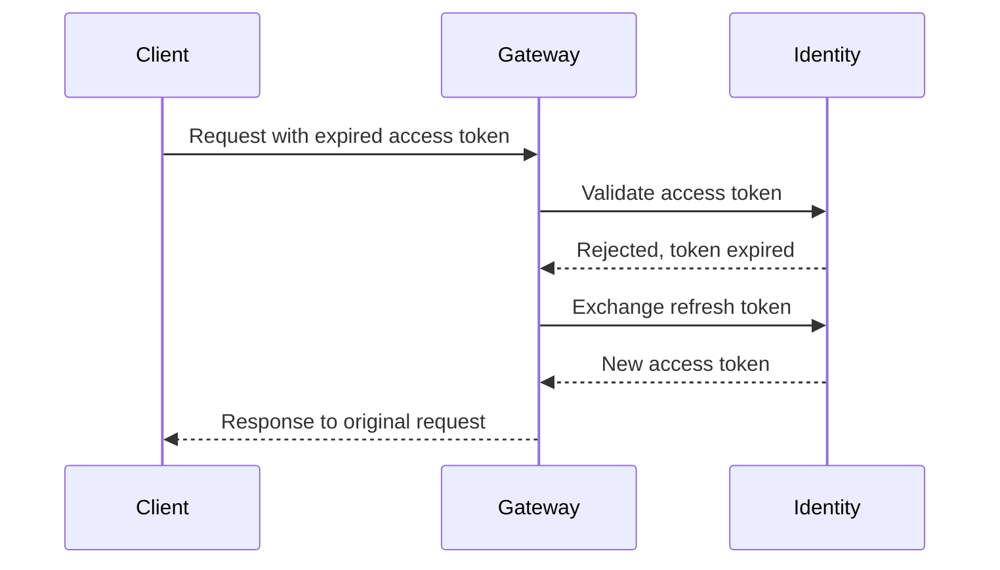
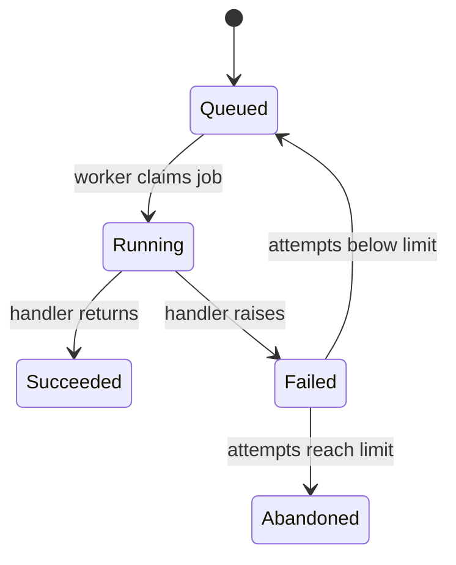
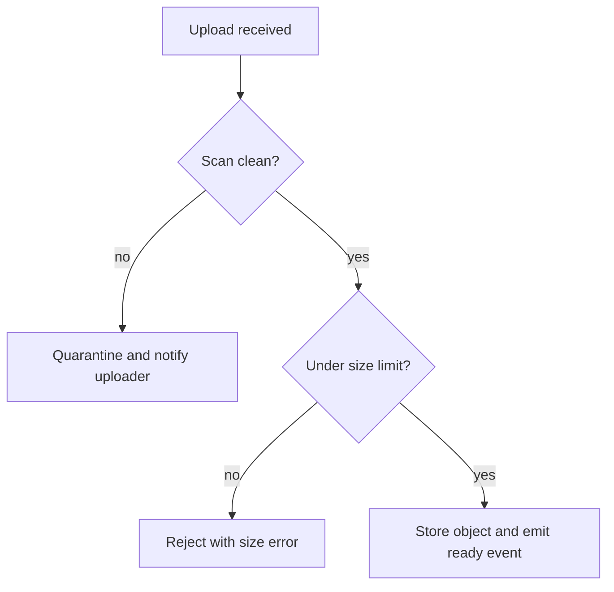

# Diagram and image accessibility

A diagram or image that a reader cannot see must still deliver its content, which is the job of `accTitle`, `accDescr`, and alt text. Whether those fields are publishable is decided by concrete checks, and the work starts earlier still, with the decision to draw a diagram at all and the choice of type.

- [The two required Mermaid accessibility fields](#the-two-required-mermaid-accessibility-fields)
- [Worked Mermaid examples with usable accessibility text](#worked-mermaid-examples-with-usable-accessibility-text)
- [A failing accDescr and its correction](#a-failing-accdescr-and-its-correction)
- [Alt text for images](#alt-text-for-images)
- [Choosing the Mermaid diagram type](#choosing-the-mermaid-diagram-type)
- [Deciding whether a diagram belongs at all](#deciding-whether-a-diagram-belongs-at-all)

## The two required Mermaid accessibility fields

`accTitle` names the subject, and `accDescr` carries everything the picture carries. Both go inside the diagram body, on the lines after the type declaration and before the first node or participant. A diagram missing either field does not get published: an agent that cannot write the description has not read the code well enough to draw the diagram, and shipping the diagram anyway hands a sighted reader information a non-sighted reader cannot reach.

Syntax that trips people up: `accTitle:` and `accDescr:` each end at the newline, so a description longer than one line uses the braced form `accDescr { ... }` instead. Continuation lines written under an `accDescr:` are read as diagram content, and the parser rejects them, so render the diagram before publishing rather than trusting the source to be well formed. Neither field is drawn on the canvas, so a heading or introductory sentence above the diagram is still needed for sighted readers.

Apply these checks to the text itself:

- **`accTitle` names this diagram and no other.** "Diagram", "Flow", "Overview", and the document's own title all fail. "Access token refresh between client, gateway, and identity service" passes because no second diagram in the project could carry it.
- **`accDescr` survives the hide test.** Cover the diagram, read the description, and try to redraw the shape from it. If the redrawing needs a guess about which node connects to which, the description is incomplete.
- **Every node, participant, or state appears by its label**, and so does every relation between them, including the direction. A description listing the boxes without the arrows describes an inventory, not a diagram.
- **Every branch names its condition and both outcomes**, and a terminal point is stated as terminal, since a reader cannot see that nothing leaves a node. "Checks the file, then stores it" hides the rejection path the diagram draws.
- **No meta description of the drawing.** "A flowchart with six nodes and two decision points" describes the rendering, not the system.

## Worked Mermaid examples with usable accessibility text

A sequence diagram, where the description carries the ordering that the arrows carry:



A state diagram, where the description carries the transition conditions and says which states are terminal:



## A failing accDescr and its correction

The failing version, with both fields present and neither doing its job:



The title could sit on any diagram in any document. The description names no node, no branch, and no outcome, so a reader who cannot see the picture learns only that uploads exist. The corrected header, with the body unchanged:

```mermaid
flowchart TD
    accTitle: Upload validation before an object reaches storage
    accDescr {
        An upload passes two checks in sequence. Upload received leads to Scan clean?, where no leads to
        Quarantine and notify uploader, ending that path, and yes leads to Under size limit?. There, no
        leads to Reject with size error, also ending that path, and yes leads to Store object and emit
        ready event. Both rejection paths stop before anything is stored.
    }
```

## Alt text for images

Alt text carries what the reader needs from the image at the point where it sits, not an inventory of the frame. "Screenshot", "diagram", "architecture", and the file name fail the same way an absent `accDescr` fails: the field is populated and the content is gone. In Markdown, the alt text is the bracketed text:

```markdown


```

In HTML, it is the `alt` attribute, and the same bar applies:

```html

```

Two further checks:

- **Text inside an image is unreachable.** Configuration, log output, terminal sessions, and error messages belong in a code block, where they can be copied, searched, and read aloud. A screenshot of text fails every reader using a screen reader and most readers using search.
- **Use an image only where showing is easier than describing.** A rendered interface, a physical layout, or a third-party console the reader must recognize qualifies. A structure that Mermaid can draw belongs in Mermaid, which stays diffable and carries its own accessibility fields. An image carrying no meaning is deleted rather than described, which is why every image that stays carries alt text saying what it shows. An image with an empty `alt` is therefore a finding rather than a compliant state: report it, and resolve it by removing the image, since reaching for empty `alt` is the signal that the image was carrying nothing. The rule admits no exception for a decorative image, because a decorative image does not belong in this documentation at all.

## Choosing the Mermaid diagram type

Pick from `flowchart`, `sequenceDiagram`, `classDiagram`, `stateDiagram`, `journey`, `C4Context`, `mindmap`, `xychart`, `kanban`, `architecture-beta`, and `treemap-beta` by naming what the content actually is, then reading off the type:

- Messages between named parties, where order over time is the point: `sequenceDiagram`.
- One entity sitting in named conditions, with events moving it between them: `stateDiagram`.
- Steps with decision points and branches, where no single actor or entity is being tracked: `flowchart`.
- Types, their fields, and the relationships between them: `classDiagram`.
- Stages a person passes through, with a rating attached to each: `journey`.
- Systems, the people who use them, and external systems at the boundary: `C4Context`.
- Deployed services and the connections between them, grouped by boundary: `architecture-beta`.
- One root concept branching into related concepts with no ordering: `mindmap`.
- Numeric values against an axis: `xychart`.
- Work items grouped by status column: `kanban`.
- Nested parts sized in proportion to a measured quantity: `treemap-beta`.

`flowchart` is the default that gets reached for when another type fits, because it accepts any shape. Two signals that the wrong type was chosen: the nodes are named systems or people and the arrows are requests and responses, which is a sequence, flattened until the ordering and the pairing of each response to its request are lost; or the nodes are named conditions and the arrows are events, which is a state machine, drawn so that a reader cannot tell which nodes are terminal. Convert rather than relabel.

## Deciding whether a diagram belongs at all

Draw one for multi-service interactions, state machines, data pipelines, flows of five or more steps, user journeys, and dependency graphs. Skip it for trivial logic, basic create, read, update, and delete operations, and any case where the diagram would repeat a short list that the prose already gives. A three-node flowchart is a sentence that took longer to read.

A diagram is a set of claims and carries the same grounding requirement as prose. Every node names something that exists in the code as read this run, and every arrow names a call, transition, or dependency that the code makes. A planned service, a structure someone described in a discussion, or an arrow added because it makes the picture symmetrical is a false statement rendered as a picture, and it is harder to fact-check later than a false sentence because no reviewer reads a diagram for citations. When the code cannot be confirmed, leave the diagram out and report the gap. The same reasoning applies afterwards: when an audit touches a file a published diagram depends on, re-read the diagram against the current code and correct or delete it in that pass. A diagram also inherits the significance filter that governs the surrounding flows, so logging, metrics, and internal helper steps stay out unless the system being documented is itself observability.
