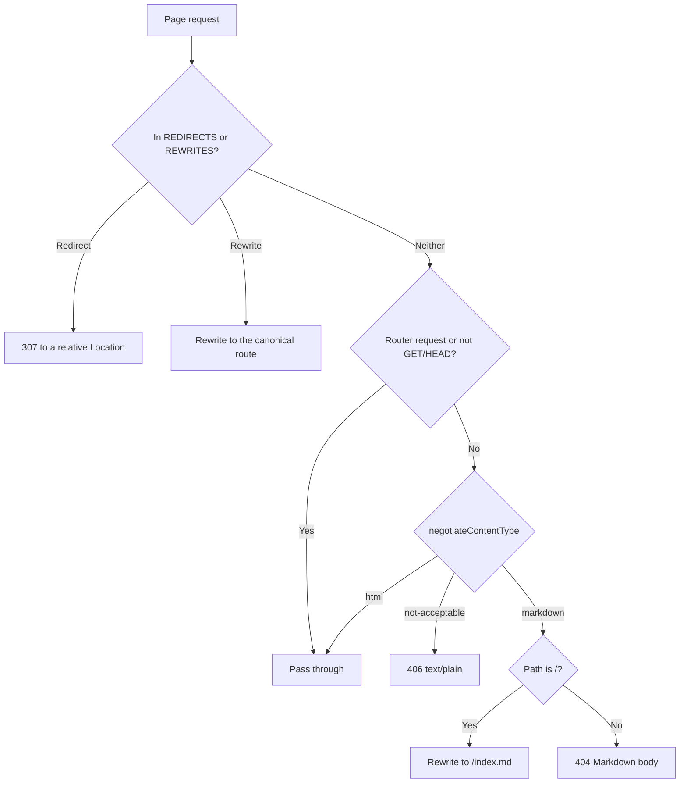

# Agent Readiness

AI agents read the site through the same URLs people use. Each page has an HTML representation for browsers and a Markdown one for agents, and [`/llms.txt`](../../src/app/llms.txt/route.ts) tells an agent what the site is for and when to use it.

## Content negotiation

[src/proxy.ts](../../src/proxy.ts) reads the `Accept` header of every page request and picks a representation with [`negotiateContentType`](../../src/util/negotiateContentType.ts), which follows the RFC 9110 rules on weights and specificity.



- **HTML wins by default.** A missing header, `*/*`, and every browser `Accept` string get HTML. Markdown wins only when `text/markdown` outweighs `text/html`, or ties with it while being named explicitly.
- **Router requests are untouched.** Requests carrying the `RSC`, `Next-Router-Prefetch`, or `Next-Router-State-Tree` header, or an `_rsc` query parameter, pass straight through.
- **The matcher skips files.** `_next/`, `api/`, and any path with a dot (`/llms.txt`, `/index.md`, `/sw.js`, images, the résumé) never reach the proxy.
- **`Vary: Accept`** is set on the Markdown, Markdown 404, and 406 responses. The Next.js app page render calls `setHeader('Vary', ...)`, which replaces any `Vary` the proxy or [`next.config.js`](../../next.config.js) sets, so the HTML response does not list `Accept`. On Vercel the proxy runs before the edge cache and Markdown is a rewrite to `/index.md`, so that cache keeps the two representations apart.

The Markdown is built by [`src/util/markdown/`](../../src/util/markdown/homeMarkdown.ts) from the same data modules the page renders, so the two representations cannot drift. It carries every project, including those behind "view more", full publication abstracts, contact details, and the privacy and cookie policy.

## About, Contact, and the policy

The site is a single page. The proxy answers the conventional paths with temporary (307) redirects from the `REDIRECTS` table in [`routes.ts`](../../src/constants/routes.ts), before negotiating: `/about` goes to `/`, `/contact` to the footer at `/#contact`, and each of `/privacy`, `/policy`, `/cookie`, `/cookies`, `/privacy-policy`, and `/cookie-policy` to `/#privacy`, where the [policy dialog](./components/consent-banner.md#policy-dialog) opens. Each `Location` is relative, so it never echoes the request's Host header, and the redirects are temporary so a real page can replace any of them. An agent following one with `Accept: text/markdown` lands on the Markdown home page, which holds the About and Contact sections and the policy.

The `REWRITES` table serves `/llm.txt` as `/llms.txt`. Next.js needs the proxy matcher as a static literal, so it names `/llm.txt` itself, and [`proxy.test.ts`](../../src/proxy.test.ts) fails if any table entry falls outside the matcher.

## llms.txt

[`buildLlmsTxt`](../../src/util/markdown/llmsTxt.ts) follows the [llmstxt.org](https://llmstxt.org/) format: an H1, a blockquote summary, prose, then H2 sections that contain only `[name](url): notes` lists. The first section, **When to use**, tells an agent which link answers which kind of question.

## Verifying

```bash
curl -sS -i -H 'Accept: text/markdown' https://alexjsully.me/
curl -sS -i -H 'Accept: text/markdown' https://alexjsully.me/no-such-page
curl -sS -i https://alexjsully.me/llms.txt
```

The first returns `Content-Type: text/markdown; charset=utf-8` with `Vary: Accept`, the second a Markdown 404, and the third the llms.txt index.
