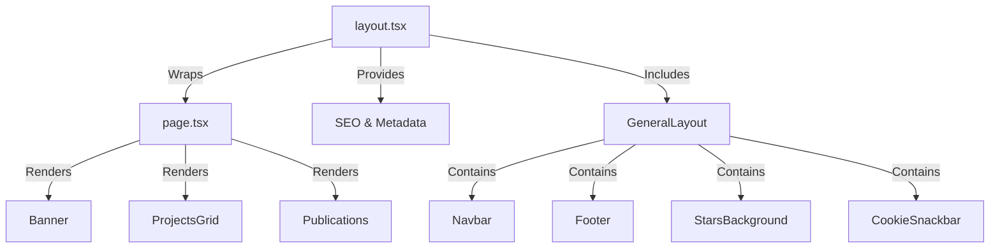

# App Directory (Next.js)

The portfolio uses Next.js App Router, where file names in [src/app/](../../src/app/) define routes and special behaviors. This follows Next.js convention-based routing rather than explicit route configuration.

## App Router Conventions

**File-Based Routing:** Next.js maps file names to functionality:

- `layout.tsx` — Wraps all child routes with shared UI and metadata
- `page.tsx` — Defines the `/` route content
- `error.tsx` — Catches errors in route segments
- `global-error.tsx` — Catches errors in root layout
- `not-found.tsx` — Handles 404 pages
- `loading.tsx` — Displays while routes load
- `manifest.ts` — Generates PWA manifest `/manifest.webmanifest`
- `robots.ts` — Generates `/robots.txt` for SEO

**Server by Default:** Components in [src/app/](../../src/app/) are React Server Components unless marked with `'use client'`. This minimizes client JavaScript.

## Component Hierarchy

The root layout renders GeneralLayout which provides navigation, footer, background, and cookie consent for all pages.

## Root Layout

**Metadata Configuration:** The layout exports a metadata object with SEO tags, OpenGraph, Twitter Cards, and PWA manifest path. Keywords are imported from [src/data/keywords.ts](../../src/data/keywords.ts).

**Viewport Setup:** Defines theme color (#131518), responsive scaling, and device width settings for mobile browsers.

**GeneralLayout:** Wraps children with [GeneralLayout](../../src/layouts/GeneralLayout.tsx) which provides navigation, footer, stars background, and cookie consent.

**Global Styles:** Imports [globals.scss](../../src/styles/globals.scss) for application-wide CSS.

**Analytics:** Includes Vercel SpeedInsights for performance tracking.

Implementation: [src/app/layout.tsx](../../src/app/layout.tsx)

## Home Page

The home page ([src/app/page.tsx](../../src/app/page.tsx)) is a client component (`'use client'`) that initializes services on mount:

**Firebase Initialization:** Calls `init()` from [src/configs/firebase.ts](../../src/configs/firebase.ts) to start analytics and performance tracking.

**Console Logo:** Debounced ASCII art logged to browser console via [ascii helper](../../src/helpers/ascii.ts).

**Service Worker Registration:** Registers `/sw.js` for PWA offline support. Registration runs once on page load.

**Content Rendering:** Displays Banner, ProjectsGrid, and Publications components in vertical stack.

Implementation: [src/app/page.tsx](../../src/app/page.tsx)

## Special Route Handlers

**PWA Manifest** ([src/app/manifest.ts](../../src/app/manifest.ts)) — Generates `/manifest.webmanifest` with app name, icons, theme colors, and display mode. See [PWA Documentation](./pwa.md).

**Robots.txt** ([src/app/robots.ts](../../src/app/robots.ts)) — Generates `/robots.txt` allowing all crawlers with sitemap URL for SEO.

## Error Handling

**Error Boundary** ([src/app/error.tsx](../../src/app/error.tsx)) — Catches errors in route segments and displays fallback UI with reset button.

**Global Error** ([src/app/global-error.tsx](../../src/app/global-error.tsx)) — Catches errors in root layout, including its own `<html>` and `<body>` tags since layout errors prevent normal rendering.

Both error boundaries are client components that accept `error` and `reset` props.

## Loading & 404

**Loading UI** ([src/app/loading.tsx](../../src/app/loading.tsx)) — Shows MUI CircularProgress spinner centered on screen while routes load.

**Not Found** ([src/app/not-found.tsx](../../src/app/not-found.tsx)) — Custom 404 page displaying pathname and navigation button back to home.

Implementation: [src/app/loading.tsx](../../src/app/loading.tsx), [src/app/not-found.tsx](../../src/app/not-found.tsx)

## Related Documentation

- [Architecture Overview](./index.md) — System architecture
- [Layouts Documentation](./layouts.md) — GeneralLayout details
- [PWA Documentation](./pwa.md) — Service worker and manifest
