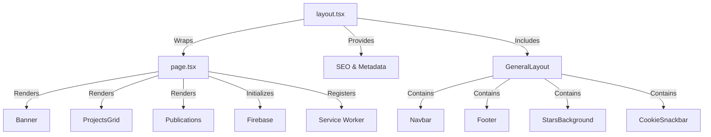
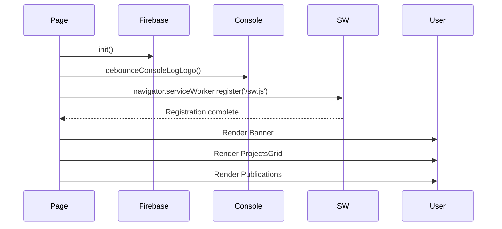

# App Directory (Next.js)

This document explains the Next.js App Router directory structure and implementation in the Alexander Sullivan's Portfolio project.

## Overview

The project uses Next.js 16+ with the App Router architecture located in [`src/app/`](../../src/app/). This modern routing system uses file-system based routing with server and client components.

## Directory Structure

```text
src/app/
├── layout.tsx              # Root layout with metadata
├── page.tsx                # Home page component
├── manifest.ts             # PWA manifest configuration
├── robots.ts               # SEO robots.txt generator
├── error.tsx               # Error boundary
├── global-error.tsx        # Global error boundary
├── loading.tsx             # Loading UI
├── not-found.tsx           # 404 page
├── favicon.ico             # Site favicon
└── sw.js/                  # Service worker route handler
```

## Architecture Pattern



## Root Layout

Location: [`src/app/layout.tsx`](../../src/app/layout.tsx)

The root layout defines metadata, global styles, and wraps all pages with the GeneralLayout component.

### Key Features

1. **Metadata Configuration:** SEO, OpenGraph, Twitter Cards, and PWA manifest
2. **Global Styles:** Imports global SCSS styles
3. **Analytics Integration:** Vercel Speed Insights
4. **Service Worker Registration:** Client component for PWA support
5. **Theme Configuration:** Viewport settings and theme color

### Metadata Structure

```typescript
export const metadata: Metadata = {
	title: {
		template: `%s | ${metadataValues.title}`,
		default: metadataValues.title,
	},
	description: metadataValues.description,
	applicationName: metadataValues.title,
	referrer: 'origin',
	keywords: seoKeywords, // From src/data/keywords.ts
	category: 'technology',
	authors: [{ name: metadataValues.name, url: metadataValues.url }],
	creator: metadataValues.name,
	publisher: metadataValues.name,
	openGraph: {
		/* OpenGraph config */
	},
	twitter: {
		/* Twitter Card config */
	},
	manifest: '/manifest.webmanifest',
	// ... additional metadata
};
```

### Viewport Configuration

```typescript
export const viewport: Viewport = {
	themeColor: '#131518',
	width: 'device-width',
	initialScale: 1,
	minimumScale: 1,
	maximumScale: 5,
	userScalable: true,
};
```

## Home Page

Location: [`src/app/page.tsx`](../../src/app/page.tsx)

The home page is a client component that initializes services and renders main sections.

### Initialization Flow



### Component Structure

```typescript
'use client';

export default function Home() {
	useEffect(() => {
		init(); // Initialize Firebase
		debounceConsoleLogLogo(); // Log ASCII art to console

		// Register service worker
		if (typeof navigator !== 'undefined' && 'serviceWorker' in navigator) {
			navigator.serviceWorker.register('/sw.js').catch(function (err) {
				console.error('Service Worker registration failed: ', err);
			});
		}
	}, []);

	return (
		<Box component='div' sx={/* styles */}>
			<Banner aria-label='Landing banner' />
			<ProjectsGrid aria-label='Grid showing projects worked on' />
			<Publications aria-label='List of scientific publications' />
		</Box>
	);
}
```

## Special Route Handlers

### Manifest (`manifest.ts`)

Generates the PWA manifest dynamically:

```typescript
import type { MetadataRoute } from 'next';

export default function manifest(): MetadataRoute.Manifest {
	return {
		name: "Alexander Sullivan's Portfolio",
		short_name: "Alexander Sullivan's Portfolio",
		icons: [
			{ src: '/icon/android-chrome-192x192.png', sizes: '192x192', type: 'image/png' },
			// ... more icons
		],
		theme_color: '#131518',
		background_color: '#131518',
		display: 'standalone',
		start_url: '/',
	};
}
```

### Robots (`robots.ts`)

Generates robots.txt for SEO:

```typescript
import type { MetadataRoute } from 'next';

export default function robots(): MetadataRoute.Robots {
	return {
		rules: {
			userAgent: '*',
			allow: '/',
		},
		sitemap: 'https://alexjsully.me/sitemap.xml',
	};
}
```

## Error Handling

### Error Boundary (`error.tsx`)

Catches errors in the app and displays a fallback UI:

```typescript
'use client';

export default function Error({
	error,
	reset,
}: {
	error: Error & { digest?: string };
	reset: () => void;
}) {
	return (
		<div>
			<h2>Something went wrong!</h2>
			<button onClick={() => reset()}>Try again</button>
		</div>
	);
}
```

### Global Error Boundary (`global-error.tsx`)

Catches errors at the root level (even in layout):

```typescript
'use client';

export default function GlobalError({
	error,
	reset,
}: {
	error: Error & { digest?: string };
	reset: () => void;
}) {
	return (
		<html>
			<body>
				<h2>Something went wrong!</h2>
				<button onClick={() => reset()}>Try again</button>
			</body>
		</html>
	);
}
```

## Loading States

Location: [`src/app/loading.tsx`](../../src/app/loading.tsx)

Displays a loading UI while the page is being rendered:

```typescript
import { CircularProgress } from '@mui/material';

export default function Loading() {
	return (
		<div style={centeredContainerStyles}>
			<CircularProgress />
		</div>
	);
}
```

The container uses inline styles with flexbox centering: `display: 'flex'`, `justifyContent: 'center'`, and `padding: '2rem'`.

## 404 Not Found

Location: [`src/app/not-found.tsx`](../../src/app/not-found.tsx)

Custom 404 page with navigation back to home:

```typescript
export default function NotFound() {
	const pathname = usePathname();

	return (
		<Stack /* ... */>
			<Typography>404</Typography>
			<Typography>{pathname}?! What is that?!</Typography>
			<Link href='/' aria-label='Go home'>
				<Button>Go back home!</Button>
			</Link>
		</Stack>
	);
}
```

## Best Practices

1. **Server vs Client Components:** Use server components by default, mark client components with `'use client'`
2. **Metadata:** Define metadata in layout.tsx for SEO benefits
3. **Error Boundaries:** Implement error.tsx for graceful error handling
4. **Loading States:** Use loading.tsx for better UX during navigation
5. **TypeScript:** Use Next.js types like `MetadataRoute`, `Metadata`, and `Viewport`
6. **Accessibility:** Include proper ARIA labels on all components

## Testing

Test files are located alongside their components:

- `loading.test.tsx` - Tests loading component
- `not-found.test.tsx` - Tests 404 page

## Related Documentation

- [Architecture Overview](./index.md)
- [Layouts](./layouts.md)
- [Components](./components/index.md)
- [PWA Documentation](./pwa.md)
- [Next.js App Router Documentation](https://nextjs.org/docs/app)

---

💡 **Tip:** The App Router automatically handles routing based on the file structure. Any `page.tsx` file becomes a route, and `layout.tsx` files wrap their children routes.
