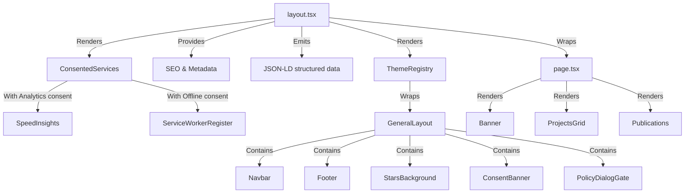

# App Directory (Next.js)

The portfolio uses Next.js App Router, where file names in [src/app/](../../src/app/layout.tsx) define routes and special behaviors. This follows Next.js convention-based routing rather than explicit route configuration.

## App Router Conventions

**File-Based Routing:** Next.js maps file names to functionality:

- `layout.tsx` - Wraps all child routes with shared UI and metadata
- `page.tsx` - Defines the `/` route content
- `error.tsx` - Catches errors in route segments
- `global-error.tsx` - Catches errors in root layout
- `not-found.tsx` - Handles 404 pages
- `manifest.ts` - Generates PWA manifest `/manifest.webmanifest`
- `robots.ts` - Generates `/robots.txt` for SEO
- `index.md/route.ts` - Serves the home page as Markdown at `/index.md`
- `llms.txt/route.ts` - Serves `/llms.txt`, which the proxy also serves at `/llm.txt`

[src/proxy.ts](../../src/proxy.ts) sits beside `app/` and runs before routing. It answers the redirects and aliases in [routes.ts](../../src/constants/routes.ts), then chooses between the HTML and Markdown representation of each page; see [Agent Readiness](./agent-readiness.md).

**Server by Default:** Components in [src/app/](../../src/app/layout.tsx) are React Server Components unless marked with `'use client'`. This minimizes client JavaScript.

## Component Hierarchy

```mermaid
flowchart TD
    accTitle: App Router Component Hierarchy
    accDescr: layout.tsx wraps all routes, provides metadata and JSON-LD structured data, and renders ThemeRegistry and ConsentedServices, which starts SpeedInsights and ServiceWorkerRegister only with consent. ThemeRegistry wraps GeneralLayout, which contains ConsentBanner, Navbar, Footer, StarsBackground, and PolicyDialogGate. page.tsx renders Banner, ProjectsGrid, and Publications
    Layout[layout.tsx] -->|Wraps| Page[page.tsx]
    Layout -->|Provides| Metadata[SEO & Metadata]
    Layout -->|Emits| JSONLD[JSON-LD structured data]
    Layout -->|Renders| TR[ThemeRegistry]
    Layout -->|Renders| CS[ConsentedServices]
    CS -->|With Analytics consent| SI[SpeedInsights]
    CS -->|With Offline consent| SW[ServiceWorkerRegister]
    TR -->|Wraps| GL[GeneralLayout]
    GL -->|Contains| Navbar
    GL -->|Contains| Footer
    GL -->|Contains| Stars[StarsBackground]
    GL -->|Contains| Consent[ConsentBanner]
    GL -->|Contains| Policy[PolicyDialogGate]
    Page -->|Renders| Banner
    Page -->|Renders| Projects[ProjectsGrid]
    Page -->|Renders| Pubs[Publications]
```

The root layout wraps GeneralLayout in [ThemeRegistry](../../src/components/ThemeRegistry.tsx), so the MUI theme reaches every component while the client boundary stays at that one provider. GeneralLayout then supplies navigation, footer, background, and the consent banner for all pages.

## Root Layout

**Metadata Configuration:** The layout exports a metadata object with SEO tags, OpenGraph, Twitter Cards, and PWA manifest path. Keywords are imported from [src/data/keywords.ts](../../src/data/keywords.ts).

**Viewport Setup:** Defines theme color (#131518), an initial scale of 1 at device width, and `colorScheme: 'dark'`, which tells the browser to render form controls and scrollbars in their dark variants.

**Structured Data:** The layout serializes the JSON-LD array from [src/data/structuredData.ts](../../src/data/structuredData.ts) into a `<script type='application/ld+json'>` in the body: a `Person` entry carrying the description, contact point, profile links, employer, and alma mater; an `Organization` entry for the AlexJSully brand with its contact point and a country-only address; an `FAQPage` entry answering questions about projects, contact, and employment status; and a `WebPage` entry naming the CSS selectors a voice assistant should read aloud. Search engines read these; nothing in the application does.

**GeneralLayout:** Wraps children with [GeneralLayout](../../src/layouts/GeneralLayout.tsx) which provides navigation, footer, stars background, and the consent banner.

**Global Styles:** Imports [globals.scss](../../src/styles/globals.scss) for application-wide CSS.

**Consented services:** Renders [ConsentedServices](../../src/components/consent/services/ConsentedServices.tsx), which starts Firebase and Vercel Speed Insights once the visitor allows Analytics and registers the service worker once they allow Offline access. See [Consent](./consent.md).

Implementation: [src/app/layout.tsx](../../src/app/layout.tsx)

## Home Page

The home page ([src/app/page.tsx](../../src/app/page.tsx)) is a client component (`'use client'`):

**Console Logo:** Debounced ASCII art logged to browser console via [ascii helper](../../src/helpers/ascii.ts).

**Content Rendering:** Displays Banner, ProjectsGrid, and Publications components in vertical stack. The privacy and cookie policy dialog is mounted by GeneralLayout, so it opens on every page.

Implementation: [src/app/page.tsx](../../src/app/page.tsx)

## Special Route Handlers

**PWA Manifest** ([src/app/manifest.ts](../../src/app/manifest.ts)) - Generates `/manifest.webmanifest` with app name, icons, theme colors, and display mode. See [PWA Documentation](./pwa.md).

**Robots.txt** ([src/app/robots.ts](../../src/app/robots.ts)) - Generates `/robots.txt` allowing all crawlers with sitemap URL for SEO.

**Markdown home page** ([src/app/index.md/route.ts](../../src/app/index.md/route.ts)) and **llms.txt** ([src/app/llms.txt/route.ts](../../src/app/llms.txt/route.ts)) - Static route handlers built from the data modules. See [Agent Readiness](./agent-readiness.md).

## Error Handling

**Error Boundary** ([src/app/error.tsx](../../src/app/error.tsx)) - Catches errors in route segments and displays fallback UI with a "Go Home" button. It writes the error to the browser console and shows `error.message`, falling back to "Unknown error." when the message is empty.

**Global Error** ([src/app/global-error.tsx](../../src/app/global-error.tsx)) - Catches errors in root layout, including its own `<html>` and `<body>` tags since layout errors prevent normal rendering. It reports the error through `captureError()` from [src/configs/sentry.ts](../../src/configs/sentry.ts).

The two differ in where the error goes: only the global boundary reports to Sentry, because a failure in the root layout is the one the application cannot otherwise surface. A report is sent only once the visitor has allowed Analytics. Both are client components that accept an `error` prop. Both, and the not-found page, render [`GoHomeLink`](../../src/components/go-home-link/GoHomeLink.tsx), a "Go Home" link that reloads the page instead of navigating when the reader is already at `/`.

## 404

**Not Found** ([src/app/not-found.tsx](../../src/app/not-found.tsx)) - Custom 404 page displaying pathname and navigation button back to home.

There is no `loading.tsx`. The home page is static, and a loading boundary would stream its content into a hidden container after the footer, out of reach of readers without JavaScript.

Implementation: [src/app/not-found.tsx](../../src/app/not-found.tsx)

## Related Documentation

- [Architecture Overview](./index.md) - System architecture
- [Layouts Documentation](./layouts.md) - GeneralLayout details
- [PWA Documentation](./pwa.md) - Service worker and manifest
- [Agent Readiness](./agent-readiness.md) - Markdown negotiation and llms.txt
