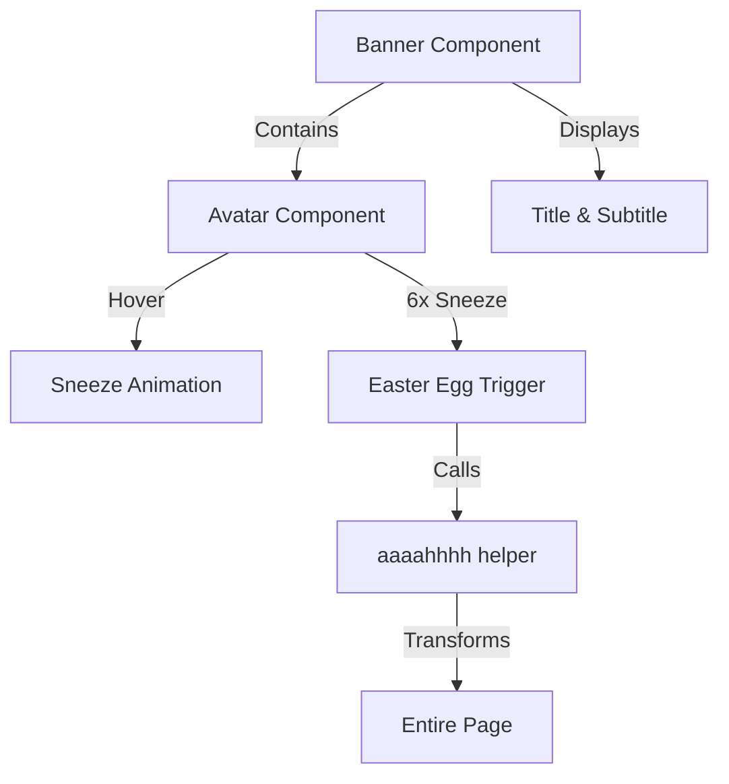
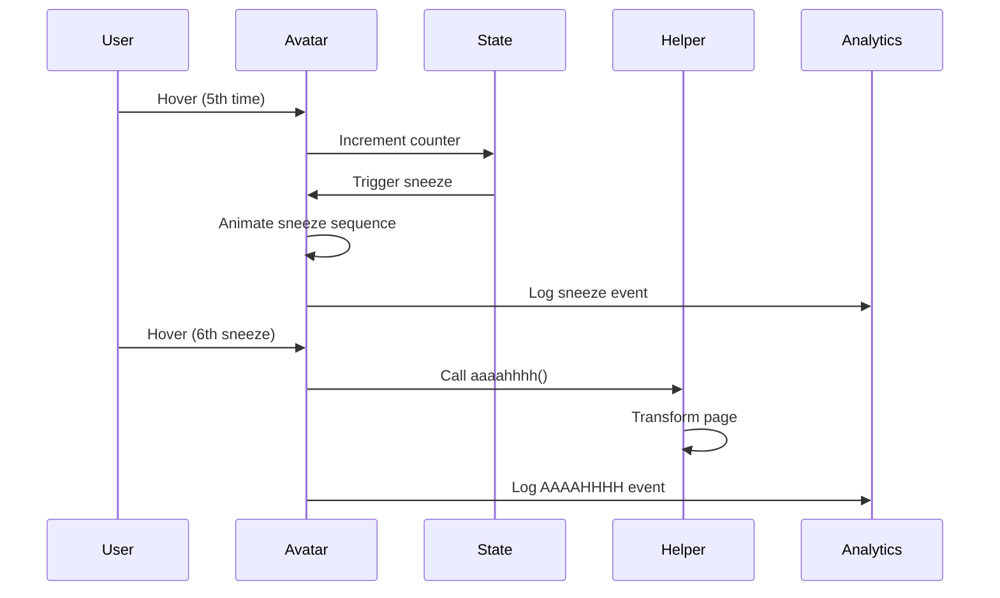

# Banner & Avatar Components

This document details the Banner and Avatar components that create the introductory section of the portfolio.

## Overview

The Banner component displays the header section with profile information and an animated avatar that includes an Easter egg feature.

## Component Structure



## Banner Component

Location: [`src/components/banner/Banner.tsx`](../../src/components/banner/Banner.tsx)

**Purpose:** Displays the introductory section with profile image and text.

**Key Features:**

- Responsive layout using MUI Grid/Stack
- Profile avatar with animations
- Title and subtitle text
- Accessibility attributes

**Usage Example:**

```tsx
import Banner from '@components/banner/Banner';

<Banner aria-label='Landing banner' />;
```

## Avatar Component

Location: [`src/components/banner/Avatar.tsx`](../../src/components/banner/Avatar.tsx)

**Purpose:** Displays an animated profile picture with an interactive sneeze animation and Easter egg.

### Key Features

1. **Sneeze Animation:** Triggered every 5 hovers
2. **Easter Egg:** After 6 sneezes, triggers the "AAAAHHHH" transformation
3. **Analytics Tracking:** Logs user interactions
4. **Image Optimization:** Uses Next.js Image component

### State Management

```typescript
const hoverProfilePic = useRef(0); // Hover count
const totalSneeze = useRef(0); // Total sneezes
const sneezing = useRef(false); // Animation lock
const [image, setImage] = useState(imageList['default']); // Current image
```

### Image Assets

```typescript
const imageList = {
	default: '/images/drawn/profile_pic_drawn.webp',
	sneeze_1: '/images/drawn/profile_pic_drawn_2.webp',
	sneeze_2: '/images/drawn/profile_pic_drawn_3.webp',
	sneeze_3: '/images/drawn/profile_pic_drawn_4.webp',
};
```

### Sneeze Animation Sequence

```typescript
handleTriggerSneeze() {
  hoverProfilePic.current += 1;

  if (hoverProfilePic.current % 5 === 0 && !sneezing.current) {
    totalSneeze.current += 1;

    if (totalSneeze.current >= 6) {
      logAnalyticsEvent('trigger_aaaahhhh', {...});
      aaaahhhh(); // Transform entire page
    } else {
      sneezing.current = true;

      // Animate through sneeze sequence
      setImage('sneeze_1');
      setTimeout(() => setImage('sneeze_2'), 500);
      setTimeout(() => setImage('sneeze_3'), 800);
      setTimeout(() => {
        setImage('default');
        sneezing.current = false;
      }, 1800);

      logAnalyticsEvent('trigger_sneeze', {...});
    }
  }
}
```

### AAAAHHHH Easter Egg

When the avatar sneezes 6 times, it triggers [`aaaahhhh()`](../../src/helpers/aaaahhhh.ts) which:

1. Converts all text to "AAAAHHHH" format
2. Replaces all images with the AAAAHHHH image
3. Changes background images
4. Creates a playful page transformation

See [AAAAHHHH Helper Documentation](../helpers.md#aaaahhhh-helper) for details.

### Analytics Integration

The component logs two event types:

```typescript
// Sneeze event
logAnalyticsEvent('trigger_sneeze', {
	name: 'trigger_sneeze',
	type: 'hover',
});

// Easter egg event
logAnalyticsEvent('trigger_aaaahhhh', {
	name: 'trigger_aaaahhhh',
	type: 'hover',
});
```

### Usage Example

```tsx
import Avatar from '@components/banner/Avatar';

<Avatar />; // No props required
```

### Performance Considerations

- **Debounced Hover:** Uses `lodash.debounce` to prevent rapid triggering
- **Ref-based State:** Uses refs for counters to avoid unnecessary re-renders
- **Animation Lock:** Prevents overlapping sneeze animations
- **Image Preloading:** All sneeze images should be optimized as WebP

### Accessibility

```tsx
<Box
	data-testid='profile_pic'
	aria-label='Profile picture'
	role='img'
	onMouseEnter={debounceHover}
	sx={{ cursor: 'pointer' }}
>
	<Image src={image} alt='Alexander Sullivan profile picture' width={200} height={200} priority />
</Box>
```

## Component Interaction



## Testing

Test file: [`src/components/banner/Avatar.test.tsx`](../../src/components/banner/Avatar.test.tsx)

**Test Coverage:**

- Component renders
- Image changes on hover
- Sneeze animation triggers
- Easter egg activation
- Analytics event logging

## Related Documentation

- [Helpers: AAAAHHHH](./helpers.md#aaaahhhh-helper)
- [Components Overview](./components/index.md)
- [Firebase Analytics](./configs.md#firebase-configuration-and-usage)

---

💡 **Tip:** Try hovering over the profile picture to discover the sneeze animation and Easter egg!
