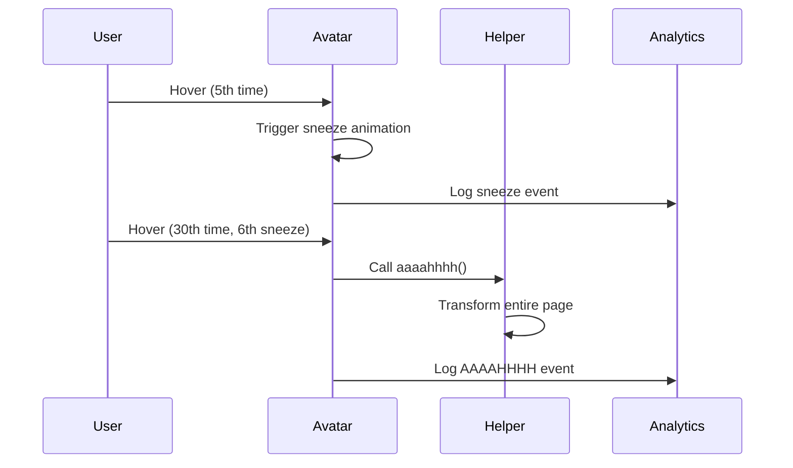

# Banner & Avatar Components

The Banner component displays the profile header with an animated avatar that includes interactive sneeze animations and a hidden Easter egg.

## Banner Component

The Banner ([src/components/banner/Banner.tsx](../../src/components/banner/Banner.tsx)) is a container component that renders:

- Avatar component with interactive animations
- Name title split into hoverable characters (green glow on hover)
- Subtitle displaying role ("Software Developer & Bioinformatician")
- Responsive layout using MUI Stack for vertical alignment

The component is server-side rendered by default with no client-side state.

Implementation: [src/components/banner/Banner.tsx](../../src/components/banner/Banner.tsx)

## Avatar Component

The Avatar ([src/components/banner/Avatar.tsx](../../src/components/banner/Avatar.tsx)) is a client component (`'use client'`) that displays an interactive profile image.

### Sneeze Animation Behavior

The avatar triggers a multi-stage sneeze animation based on hover interactions:

1. **Hover Counting:** Each hover/click increments a counter (debounced by 100ms)
2. **Sneeze Trigger:** Every 5th hover triggers a 3-stage sneeze animation
3. **Animation Lock:** While sneezing, additional hovers are ignored
4. **Image Sequence:** Avatar cycles through 4 images (default → sneeze_1 → sneeze_2 → sneeze_3 → default)
5. **Timing:** Stage transitions use constants (500ms → 300ms → 1000ms)

After each sneeze, the component logs a `trigger_sneeze` analytics event via Firebase.

### Easter Egg: AAAAHHHH Transformation

After the 6th sneeze, instead of animating, the avatar calls the [`aaaahhhh()`](../../src/helpers/aaaahhhh.ts) helper function which:

- Transforms all text on the page to "AAAAHHHH" format (first half → 'A', second half → 'H')
- Replaces all images with `/images/aaaahhhh/aaaahhhh.webp`
- Changes background images including the stars
- Sets page title to "Alexander Sullivan's AAAAHHHHH"
- Logs a `trigger_aaaahhhh` analytics event

This creates a playful full-page transformation. See [AAAAHHHH Helper](../helpers.md#aaaahhhh-easter-egg-helper) for implementation details.

### State Management Strategy

The component uses React refs for counters (hover count, sneeze count, animation lock) to avoid unnecessary re-renders. Only the current image is stored in React state, triggering re-renders for visual updates.

This pattern keeps the component performant by limiting state updates to what affects the DOM.

### Memory Management

The component debounces hover interactions using `lodash.debounce` and cancels the debounce function on unmount via `useEffect` cleanup. This prevents memory leaks from pending callbacks after component removal.

### Accessibility

The avatar uses Next.js `Image` component with:

- `priority` flag for above-the-fold loading
- `alt` text describing the image
- `aria-label` for screen readers
- Explicit width/height for layout stability
- Interactive `onClick` and `onMouseEnter` handlers

Implementation: [src/components/banner/Avatar.tsx](../../src/components/banner/Avatar.tsx)

## Component Interaction Flow

## Related Documentation

- [Helpers: AAAAHHHH](../helpers.md#aaaahhhh-easter-egg-helper) — Easter egg implementation
- [Constants](../constants.md) — Timing and threshold values
- [Firebase Analytics](../configs.md) — Event tracking
