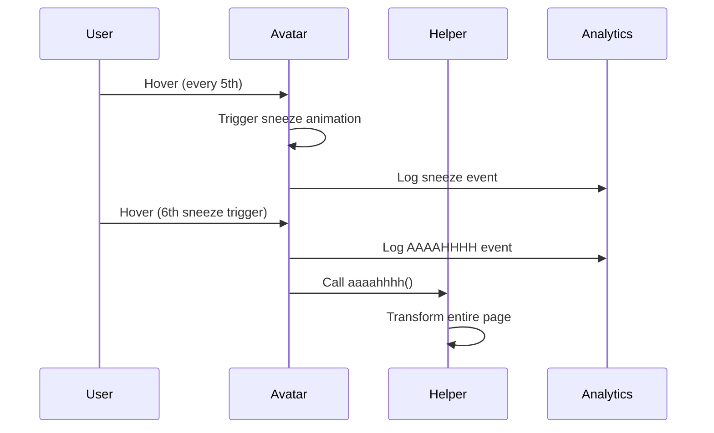

# Banner & Avatar Components

The Banner component displays the profile header with an animated avatar that includes interactive sneeze animations and a hidden Easter egg.

## Banner Component

The Banner ([src/components/banner/Banner.tsx](../../../src/components/banner/Banner.tsx)) is a container component that renders:

- Avatar component with interactive animations
- Name title split into hoverable characters (green glow on hover)
- Subtitle displaying role ("Software Developer & Bioinformatician")
- Responsive layout using an MUI Box with `flexDirection: 'column'` for vertical alignment

Banner declares no `'use client'` directive of its own and holds no state, effects, or event handlers. Its parent [page.tsx](../../../src/app/page.tsx) does declare one, so Banner is reached through a client boundary rather than sitting behind its own.

Implementation: [src/components/banner/Banner.tsx](../../../src/components/banner/Banner.tsx)

## Avatar Component

The Avatar ([src/components/banner/Avatar.tsx](../../../src/components/banner/Avatar.tsx)) is a client component that displays an interactive profile image.

### Sneeze Animation Behavior

The avatar triggers a multi-stage sneeze animation based on hover interactions:

1. **Hover Counting:** Each hover/click increments a counter (debounced by 100ms)
2. **Sneeze Trigger:** Every 5th hover triggers a 3-stage sneeze animation
3. **Animation Lock:** While a sneeze is in progress the counter keeps advancing, but no new sneeze starts. A hover that lands on a multiple of five mid-animation is therefore counted and discarded, which is why the sneeze count can trail the hover count divided by five
4. **Image Sequence:** Avatar cycles through 4 images (default → sneeze_1 → sneeze_2 → sneeze_3 → default)
5. **Timing:** Stage transitions use constants (500ms → 300ms → 1000ms)

Each sneeze logs a `trigger_sneeze` analytics event via Firebase as the animation starts, not when it finishes.

### Easter Egg: AAAAHHHH Transformation

On the sixth sneeze trigger the avatar does not sneeze at all. The sneeze counter reaches `THRESHOLDS.AAAAHHHH_TRIGGER_COUNT` (6) before the animation branch is reached, so the reader sees five sneezes and then, on the sixth trigger, the transformation. The avatar logs a `trigger_aaaahhhh` analytics event and calls the [`aaaahhhh()`](../../../src/helpers/aaaahhhh.ts) helper function, which:

- Transforms all text on the page to "AAAAHHHH" format (first half → 'A', second half → 'H')
- Replaces all images with `/images/aaaahhhh/aaaahhhh.webp`
- Changes background images including the stars
- Sets page title to "Alexander Sullivan's AAAAHHHHH"

This creates a playful full-page transformation. See [AAAAHHHH Helper](../helpers.md#aaaahhhh-easter-egg-helper) for implementation details.

### State Management Strategy

The component uses React refs for counters (hover count, sneeze count, animation lock) to avoid unnecessary re-renders. Only the current image is stored in React state, triggering re-renders for visual updates.

This pattern keeps the component performant by limiting state updates to what affects the DOM.

### Memory Management

The component debounces hover interactions using `lodash.debounce` and cancels the debounce function on unmount via `useEffect` cleanup. This prevents memory leaks from pending callbacks after component removal.

### Accessibility

The avatar uses Next.js `Image` component with:

- `priority` flag for above-the-fold loading
- `alt` text describing the image
- `aria-label` for screen readers
- Explicit width/height for layout stability
- Interactive `onClick` and `onMouseEnter` handlers

Implementation: [src/components/banner/Avatar.tsx](../../../src/components/banner/Avatar.tsx)

## Component Interaction Flow

```mermaid
sequenceDiagram
    accTitle: Avatar Sneeze and Easter Egg Interaction Sequence
    accDescr: Every fifth hover of the avatar triggers a sneeze animation and logs a sneeze event. On the sixth such trigger the avatar skips the animation, logs an AAAAHHHH event, and calls the aaaahhhh helper to transform the whole page
    participant User
    participant Avatar
    participant Helper
    participant Analytics

    User->>Avatar: Hover (every 5th)
    Avatar->>Avatar: Trigger sneeze animation
    Avatar->>Analytics: Log sneeze event

    User->>Avatar: Hover (6th sneeze trigger)
    Avatar->>Analytics: Log AAAAHHHH event
    Avatar->>Helper: Call aaaahhhh()
    Helper->>Helper: Transform entire page
```

## Related Documentation

- [Helpers: AAAAHHHH](../helpers.md#aaaahhhh-easter-egg-helper) - Easter egg implementation
- [Constants](../constants.md) - Timing and threshold values
- [Firebase Analytics](../configs.md) - Event tracking
