# Consent Banner

The consent banner asks a visitor which optional purposes to allow, and the policy dialog shows the privacy and cookie policy with the same switches. How choices are stored and what each purpose starts is in [Consent](../consent.md).

## Banner

Location: [`src/components/consent/banner/ConsentBanner.tsx`](../../../src/components/consent/banner/ConsentBanner.tsx)

[`GeneralLayout`](../../../src/layouts/GeneralLayout.tsx) renders the banner first, before the navbar, so keyboard and screen-reader users reach it before the page. It is a compact, fixed, non-modal `section` with `role='region'` and the accessible name "Your privacy choices", at the bottom left of the viewport on wider screens and full width on phones, clear of the device's safe-area inset. One sentence names the optional purposes and links to the policy; the switches, and the detail behind each purpose, are one click away under "Customize".

```mermaid
stateDiagram-v2
    accTitle: Consent banner visibility
    accDescr: The banner renders nothing until the consent cookie can be read. An undecided visitor sees it; choosing Essential only, Accept all, or saving custom switches hides it. Cookie settings in the footer reopens it with the switches showing, and Close without changes hides it again. It is also hidden while the policy dialog is open
    [*] --> Unknown: server render and hydration
    Unknown --> Shown: no stored choice
    Unknown --> Hidden: stored choice
    Shown --> Hidden: Essential only, Accept all, or Save choices
    Hidden --> Settings: Cookie settings
    Settings --> Hidden: Save choices or Close without changes
```

"Essential only" and "Accept all" are both small [`PillButton`](../../../src/components/pill-button/PillButton.tsx)s with the accent fill, so they render identically. "Customize" replaces them with [`ConsentControls`](../../../src/components/consent/controls/ConsentControls.tsx). The banner shows its switches while the `cookie-settings` panel is open, which the footer's "Cookie settings" link does. While the policy dialog is open the banner stays mounted but hidden and `inert`, so it never covers the dialog and the dialog can return focus to the banner's policy link when it closes.

Focus moves into the banner when its switches appear, and returns to the element it came from when the banner closes, or to the `<main>` element when that element is gone or was the page body, which Safari leaves focused after a click on a link. Escape closes reopened settings without changes; on a first visit there is no earlier choice to keep, so Escape does nothing. A visually hidden `role='status'` element outside the banner announces "Choices saved." after any choice, since the banner itself is removed. While the banner is up, the page's `scroll-padding-bottom` matches its height, so an element focused by keyboard is never hidden behind it. The switches are loaded on demand, and fetching starts as soon as the pointer or keyboard reaches "Customize".

## Switches

Location: [`src/components/consent/controls/ConsentControls.tsx`](../../../src/components/consent/controls/ConsentControls.tsx)

One row per purpose, each a `Switch` named by the purpose and described by a sentence naming the vendors involved, after an Essential row marked "Always on". The name and description sit in a `<label>`, so clicking either toggles the switch. The switches start from the stored choice, and "Save choices" stores them and announces "Choices saved." through a `role='status'` element. The banner and the policy dialog both render this component.

## Policy dialog

Location: [`src/components/policy/dialog/PolicyDialog.tsx`](../../../src/components/policy/dialog/PolicyDialog.tsx)

[`GeneralLayout`](../../../src/layouts/GeneralLayout.tsx) renders [`PolicyDialogGate`](../../../src/components/policy/gate/PolicyDialogGate.tsx) on every page, which fetches the dialog's code once the page is idle and mounts the dialog the first time it opens. A [`PanelLink`](../../../src/components/panel-link/PanelLink.tsx) in the banner or the footer opens it without changing the URL, through [`panelState.ts`](../../../src/util/panelState.ts). A redirect (`/privacy`, `/policy`, `/cookie`, `/cookies`, `/privacy-policy`, and `/cookie-policy`; see [Agent Readiness](../agent-readiness.md)) opens it by landing on `/#privacy`, and closing removes that fragment without adding a history entry. Each `PanelLink` keeps an `href` to the fragment, so it still opens the dialog before the page hydrates, without JavaScript, and in a new tab. Below the `sm` breakpoint the dialog fills the screen.

[`PolicyContent`](../../../src/components/policy/content/PolicyContent.tsx) renders the sections of [`policy.ts`](../../../src/data/policy.ts): paragraphs, lists, tables, and the switches where the policy places them. Below the `sm` breakpoint each table row stacks into label and value pairs, so nothing scrolls sideways; each table sits in a focusable region named after its section, such as "Questions about your information table". [`policyMarkdown.ts`](../../../src/util/markdown/policyMarkdown.ts) renders the same sections as Markdown.

## Testing

Each component has a colocated test, and [`landing.cy.ts`](../../../cypress/e2e/landing.cy.ts) checks in a browser that nothing is stored or requested before a choice, that "Essential only" survives a reload, and that "Accept all" starts analytics without advertising cookies.
