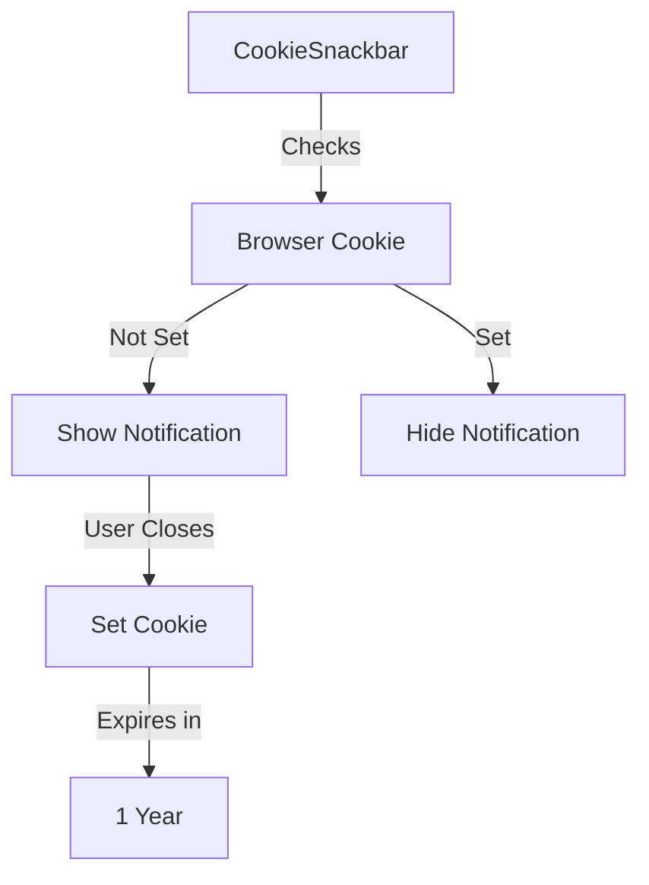
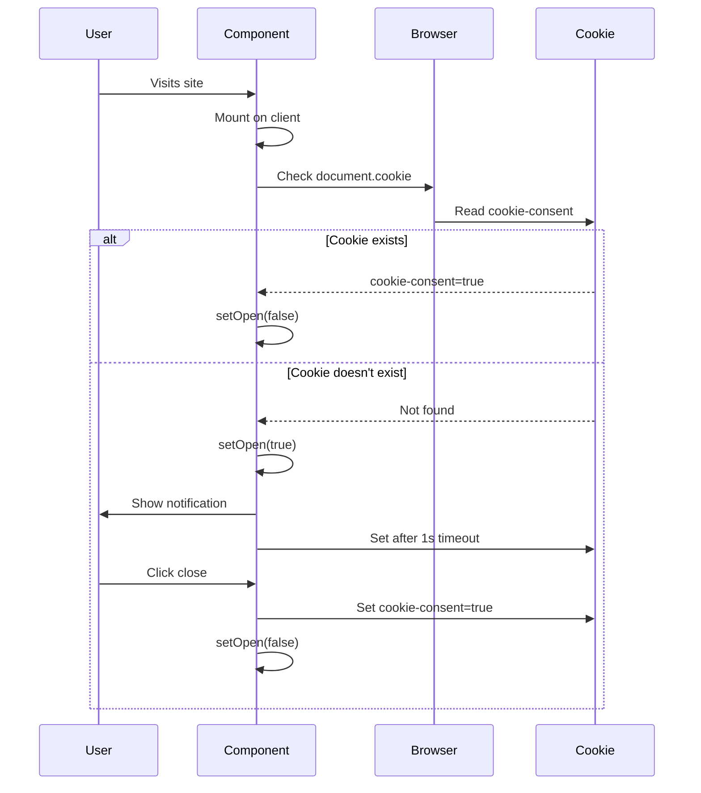

# Cookie Snackbar Component

This document details the CookieSnackbar component that manages cookie consent notifications.

## Overview

Location: [`src/components/cookie-snackbar/CookieSnackbar.tsx`](../../src/components/cookie-snackbar/CookieSnackbar.tsx)

The CookieSnackbar component displays a cookie consent notification to users when they first visit the site. It uses browser cookies to remember user consent and avoid showing the notification on subsequent visits.

## Component Structure



## Key Features

1. **Cookie Consent Management:** Tracks and stores user consent using browser cookies
2. **SSR/Client Safety:** Prevents hydration mismatches with mounted state
3. **Auto-dismiss:** Automatically sets consent cookie after 1 second if not dismissed
4. **Persistent Storage:** Stores consent for 1 year (31,536,000 seconds)
5. **MUI Integration:** Uses Material-UI Snackbar and Alert components
6. **Accessibility:** Includes proper ARIA labels for close button

## Implementation

### State Management

```typescript
const [mounted, setMounted] = useState(false); // Client-side hydration guard
const [open, setOpen] = useState(false); // Controls snackbar visibility
```

### Cookie Check Logic

```typescript
useEffect(() => {
	setMounted(true);

	// Check if consent cookie exists
	if (document.cookie.includes('cookie-consent=true')) {
		setOpen(false);
	} else {
		setOpen(true);
		// Auto-set cookie after 1 second
		setTimeout(() => {
			document.cookie = 'cookie-consent=true; max-age=31536000; path=/';
		}, 1000);
	}
}, []);
```

### Close Handler

```typescript
const handleClose = () => {
	document.cookie = 'cookie-consent=true; max-age=31536000; path=/';
	setOpen(false);
};
```

## Component Flow



## Cookie Details

**Cookie Name:** `cookie-consent`
**Cookie Value:** `true`
**Max Age:** 31,536,000 seconds (1 year)
**Path:** `/` (site-wide)

## SSR Considerations

The component uses a `mounted` state to prevent server-side rendering issues:

```typescript
const [mounted, setMounted] = useState(false);

useEffect(() => {
	setMounted(true);
	// Cookie logic here
}, []);

if (!mounted) return null;
```

This ensures:

- No cookie access during SSR (server has no `document.cookie`)
- No hydration mismatches between server and client
- Component only renders on client after mounting

## Accessibility

```tsx
<IconButton aria-label='close' color='inherit' onClick={handleClose} size='small'>
	<CloseRoundedIcon fontSize='small' />
</IconButton>
```

- **ARIA Label:** Close button has descriptive `aria-label`
- **Keyboard Accessible:** Full keyboard navigation support
- **Focus Management:** Proper focus indicators via MUI

## Testing

Test file: [`src/components/cookie-snackbar/CookieSnackbar.test.tsx`](../../src/components/cookie-snackbar/CookieSnackbar.test.tsx)

**Test Coverage:**

- Component renders on client
- Snackbar opens when cookie not present
- Snackbar closes when cookie exists
- Close button sets cookie and hides snackbar
- Auto-dismiss sets cookie after 1 second
- SSR safety (no crash on server)

## Integration

The component is rendered in [`GeneralLayout`](../../src/layouts/GeneralLayout.tsx):

```tsx
export default function GeneralLayout({ children }) {
	return (
		<div id='content'>
			<Navbar />
			<main>
				{children}
				<StarsBackground />
				<CookieSnackbar />
			</main>
			<Footer />
		</div>
	);
}
```

## Customization

To customize the cookie snackbar:

1. **Message:** Modify the text in the Alert component
2. **Cookie Duration:** Change `max-age=31536000` value
3. **Auto-dismiss Delay:** Adjust `setTimeout(() => {...}, 1000)` delay
4. **Severity:** Change `severity='info'` to `success`, `warning`, or `error`
5. **Position:** Add `anchorOrigin` prop to Snackbar for positioning

**Example Custom Position:**

```tsx
<Snackbar
	onClose={handleClose}
	open={open}
	anchorOrigin={{ vertical: 'bottom', horizontal: 'center' }}
>
```

## Related Documentation

- [GeneralLayout](../layouts.md)
- [Components Overview](./index.md)
- [MUI Snackbar Documentation](https://mui.com/material-ui/react-snackbar/)

---

**Tip:** The component automatically sets the consent cookie after 1 second to avoid interrupting the user experience while still meeting consent requirements.
