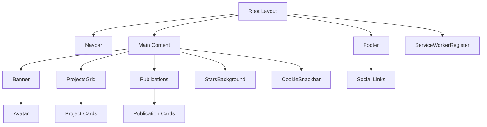
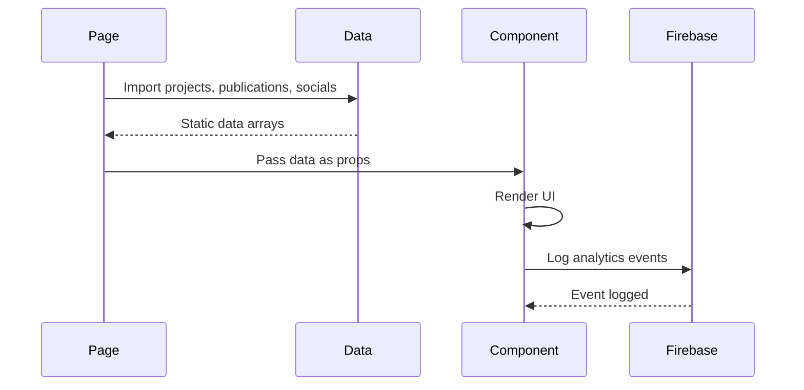
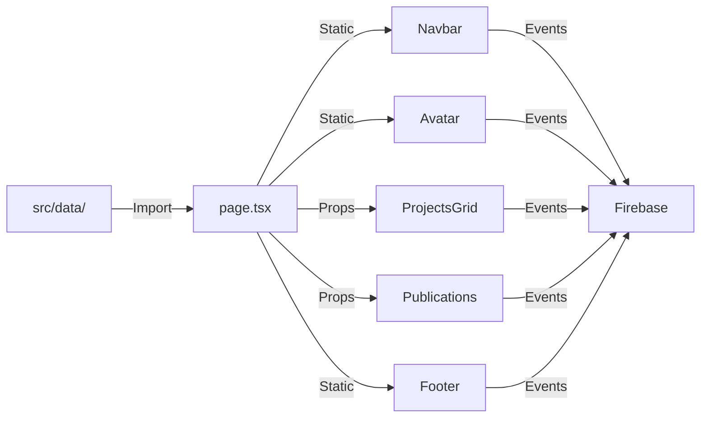

# Components Documentation

This document describes the internal architecture, relationships, and usage of major UI components in the AlexJSully Portfolio project. Components are modular, reusable, and styled with Material-UI and Emotion.

## Component List & Hierarchy

### Core Components

- [Navbar](./navbar.md): Top navigation bar with smooth scrolling
- [Banner & Avatar](./avatar.md): Header section with animated profile picture
- [ProjectsGrid](./projects.md): Displays project cards in a grid
- [Publications](./publications.md): Lists publications with metadata
- [Footer](./socials.md): Social media links and copyright
- [StarsBackground](./stars.md): Animated starfield background
- [CookieSnackbar](./cookie-snackbar.md): Cookie consent notification
- [ServiceWorkerRegister](../service-worker.md): PWA service worker registration

### Component Hierarchy



## Component Details

### Navbar

**Location:** [`src/components/navbar/Navbar.tsx`](../../src/components/navbar/Navbar.tsx)

Top navigation bar with smooth scrolling to page sections.

**Features:**

- Smooth scroll navigation
- Firebase Analytics tracking
- Responsive design
- Path-aware behavior

**See:** [Navbar Documentation](./navbar.md)

### Banner & Avatar

**Location:** [`src/components/banner/Banner.tsx`](../../src/components/banner/Banner.tsx), [`Avatar.tsx`](../../src/components/banner/Avatar.tsx)

Header section with animated profile picture featuring a sneeze animation and Easter egg.

**Features:**

- Interactive avatar with sneeze animation
- Easter egg trigger (6 sneezes activates AAAAHHHH transformation)
- Analytics tracking
- Image optimization

**See:** [Banner & Avatar Documentation](./avatar.md)

### ProjectsGrid

**Location:** [`src/components/projects/ProjectsGrid.tsx`](../../src/components/projects/ProjectsGrid.tsx)

Displays project cards in a responsive grid layout.

**Features:**

- Grid layout with MUI
- Project thumbnails and metadata
- External links with icons
- YouTube video embeds
- Analytics tracking
- Responsive design

**See:** [Projects Documentation](./projects.md)

### Publications

**Location:** [`src/components/publications/Publications.tsx`](../../src/components/publications/Publications.tsx)

Lists publications with authors, abstracts, and metadata.

**Features:**

- Publication cards with metadata
- DOI and journal links
- Related project linking
- Analytics tracking

**See:** [Publications Documentation](./publications.md)

### Footer

**Location:** [`src/components/footer/Footer.tsx`](../../src/components/footer/Footer.tsx)

Social media links and copyright information.

**Features:**

- Social media icon buttons
- Tooltips with platform names
- Responsive grid layout
- Analytics tracking

**See:** [Socials Documentation](./socials.md)

### StarsBackground

**Location:** [`src/components/Stars/StarsBackground.tsx`](../../src/components/Stars/StarsBackground.tsx)

Animated starfield background with twinkling stars.

**Features:**

- Dynamic star generation (50-100 stars)
- CSS animations for twinkling
- Fixed position background
- Performance optimized

**See:** [Stars Documentation](./stars.md)

### CookieSnackbar

**Location:** [`src/components/cookie-snackbar/CookieSnackbar.tsx`](../../src/components/cookie-snackbar/CookieSnackbar.tsx)

Cookie consent notification with localStorage persistence.

**Features:**

- Cookie consent management
- localStorage persistence
- MUI Snackbar integration
- Privacy compliance

**See:** [Cookie Snackbar Documentation](./cookie-snackbar.md)

### ServiceWorkerRegister

**Location:** [`src/components/ServiceWorkerRegister.tsx`](../../src/components/ServiceWorkerRegister.tsx)

Client component that registers the service worker for PWA functionality.

**Features:**

- Service worker registration
- Error handling
- Browser compatibility check

**See:** [Service Worker Documentation](../service-worker.md)

## Relationships & Composition

Components are composed in the [`GeneralLayout`](../../src/layouts/GeneralLayout.tsx):

```tsx
export default function GeneralLayout({ children }) {
	return (
		<div id='content'>
			<Navbar />
			<main>
				{children}
				<StarsBackground />
				<CookieSnackbar />
			</main>
			<footer>
				<Footer />
			</footer>
		</div>
	);
}
```

Data flow:



## How Components Work

**Component Organization:**

- Located in `src/components/`
- Grouped by feature (e.g., `banner/`, `projects/`)
- TypeScript with strong typing
- Path aliases for clean imports (`@components/`)

**Data Integration:**

- Import from `src/data/`
- TypeScript interfaces for type safety
- Props for component composition

**Styling:**

- Material-UI (MUI) components
- Emotion for CSS-in-JS
- Responsive design with MUI Grid/Stack
- Theme colors and typography

**Testing:**

- Jest for unit tests
- Cypress for E2E tests
- Test files colocated with components

## Component Data Flow



## Related Docs

- [Architecture Overview](../index.md)
- [Data Architecture](../data.md)
- [GeneralLayout](../layouts.md)
- [Firebase Configuration](../configs.md)
