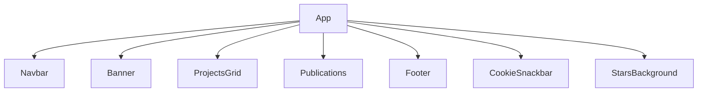

# Components Documentation

This document describes the internal architecture, relationships, and usage of major UI components in the AlexJSully Portfolio project. Components are modular, reusable, and styled with Material-UI and Emotion.

## 📦 Component List & Hierarchy

- [ProjectsGrid](./projects.md): Displays a grid of projects.
- [Publications](./publications.md): Lists publications.
- [Footer](./socials.md): Shows social media links.
- [Navbar](../architecture/index.md): Navigation bar (see architecture for layout details).
- [Banner, CookieSnackbar, StarsBackground]: Utility and visual components.

### Component Hierarchy

## 🔍 Component Details

- **Navbar:** Top navigation bar, links to sections. Handles navigation, accessibility, and analytics logging.
- **Banner:** Header section, may include avatar and intro. Displays profile and branding.
- **ProjectsGrid:** Displays project cards in a grid. Handles filtering, analytics, and responsive layout.
- **Publications:** Lists publications with metadata. Supports links to external resources.
- **Footer:** Social media links and copyright. Includes contact and resume links.
- **CookieSnackbar:** Shows cookie consent. Manages cookie state and user interaction.
- **StarsBackground:** Visual background effect. Renders animated stars for visual appeal.

## 🏗️ Relationships & Composition

- Components are composed in page layouts (see `GeneralLayout.tsx`).
- Data is passed via props or imported from `src/data/`.
- Styling is handled via MUI and Emotion.
- Utility components (Banner, CookieSnackbar, StarsBackground) are used for branding and user experience.

## 🧩 How Components Work

Components are located in `src/components/` and are imported using TypeScript path aliases (see `tsconfig.json`).
Each component is tested with Jest and/or Cypress for reliability.

## 🔗 Related Docs

- [Architecture Overview](../architecture/index.md)
- [Usage Guides](../usage/index.md)

---

💡 **Tip:** See each component's documentation for usage examples, diagrams, and integration details.
