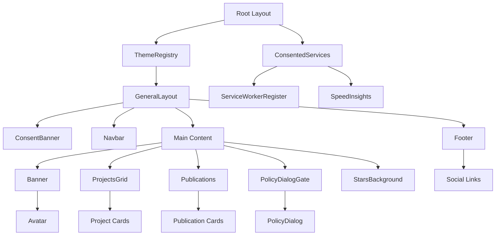
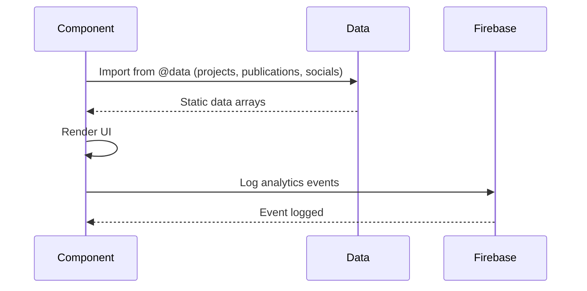
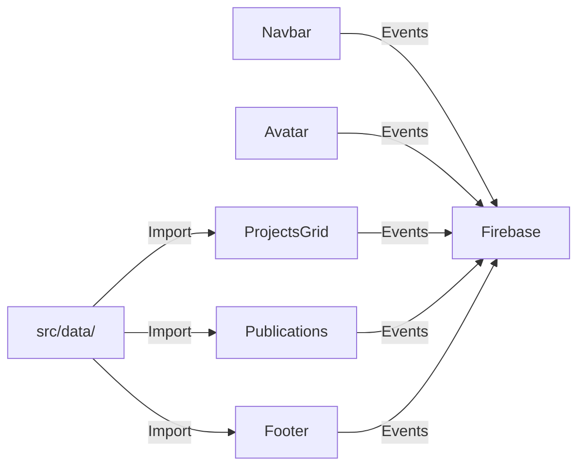

# Components Documentation

This document describes the internal architecture, relationships, and usage of major UI components in the Alexander Sullivan's Portfolio project. Components are modular, reusable, and styled with Material-UI and Emotion.

## Component List & Hierarchy

### Core Components

- [Navbar](./navbar.md): Top navigation bar with smooth scrolling
- [Banner & Avatar](./avatar.md): Header section with animated profile picture
- [ProjectsGrid](./projects.md): Displays project cards in a grid
- [Publications](./publications.md): Lists publications with metadata
- [Footer](./socials.md): Social media links, contact buttons, and attribution
- [StarsBackground](./stars.md): Animated starfield background
- [ConsentBanner, ConsentControls, and PolicyDialog](./consent-banner.md): The consent choices, their switches, and the privacy and cookie policy dialog
- [ConsentedServices](../consent.md): Starts each optional service once its purpose is allowed
- [PolicyDialogGate](../../../src/components/policy/gate/PolicyDialogGate.tsx): Loads the policy dialog's code once the page is idle and mounts the dialog the first time it is opened
- [LinkIcon](../../../src/components/link-icon/LinkIcon.tsx): The mark beside a phrase link: this site's icon for a same-site link, the linked site's icon once Link icons is allowed, a generated globe otherwise. `mailto:` links and the [PanelLink](../../../src/components/panel-link/PanelLink.tsx)s that open a dialog carry none
- [PanelLink](../../../src/components/panel-link/PanelLink.tsx): A link that opens a panel, such as the policy dialog, without changing the URL
- [PillButton](../../../src/components/pill-button/PillButton.tsx): The site's pill-shaped contained button, whose fill alone changes on hover, used by the footer, the consent banner, and the error and not-found pages
- [ServiceWorkerRegister](../service-worker.md): PWA service worker registration
- [ThemeRegistry](#themeregistry): Client boundary supplying the MUI theme to every component below it

### Component Hierarchy

```mermaid
flowchart TD
    accTitle: Page Component Composition Tree
    accDescr: Root Layout has two children: ThemeRegistry and ConsentedServices, which renders ServiceWorkerRegister and SpeedInsights once each is allowed. ThemeRegistry wraps GeneralLayout, which wraps ConsentBanner, Navbar, Main Content, and Footer. Main Content contains Banner, ProjectsGrid, Publications, PolicyDialogGate, and StarsBackground. PolicyDialogGate loads PolicyDialog. Banner contains Avatar. ProjectsGrid and Publications generate cards. Footer contains social links
    RootLayout[Root Layout] --> ThemeRegistry
    ThemeRegistry --> GeneralLayout
    RootLayout --> ConsentedServices
    ConsentedServices --> ServiceWorkerRegister
    ConsentedServices --> SpeedInsights
    GeneralLayout --> ConsentBanner
    GeneralLayout --> Navbar
    GeneralLayout --> Main[Main Content]
    GeneralLayout --> Footer

    Main --> Banner
    Main --> ProjectsGrid
    Main --> Publications
    Main --> PolicyDialogGate
    Main --> StarsBackground
    PolicyDialogGate --> PolicyDialog

    Banner --> Avatar

    ProjectsGrid --> ProjectCards[Project Cards]
    Publications --> PublicationCards[Publication Cards]
    Footer --> SocialLinks[Social Links]
```

## Component Details

### Navbar

**Location:** [`src/components/navbar/Navbar.tsx`](../../../src/components/navbar/Navbar.tsx)

Top navigation bar with smooth scrolling to page sections.

**Features:**

- Smooth scroll navigation
- Firebase Analytics tracking
- Responsive design
- Path-aware behavior

**See:** [Navbar Documentation](./navbar.md)

### Banner & Avatar

**Location:** [`src/components/banner/Banner.tsx`](../../../src/components/banner/Banner.tsx), [`Avatar.tsx`](../../../src/components/banner/Avatar.tsx)

Header section with animated profile picture featuring a sneeze animation and Easter egg.

**Features:**

- Interactive avatar with sneeze animation
- Easter egg trigger (the sixth sneeze trigger runs the AAAAHHHH transformation in place of a sixth sneeze)
- Analytics tracking
- Image optimization

**See:** [Banner & Avatar Documentation](./avatar.md)

### ProjectsGrid

**Location:** [`src/components/projects/ProjectsGrid.tsx`](../../../src/components/projects/ProjectsGrid.tsx)

Displays project cards in a responsive grid layout.

**Features:**

- Grid layout with MUI
- Project thumbnails and metadata
- External links with icons
- YouTube video embeds
- Analytics tracking
- Responsive design

**See:** [Projects Documentation](./projects.md)

### Publications

**Location:** [`src/components/publications/Publications.tsx`](../../../src/components/publications/Publications.tsx)

Lists publications with authors, abstracts, and metadata.

**Features:**

- Publication cards with metadata
- Card links to the publication's DOI page, with the DOI itself a separate icon link
- Analytics tracking

**See:** [Publications Documentation](./publications.md)

### Footer

**Location:** [`src/components/footer/Footer.tsx`](../../../src/components/footer/Footer.tsx)

Social media links, contact buttons (email and resume), and an open-source attribution.

**Features:**

- Social media icon buttons
- Tooltips with platform names
- Responsive grid layout
- Analytics tracking

**See:** [Socials Documentation](./socials.md)

### StarsBackground

**Location:** [`src/components/Stars/StarsBackground.tsx`](../../../src/components/Stars/StarsBackground.tsx)

Animated starfield background with twinkling stars.

**Features:**

- Dynamic star generation (10 to maxStars/2, capped at 600)
- CSS animations for twinkling
- Fixed position background
- Performance optimized

**See:** [Stars Documentation](./stars.md)

### ConsentBanner

**Location:** [`src/components/consent/banner/ConsentBanner.tsx`](../../../src/components/consent/banner/ConsentBanner.tsx)

Asks which optional purposes to allow, with equally weighted "Essential only" and "Accept all" buttons and a "Customize" view of per-purpose switches. "Cookie settings" in the footer reopens it.

**See:** [Consent Banner Documentation](./consent-banner.md)

### ServiceWorkerRegister

**Location:** [`src/components/ServiceWorkerRegister.tsx`](../../../src/components/ServiceWorkerRegister.tsx)

Client component that registers the service worker for PWA functionality. [ConsentedServices](../../../src/components/consent/services/ConsentedServices.tsx) mounts it only once the visitor allows Offline access.

**Features:**

- Service worker registration
- Error handling
- Browser compatibility check

**See:** [Service Worker Documentation](../service-worker.md)

### ThemeRegistry

**Location:** [`src/components/ThemeRegistry.tsx`](../../../src/components/ThemeRegistry.tsx)

Supplies the MUI theme from [`theme.ts`](../../../src/styles/theme.ts) to everything beneath it, by wrapping its children in MUI's `ThemeProvider`.

It exists as a component of its own because `ThemeProvider` needs a client boundary. Taking `children` as a prop rather than importing the subtree means the components it wraps stay server-rendered: only the provider itself crosses into the client bundle. The theme it supplies adds one breakpoint, `xxl` at 2560px, past MUI's default `xl`, which is what lets [ProjectsGrid](../../../src/components/projects/ProjectsGrid.tsx) widen its card grid on ultra-wide displays. It also sets the dark palette, the site's only appearance, from the colour tokens in [`tokens.ts`](../../../src/styles/tokens.ts), keeping primary and secondary at the blue and purple the buttons were designed with.

## Relationships & Composition

[`GeneralLayout`](../../../src/layouts/GeneralLayout.tsx) composes the site-wide components. Its root `
` is a flex column holding four children in order: the ConsentBanner, the Navbar, a `<main>` element carrying `flex: '1 0 auto'` so it absorbs the leftover height, and a `<footer>` wrapping the Footer component. The page children, StarsBackground, and PolicyDialogGate sit inside that `<main>`. Full structure: [Layouts](../layouts.md).

Data flow:

```mermaid
sequenceDiagram
    accTitle: Component Data Integration and Analytics Flow
    accDescr: Each component imports its own static data directly from the data modules, renders the UI, and logs analytics events to Firebase
    participant Component
    participant Data
    participant Firebase

    Component->>Data: Import from @data (projects, publications, socials)
    Data-->>Component: Static data arrays
    Component->>Component: Render UI
    Component->>Firebase: Log analytics events
    Firebase-->>Component: Event logged
```

## How Components Work

**Component Organization:**

- Located in `src/components/`
- Grouped by feature (e.g., `banner/`, `projects/`)
- TypeScript with strong typing
- Path aliases for clean imports (`@components/`)

**Data Integration:**

- Import from `src/data/`
- TypeScript interfaces for type safety
- Props for component composition

**Styling:**

- Material-UI (MUI) components
- Emotion for CSS-in-JS
- Responsive design with MUI Grid/Stack
- Theme colors and typography

**Testing:**

- Jest for unit tests
- Cypress for E2E tests
- Test files colocated with components

## Component Data Flow

```mermaid
flowchart LR
    accTitle: Component Data and Event Flow
    accDescr: ProjectsGrid, Publications, and Footer import their static data directly from the data modules. These components, along with Navbar and Avatar, log events to Firebase
    Data[src/data/] -->|Import| ProjectsGrid
    Data -->|Import| Publications
    Data -->|Import| Footer

    Navbar -->|Events| Firebase[Firebase]
    Avatar -->|Events| Firebase
    ProjectsGrid -->|Events| Firebase
    Publications -->|Events| Firebase
    Footer -->|Events| Firebase
```

## Related Docs

- [Architecture Overview](../index.md)
- [Data Architecture](../data.md)
- [GeneralLayout](../layouts.md)
- [Firebase Configuration](../configs.md)
