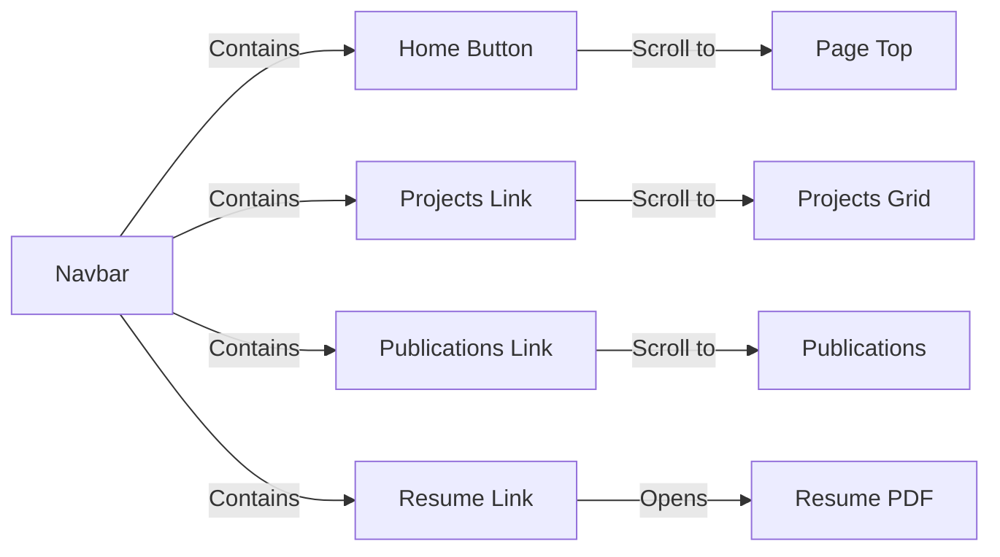
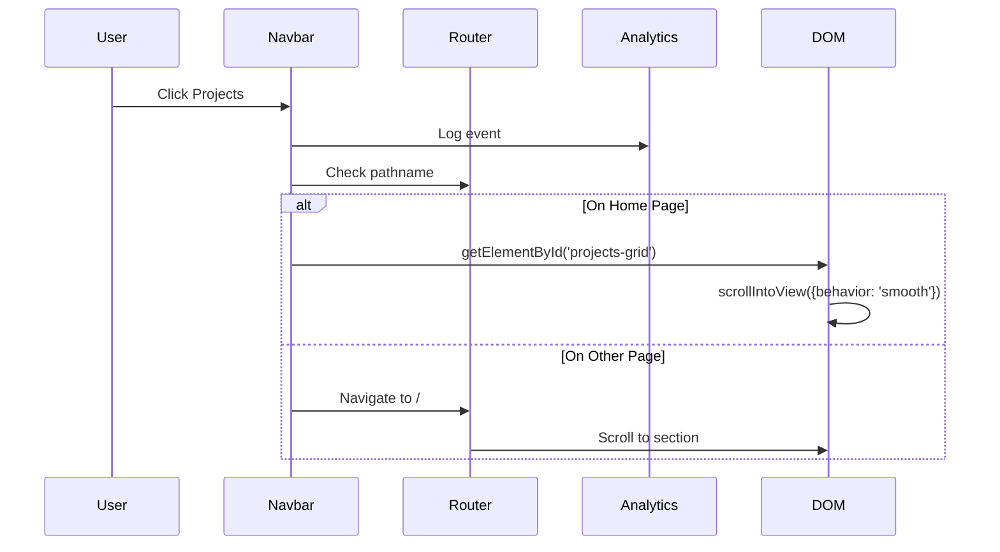

# Navbar Component Documentation

This document details the navigation bar component that provides site-wide navigation and smooth scrolling.

## Overview

The Navbar component is a fixed-position navigation bar located in [`src/components/navbar/Navbar.tsx`](../../src/components/navbar/Navbar.tsx). It provides navigation links with smooth scrolling behavior and analytics tracking.

## Component Structure



## Key Features

### 1. Smooth Scrolling Navigation

The navbar uses smooth scrolling to navigate to page sections:

```typescript
onClick={(e) => {
	logAnalyticsEvent('navbar_projects', {
		name: 'navbar_projects',
		type: 'click',
	});

	if (pathname === '/') {
		e.preventDefault();
		document.getElementById('projects-grid')?.scrollIntoView({ behavior: 'smooth' });
	}
}};
```

### 2. Analytics Integration

Each navigation action is logged using Firebase Analytics:

```typescript
logAnalyticsEvent('navbar_home', {
	name: 'navbar_home',
	type: 'click',
});
```

**Tracked Events:**

- `navbar_home` - Home button click
- `navbar_projects` - Projects link click
- `navbar_publications` - Publications link click
- `navbar_resume` - Resume link click

### 3. Responsive Design

Built with Material-UI AppBar and Toolbar:

```typescript
<AppBar
	sx={{
		backgroundColor: '#131518',
		transition: 'all 0.5s ease-in-out',
	}}
>
	<Toolbar
		sx={{
			fontSize: '1.25rem',
			height: '2rem',
			justifyContent: 'space-between',
			transition: 'all 0.5s ease-in-out',
			zIndex: 10,
		}}
	>
		{/* Navigation items */}
	</Toolbar>
</AppBar>
```

### 4. Path-aware Behavior

Uses Next.js `usePathname` hook to determine behavior:

```typescript
const pathname = usePathname();

// On home page, prevent default and smooth scroll
// On other pages, navigate to home first
if (pathname === '/') {
	e.preventDefault();
	document.getElementById('content')?.scrollIntoView({ behavior: 'smooth' });
}
```

## Navigation Items

### Home Button

**Icon:** `HomeRoundedIcon` from MUI
**Target:** Page top (`#content`)
**Tooltip:** "Home"

```tsx
<Link aria-label='Home' href='/'>
	<Tooltip arrow describeChild title='Home'>
		<IconButton aria-label='Home button'>
			<HomeRoundedIcon />
		</IconButton>
	</Tooltip>
</Link>
```

### Projects Link

**Target:** `#projects-grid` section
**Text:** "Projects"

### Publications Link

**Target:** `#publications` section
**Text:** "Publications"

### Resume Link

**Target:** External PDF (`/resume/resume.pdf`)
**Behavior:** Opens in new tab

```tsx
<Link
	aria-label='See resume'
	href='/resume/resume.pdf'
	onClick={() => {
		logAnalyticsEvent('navbar_resume', {
			name: 'navbar_resume',
			type: 'click',
		});
	}}
	rel='noopener noreferrer'
	target='_blank'
>
	Resume
</Link>
```

## Interaction Flow



## Accessibility Features

1. **ARIA Labels:** All links have descriptive `aria-label` attributes
2. **Tooltips:** Visual feedback for icon buttons
3. **Keyboard Navigation:** Fully keyboard accessible
4. **Focus Management:** Proper focus indicators
5. **Semantic HTML:** Uses proper `<Link>` and `<IconButton>` components

## Styling

**Colors:**

- Background: `#131518` (dark gray)
- Text: Inherited from theme
- Hover: MUI default hover state

**Transitions:**

- All transitions: `0.5s ease-in-out`
- Height: `2rem`
- z-index: `10` (ensures navbar stays on top)

## Testing

Test file: [`src/components/navbar/Navbar.test.tsx`](../../src/components/navbar/Navbar.test.tsx)

**Test Coverage:**

- Component renders
- Navigation links present
- Click handlers fire
- Analytics events logged
- Smooth scroll behavior
- External links open correctly

## Usage Example

```tsx
import Navbar from '@components/navbar/Navbar';

// In layout or page
<Navbar />;
```

## Integration with Layout

The Navbar is rendered in the [`GeneralLayout`](../../src/layouts/GeneralLayout.tsx):

```tsx
export default function GeneralLayout({ children }) {
	return (
		<div id='content'>
			<Navbar />
			<main>{children}</main>
			<Footer />
		</div>
	);
}
```

## Scroll Target IDs

The component relies on the following element IDs:

- `content` - Page container
- `projects-grid` - Projects section
- `publications` - Publications section

Ensure these IDs exist in your page structure.

## Performance Considerations

- **Client Component:** Uses `'use client'` for browser APIs
- **Lightweight:** Minimal re-renders
- **Fixed Position:** Always visible during scroll
- **Analytics Batching:** Firebase handles event batching

## Related Documentation

- [GeneralLayout](./layouts.md)
- [Firebase Analytics](./configs.md#firebase-configuration-and-usage)
- [Components Overview](./index.md)

---

💡 **Tip:** Use descriptive `aria-label` and `id` attributes for smooth scrolling to work correctly.
