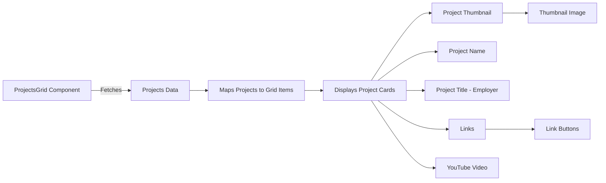

# Projects Documentation

## Overview

This document explains how the projects grid is displayed and how to add new projects to the codebase.

## Projects Grid Display

The projects grid is displayed using the `ProjectsGrid` component located in [ProjectsGrid.tsx](../../src/components/projects/ProjectsGrid.tsx). This component creates a grid layout to showcase the projects.

### Key Elements

- **State Management:** Uses React `useState` to toggle featured/all projects.
- **Grid Layout:** Responsive grid via MUI Grid/Stack.
- **Project Cards:** Thumbnail, name, title, employer, resource links.

### Flowchart



```ts
{
  name: 'Project Name',
  title: 'Project Title',
  employer: 'Employer',
  thumbnail: 'image/path',
  links: [{ type: 'github', url: '...' }],
  // ...other fields
}
```

## 🔗 Related Docs

- [Component Overview](./index.md)
- [System Architecture](../architecture/index.md)

```json
{
	"name": "Project Name",
	"id": "project-id", // unique identifier for the project (associated with the image file name or publication)
	"description": "Project description", // optional
	"employer": "Employer Name", // optional
	"employerURL": "https://employer-website.com", // required if employer is provided
	"title": "Job Title",
	"publication": "https://publication-url.com", // optional
	"type": "Employment", // or 'Personal Project', 'School (MSc)', etc.
	"url": "https://project-url.com", // optional
	"urls": [
		// this is used to create a series of buttons with links
		{
			"text": "Link Text",
			"tooltip": "Tooltip description",
			"icon": "IconComponent", // this is a JSX component
			"url": "https://link-url.com"
		}
	],
	"color": "#colorCode",
	"dates": {
		"startDate": "YYYY-MM",
		"endDate": "YYYY-MM" // or current if ongoing
	},
	"showcase": true, // or false
	"objectFit": "contain", // optional, cover is used if nothing is provided
	"youtubeURL": "https://www.youtube.com/embed/{videoID}?autoplay=1&mute=1&cc_load_policy=1&controls=1" // optional: displays a YouTube video to play in the card if mouse hovered over
}
```

### Adding Thumbnail Images

To add a thumbnail image for the new project, place the image in the appropriate directory:

1. **Navigate to the images directory**: Go to the [public image projects directory](../../public/images/projects).
2. **Create a new directory**: Create a new directory with the project ID (e.g., `new-project`).
3. **Add the thumbnail image**: Place the thumbnail image in the new directory and name it `thumbnail.webp`. Recommended to use `.webp` format for better performance.

By following these steps, you can successfully add new projects to the projects grid.
