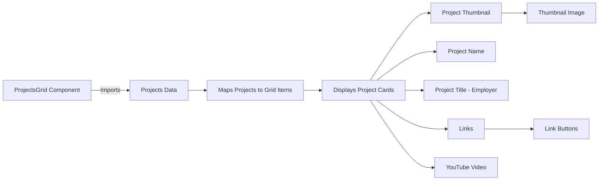

# Projects Documentation

## Overview

This document explains how the projects grid is displayed and how to add new projects to the codebase.

## Projects Grid Display

The projects grid is displayed using the `ProjectsGrid` component located in [ProjectsGrid.tsx](../../../src/components/projects/ProjectsGrid.tsx). This component creates a grid layout to showcase the projects.

### Key Elements

- **State Management:** Uses React `useState` and local component state to manage view toggles and UI interactions.
- **Grid Layout:** Responsive grid via MUI `Grid`/`Stack` and CSS-in-JS styles.
- **Project Cards:** Thumbnail, name, title, employer, resource links. The component imports the project data from `src/data/projects.ts`.
- **Analytics:** The component calls `logAnalyticsEvent` for user interactions (e.g., clicking a project link or viewing details).
- **Network-Aware:** Uses `isNetworkFast()` utility to conditionally enable video autoplay.
- **Hover Delay:** Uses `DELAYS.PROJECT_HOVER_VIDEO` (1000ms) before showing videos on hover.
- **Memory Management:** Cleans up timeout on component unmount to prevent memory leaks.

### Flowchart

```mermaid
flowchart LR
    accTitle: Projects Grid Data Flow
    accDescr: ProjectsGrid component imports projects data, maps to grid items, displays project cards with thumbnail image, name, title/employer, and action links. Includes network-aware video autoplay
    A[ProjectsGrid Component] -->|Imports| B[Projects Data]
    B --> C[Maps Projects to Grid Items]
    C --> D[Displays Project Cards]
    D --> E[Project Thumbnail]
    D --> F[Project Name]
    D --> G[Project Title - Employer]
    D --> I[Links]
    E --> J[Thumbnail Image]
    I --> K[Link Buttons]
    D --> L[YouTube Video]
```

### Showing all projects

Every project is rendered into the grid, but a card whose `showcase` is not `true` is laid out with `display: 'none'` until the reader presses "View More Projects". The heading tracks the same state, reading "Featured Projects" or "All Projects". Toggling also scrolls the grid back into view, but only when the grid title has left the viewport, so pressing the button while the heading is already on screen does not move the page.

## Adding a project

Add an object to the `projects` array in [projects.ts](../../../src/data/projects.ts). The `Projects` interface in that same file is the authority on the shape; each field carries its own documentation comment there. Six fields are required:

- `name`, the display name on the card
- `id`, unique, and reused as the thumbnail directory name
- `title`, the role or subtitle shown beneath the name
- `url`, where the card links
- `urls`, the array of buttons, each with `text`, `tooltip`, `icon`, and `url`
- `color`, a hex string the card tints its background and border with

The rest are optional: `description`, `employer` and `employerURL` (supply `employerURL` whenever `employer` is set, since the employer renders as a link), `publication`, `type`, `dates`, `showcase`, `objectFit` (defaults to `cover`), and `youtubeURL`.

Supply `youtubeURL` as an embed URL to give the card a hover video. Autoplay is not part of the stored value: [ProjectsGrid](../../../src/components/projects/ProjectsGrid.tsx) appends `&autoplay=1` at render time, and only when [`isNetworkFast()`](../../../src/util/isNetworkFast.ts) reports a fast connection.

### Adding Thumbnail Images

The card builds its image path from the project ID, as `/images/projects/{id}/thumbnail.webp`, so the directory name and the file name are both fixed by the code rather than configurable:

1. **Create a new directory** under the projects image directory, named exactly the project's `id`.
2. **Add the thumbnail image** to that directory, named `thumbnail.webp`.

A mismatched directory name produces a card with a broken image and no error, since nothing validates the path at build time.

## Related Docs

- [Component Overview](./index.md)
- [Data Architecture](../data.md) - The `Projects` interface and how data reaches components
- [Images & Icons](../images.md) - Thumbnail conventions and the icon system
- [System Architecture](../index.md)
