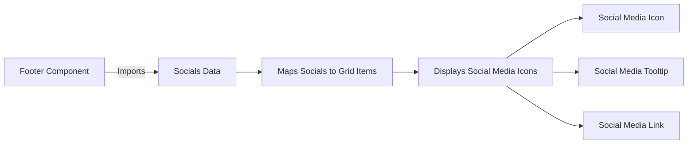

# Socials Documentation

The social links in the footer are driven entirely by one data file, so adding a platform is a data change rather than a component change. This document covers how they render and what an entry has to supply.

## Overview

This document explains how the social media links are displayed and how to add new social media links to the codebase.

## Social Media Links Display

The social media links are displayed using the `Footer` component located in [Footer.tsx](../../../src/components/footer/Footer.tsx). This component creates a grid layout to showcase the social media links.

### Key Elements

- **Grid Layout**: The social media links are displayed in a responsive grid layout using Material-UI's `Grid` and `Tooltip` components.
- **Social Media Icons**: Each social media link is displayed as an icon button with a tooltip.

### Flowchart



## Adding New Social Media Links

To add new social media links, update the `socials` array in [socials.ts](../../../src/data/socials.ts).

### Steps to Add a New Social Media Link

1. Open the [socials.ts](../../../src/data/socials.ts) file.
2. Add a new object to the socials array with the following structure:

    ```typescript
    {
    	name: 'Social Media Name',
    	url: 'https://social-media-url.com',
    	icon: SocialMediaIconComponent,
    	color: '#colorCode',
    }
    ```

The `icon` value is the component itself, not an element: [Footer](../../../src/components/footer/Footer.tsx) invokes it as `social.icon({})`, so pass an export from [icons.tsx](../../../src/images/icons.tsx) such as `GitHubIcon`. The `color` value tints the icon and its drop shadow on hover, falling back to the theme's `primary.main` when absent, and `name` does triple duty as the tooltip text, the accessible label, and the suffix of the analytics event, which is built as `` `footer-${social.name.toLowerCase()}` `` and therefore keeps any spaces in the name.

## Related Documentation

- [Components Overview](./index.md)
- [Data Architecture](../data.md) - How the socials array reaches the footer
- [Images & Icons](../images.md) - Where the icon components come from
