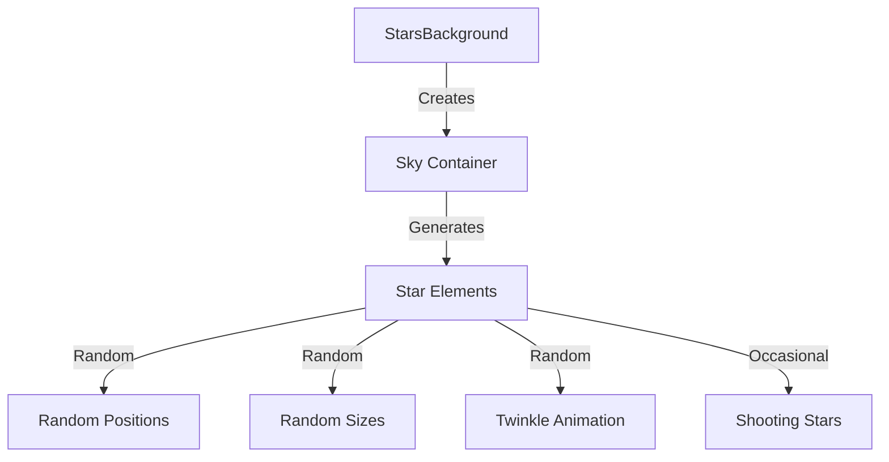
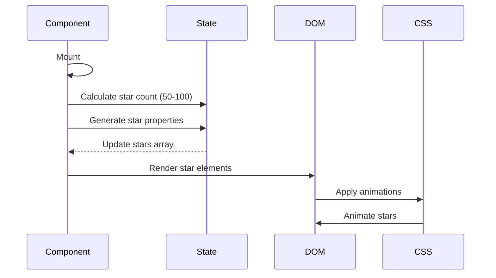
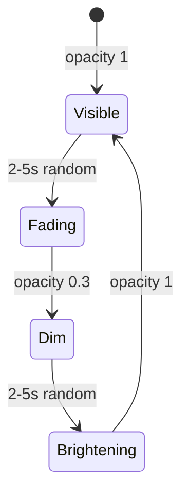

# Stars Background Component

This document details the StarsBackground component that creates an animated starfield background effect.

## Overview

Location: [`src/components/Stars/StarsBackground.tsx`](../../src/components/Stars/StarsBackground.tsx)

The StarsBackground component creates a visually appealing animated background with twinkling stars and occasional shooting stars.

## Component Structure



## Key Features

### 1. Dynamic Star Generation

Stars are generated on component mount based on window width:

```typescript
useEffect(() => {
  const maxStars = typeof window !== 'undefined' && window?.innerWidth ? window?.innerWidth : 400;
  const numberOfStars = Math.floor(Math.random() * (maxStars / 2)) + 10;

  const starsArray: ReactElement[] = [];

  for (let i = 0; i < numberOfStars; i += 1) {
    const starSize = `${Math.random() * 5 + 1}px`;

    const style = {
      background: `#ffffff50`,
      borderRadius: '50%',
      opacity: 0.5,
      position: 'absolute',
      transition: 'transform 1s',
      animation: `twinkle ${Math.random() * 5}s ease-in-out infinite`,
      width: starSize,
      height: starSize,
      top: `${Math.random() * 100}vh`,
      left: `${Math.random() * 100}vw`,
    };

    starsArray.push(<Box key={i} data-testid='star' sx={style} onMouseEnter={handleStarAnimation} />);
  }

  setStars(starsArray);
}, []);
```

**Star Count:** Based on window width (10 to width/2 stars)

### 2. Star Properties

Each star has:

- **Position:** Random coordinates using viewport units (`vh`, `vw`) for consistent sizing
- **Size:** Random size between 1-6px
- **Animation:** Infinite twinkling with random duration (0-5 seconds)
- **Opacity:** Semi-transparent at 0.5 for a softer appearance
- **Background:** White with 50% opacity (`#ffffff50`)

### 3. Twinkle Animation

Stars twinkle using CSS animations applied through the `sx` prop. Each star receives:

- **animation:** `twinkle` with dynamic duration (using template literal with `star.animationDuration`) set to infinite
- **animationDelay:** Random delay from `star.animationDelay` for staggered effect

The `twinkle` keyframe animation should be defined in global styles:

```scss
@keyframes twinkle {
	0%,
	100% {
		opacity: 1;
	}
	50% {
		opacity: 0.3;
	}
}
```

### 4. Shooting Stars

Stars can become shooting stars on hover or through automatic triggering:

```typescript
import { THRESHOLDS } from '@constants/index';

const handleStarAnimation = (e: React.MouseEvent<HTMLElement> | { target: HTMLElement }): void => {
	const target = e.target as HTMLElement;
	const shootingStarSpeed = Math.random() * 4 + 1;

	target.style.animation = `shootAway ${shootingStarSpeed}s forwards`;
	target.style.background = '#fff90050';
	target.style.transform = `scale(${Math.random() * 2 + 1})`;

	setTimeout(() => {
		if (target) {
			target.setAttribute('data-star-used', 'true');
		}
	}, shootingStarSpeed * 1000);
};
```

**Automatic Shooting Stars:**

If there are more than `THRESHOLDS.MIN_STARS_FOR_ANIMATION` (15) unused stars, the component automatically triggers random shooting star animations:

```typescript
const handleForceStarAnimation = () => {
	const allStars = Array.from(document.querySelectorAll('[data-testid="star"]')).filter(
		(star) => star.getAttribute('data-star-used') !== 'true',
	);

	if (!isEmpty(allStars) && allStars.length > THRESHOLDS.MIN_STARS_FOR_ANIMATION) {
		const randomStar = allStars[Math.floor(Math.random() * allStars.length)] as HTMLElement;
		if (randomStar) {
			handleStarAnimation({ target: randomStar });
		}

		const randomTime = Math.random() * 5 + 1.5;
		forceAnimationTimeoutRef.current = setTimeout(() => {
			handleForceStarAnimation();
		}, randomTime * 1000);
	}
};
```

## Rendering Flow



## Accessibility

The component uses proper ARIA attributes for screen readers:

- `id='sky'` - Unique identifier for the container
- `aria-label='Starry background'` - Descriptive label for assistive technologies
- `component='div'` - Renders as a div element
- `role='img'` - Identifies as an image for screen readers
- `sx` prop contains styling with spread operator for dynamic styles

**Note:** Unlike decorative backgrounds that use `aria-hidden='true'`, this component uses `role='img'` with an `aria-label` because it's a significant visual element of the user experience.

## Performance Considerations

1. **Fixed Position:** Uses `position: fixed` to avoid reflow
2. **Controlled Overflow:** `overflow: hidden` prevents scrollbars
3. **GPU Acceleration:** CSS animations use GPU when possible
4. **Single Generation:** Stars generated once on mount, not on every render
5. **Dynamic Count:** Star count based on viewport width for responsive performance
6. **Memory Cleanup:** Clears timeout on unmount to prevent memory leaks
7. **Fade Effect:** Uses MUI Fade component for smooth appearance
8. **Analytics Throttling:** First hover tracked, subsequent hovers don't spam analytics

**Cleanup Logic:**

```typescript
useEffect(() => {
	createStars();

	// Cleanup timeout on unmount to prevent memory leaks
	return () => {
		if (forceAnimationTimeoutRef.current) {
			clearTimeout(forceAnimationTimeoutRef.current);
		}
	};
}, []);
```

## Integration

The component is rendered in [`GeneralLayout`](../../src/layouts/GeneralLayout.tsx):

```tsx
export default function GeneralLayout({ children }) {
	return (
		<div id='content'>
			<Navbar />
			<main>
				{children}
				<StarsBackground />
				<CookieSnackbar />
			</main>
			<Footer />
		</div>
	);
}
```

## Testing

Test file: [`src/components/Stars/StarsBackground.test.tsx`](../../src/components/Stars/StarsBackground.test.tsx)

**Test Coverage:**

- Component renders
- Stars are created on mount
- Star count is within range (50-100)
- Stars have proper data-testid
- Accessibility attributes present
- Performance with large star counts

## Customization

To customize the background:

1. **Star Count:** Adjust `Math.floor(Math.random() * (maxStars / 2)) + 10` in `createStars()`
2. **Star Size:** Modify `Math.random() * 5 + 1` (currently 1-6px)
3. **Animation Speed:** Change `Math.random() * 5` for twinkle duration
4. **Shooting Star Speed:** Adjust `Math.random() * 4 + 1` in `handleStarAnimation`
5. **Background Color:** Inherited from global `body` background (`#131518`)
6. **Star Color:** Modify `background: '#ffffff50'` in `starStyles`
7. **Auto-trigger Threshold:** Update `THRESHOLDS.MIN_STARS_FOR_ANIMATION` in constants
8. **Initial Trigger Delay:** Update `DELAYS.STAR_ANIMATION_INITIAL` in constants

## Visual Effect



## Related Documentation

- [GeneralLayout](../layouts.md)
- [Components Overview](./index.md)
- [Global Styles](../../src/styles/globals.scss)

---

💡 **Tip:** The starfield creates depth and visual interest without distracting from content. Keep star count reasonable for performance.
