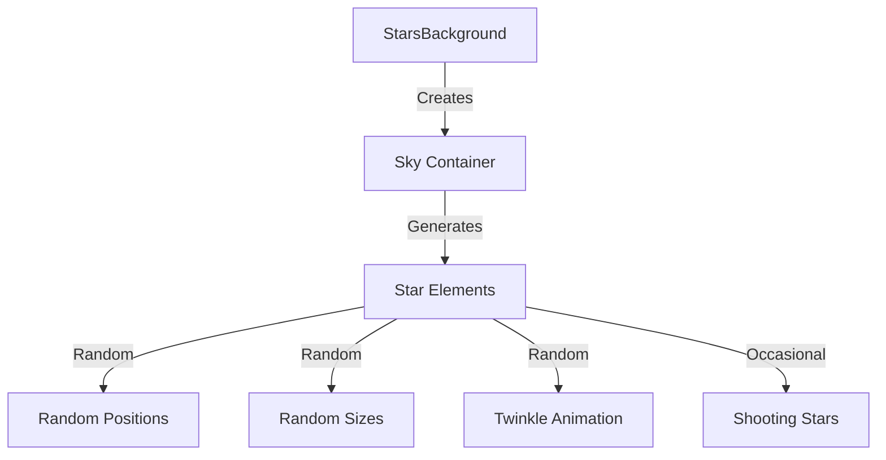
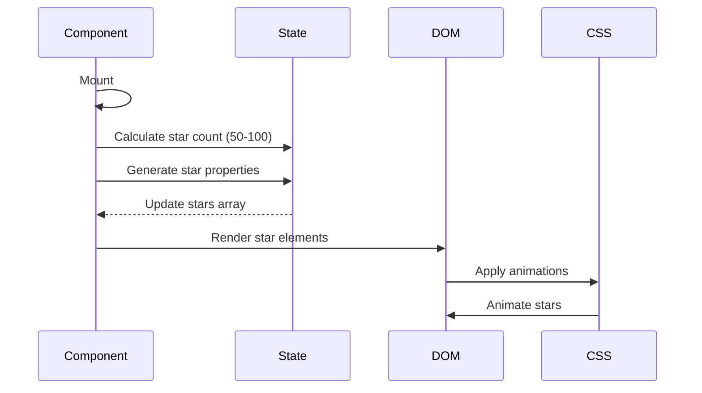
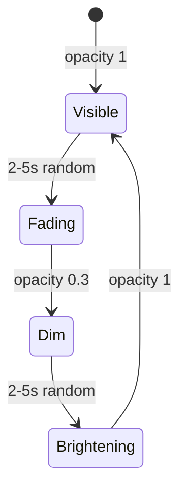

# Stars Background Component

This document details the StarsBackground component that creates an animated starfield background effect.

## Overview

Location: [`src/components/Stars/StarsBackground.tsx`](../../src/components/Stars/StarsBackground.tsx)

The StarsBackground component creates a visually appealing animated background with twinkling stars and occasional shooting stars.

## Component Structure



## Key Features

### 1. Dynamic Star Generation

Stars are generated on component mount with random properties:

```typescript
useEffect(() => {
	const starCount = Math.floor(Math.random() * 50) + 50; // 50-100 stars

	const newStars = Array.from({ length: starCount }, (_, i) => ({
		id: i,
		top: `${Math.random() * 100}%`,
		left: `${Math.random() * 100}%`,
		size: Math.random() * 3 + 1, // 1-4px
		animationDuration: `${Math.random() * 3 + 2}s`, // 2-5s
		animationDelay: `${Math.random() * 5}s`,
	}));

	setStars(newStars);
}, []);
```

### 2. Star Properties

Each star has:

- **Position:** Random top and left coordinates (0-100%)
- **Size:** Random size between 1-4px
- **Animation Duration:** Random duration 2-5 seconds
- **Animation Delay:** Random delay 0-5 seconds

### 3. Twinkle Animation

Stars twinkle using CSS animations:

```typescript
sx={{
	animation: `twinkle ${star.animationDuration} infinite`,
	animationDelay: star.animationDelay,
}};
```

The `twinkle` animation should be defined in global styles:

```scss
@keyframes twinkle {
	0%,
	100% {
		opacity: 1;
	}
	50% {
		opacity: 0.3;
	}
}
```

### 4. Shooting Stars

Occasionally, stars become shooting stars (implementation detail may vary).

## Component Implementation

```tsx
'use client';

import { Box } from '@mui/material';
import { useEffect, useState } from 'react';

export default function StarsBackground() {
	const [stars, setStars] = useState<Star[]>([]);

	useEffect(() => {
		// Generate stars on mount
		const starCount = Math.floor(Math.random() * 50) + 50;
		const newStars = Array.from({ length: starCount }, (_, i) => ({
			id: i,
			top: `${Math.random() * 100}%`,
			left: `${Math.random() * 100}%`,
			size: Math.random() * 3 + 1,
			animationDuration: `${Math.random() * 3 + 2}s`,
			animationDelay: `${Math.random() * 5}s`,
		}));
		setStars(newStars);
	}, []);

	return (
		<Box
			id='sky'
			aria-hidden='true'
			sx={{
				position: 'fixed',
				top: 0,
				left: 0,
				width: '100%',
				height: '100%',
				backgroundColor: '#131518',
				zIndex: -1,
				overflow: 'hidden',
			}}
		>
			{stars.map((star) => (
				<Box
					key={star.id}
					data-testid='star'
					sx={{
						position: 'absolute',
						top: star.top,
						left: star.left,
						width: `${star.size}px`,
						height: `${star.size}px`,
						backgroundColor: 'white',
						borderRadius: '50%',
						animation: `twinkle ${star.animationDuration} infinite`,
						animationDelay: star.animationDelay,
					}}
				/>
			))}
		</Box>
	);
}
```

## Rendering Flow



## Accessibility

The component uses `aria-hidden='true'` because the background is purely decorative:

```tsx
<Box id='sky' aria-hidden='true' sx={{...}}>
```

## Performance Considerations

1. **Fixed Position:** Uses `position: fixed` to avoid reflow
2. **z-index: -1:** Renders behind content
3. **GPU Acceleration:** CSS animations use GPU when possible
4. **Random Generation:** Stars generated once on mount, not on every render
5. **Controlled Count:** Limited to 50-100 stars for performance

## Integration

The component is rendered in [`GeneralLayout`](../../src/layouts/GeneralLayout.tsx):

```tsx
export default function GeneralLayout({ children }) {
	return (
		<div id='content'>
			<Navbar />
			<main>
				{children}
				<StarsBackground />
				<CookieSnackbar />
			</main>
			<Footer />
		</div>
	);
}
```

## Testing

Test file: [`src/components/Stars/StarsBackground.test.tsx`](../../src/components/Stars/StarsBackground.test.tsx)

**Test Coverage:**

- Component renders
- Stars are created on mount
- Star count is within range (50-100)
- Stars have proper data-testid
- Accessibility attributes present
- Performance with large star counts

## Customization

To customize the background:

1. **Star Count:** Adjust `Math.floor(Math.random() * 50) + 50`
2. **Star Size:** Modify `Math.random() * 3 + 1`
3. **Animation Speed:** Change `Math.random() * 3 + 2`
4. **Background Color:** Update `backgroundColor` in sky container
5. **Star Color:** Modify star `backgroundColor`

## Visual Effect



## Related Documentation

- [GeneralLayout](../layouts.md)
- [Components Overview](./index.md)
- [Global Styles](../../src/styles/globals.scss)

---

💡 **Tip:** The starfield creates depth and visual interest without distracting from content. Keep star count reasonable for performance.
