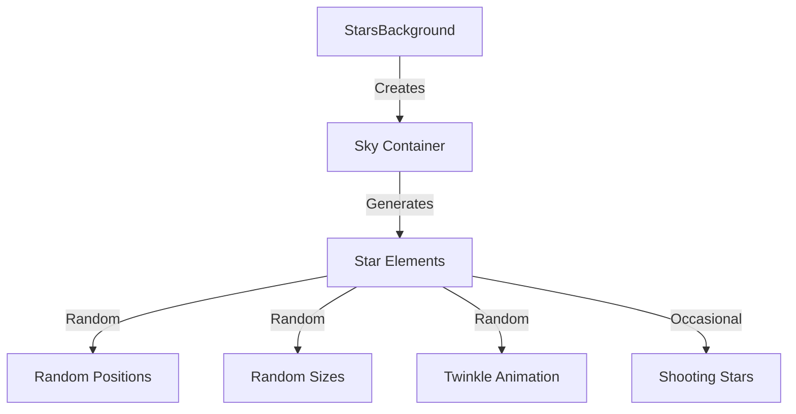
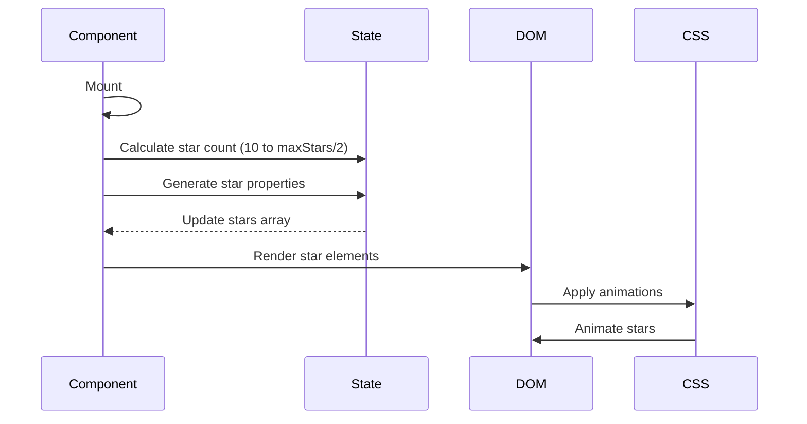
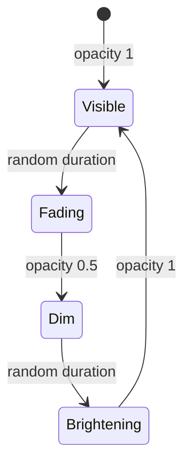

# Stars Background Component

This document details the StarsBackground component that creates an animated starfield background effect.

## Overview

Location: [`src/components/Stars/StarsBackground.tsx`](../../../src/components/Stars/StarsBackground.tsx)

The StarsBackground component creates a visually appealing animated background with twinkling stars and occasional shooting stars.

## Component Structure


```mermaid
flowchart TD
    accTitle: StarsBackground Component Architecture
    accDescr: StarsBackground creates a sky container with star elements that have random positions, sizes, twinkle animations, and occasional shooting star effects
    StarsBackground[StarsBackground] -->|Creates| Container[Sky Container]
    Container -->|Generates| Stars[Star Elements]
    Stars -->|Random| Position[Random Positions]
    Stars -->|Random| Size[Random Sizes]
    Stars -->|Random| Animation[Twinkle Animation]
    Stars -->|Occasional| Shooting[Shooting Stars]
```

## Key Features

### 1. Dynamic Star Generation

Stars are generated on component mount based on window width:

```typescript
const screenWidth = typeof window !== 'undefined' && window?.innerWidth ? window?.innerWidth : 400;
const maxStars = Math.min(screenWidth, MAX_STARS);
const numberOfStars = Math.floor(Math.random() * (maxStars / 2)) + 10;
```

Each star is a `Box` with random size, position, and a `twinkle` animation; the full generation loop lives in `createStars()` in [`StarsBackground.tsx`](../../../src/components/Stars/StarsBackground.tsx).

**Star Count:** Based on window width (10 to maxStars/2, where maxStars is the screen width capped at 600)

### 2. Star Properties

Each star has:

- **Position:** Random coordinates using viewport units (`vh`, `vw`) for consistent sizing
- **Size:** Random size between 1-6px
- **Animation:** Infinite twinkling with random duration (0-5 seconds)
- **Opacity:** Semi-transparent at 0.5 for a softer appearance
- **Background:** White with 50% opacity (`#ffffff50`)

### 3. Twinkle Animation

Stars twinkle using CSS animations applied through the `sx` prop. Each star receives:

- **animation:** `twinkle` with a random duration (`Math.random() * 5` seconds) and `ease-in-out` timing, set to `infinite`

The `twinkle` keyframes live in [globals.scss](../../../src/styles/globals.scss), which also defines the `shootAway` keyframes the shooting-star handler applies. `twinkle` steps opacity from 0.5 at both ends up to 1 at the midpoint, so a star fades in and out rather than blinking. Because the component names both animations as strings, renaming either keyframe in the stylesheet silently stops the effect.

### 4. Shooting Stars

Stars can become shooting stars on hover or through automatic triggering:

```typescript
const handleStarAnimation = (e: React.MouseEvent<HTMLElement> | { target: HTMLElement }): void => {
	const target = e.target as HTMLElement;
	const shootingStarSpeed = Math.random() * 4 + 1;

	target.style.animation = `shootAway ${shootingStarSpeed}s forwards`;
	target.style.background = '#fff90050';
	target.style.transform = `scale(${Math.random() * 2 + 1})`;

	setTimeout(() => {
		if (target) {
			target.setAttribute('data-star-used', 'true');
		}
	}, shootingStarSpeed * 1000);
};
```

**Automatic Shooting Stars:**

`handleForceStarAnimation()` in [StarsBackground.tsx](../../../src/components/Stars/StarsBackground.tsx) drives the unattended loop. It collects every star that has not already been shot, by filtering the `data-star-used` attribute the hover handler stamps, then branches on how many are left:

- **Above `THRESHOLDS.MIN_STARS_FOR_ANIMATION`** (15): it shoots one star chosen at random, then schedules itself again after a random 1.5 to 6.5 seconds. It clears the previous timeout handle before storing the new one, so the recursion does not leak a timer per iteration.
- **At or below the threshold**: it calls `createStars(false)` instead, discarding the spent field and generating a fresh one. The `false` argument skips the block that re-arms the loop, so the automatic shooting stops there and does not resume until the component remounts.

The pool has to stay larger than the threshold for the random pick to keep finding unused stars without repeating. Once it does not, the field is replaced but the unattended loop ends: the new stars twinkle, and hovering one still makes it shoot, but nothing shoots on its own again.

## Rendering Flow


```mermaid
sequenceDiagram
    accTitle: StarsBackground Mount and Rendering Sequence
    accDescr: On mount, component calculates star count, generates star properties, updates state, renders elements, and applies CSS animations
    participant Component
    participant State
    participant DOM
    participant CSS

    Component->>Component: Mount
    Component->>State: Calculate star count (10 to maxStars/2)
    Component->>State: Generate star properties
    State-->>Component: Update stars array
    Component->>DOM: Render star elements
    DOM->>CSS: Apply animations
    CSS->>DOM: Animate stars
```

## Accessibility

The component uses proper ARIA attributes for screen readers:

- `id='sky'` - Unique identifier for the container
- `aria-label='Starry background'` - Descriptive label for assistive technologies
- `component='div'` - Renders as a div element
- `role='img'` - Identifies as an image for screen readers
- `sx` prop contains styling with spread operator for dynamic styles

**Note:** Unlike decorative backgrounds that use `aria-hidden='true'`, this component uses `role='img'` with an `aria-label` because it's a significant visual element of the user experience.

## Performance Considerations

1. **Fixed Position:** Uses `position: fixed` to avoid reflow
2. **Controlled Overflow:** `overflow: hidden` prevents scrollbars
3. **GPU Acceleration:** CSS animations use GPU when possible
4. **Single Generation:** Stars generated once on mount, not on every render
5. **Dynamic Count:** Star count based on viewport width for responsive performance
6. **Memory Cleanup:** Clears timeout on unmount to prevent memory leaks
7. **Fade Effect:** Uses MUI Fade component for smooth appearance
8. **Analytics Throttling:** First hover tracked, subsequent hovers don't spam analytics

**Cleanup Logic:**

```typescript
useEffect(() => {
	createStars();

	// Cleanup timeout on unmount to prevent memory leaks
	return () => {
		if (forceAnimationTimeoutRef.current) {
			clearTimeout(forceAnimationTimeoutRef.current);
		}
	};
}, []);
```

## Integration

[`GeneralLayout`](../../../src/layouts/GeneralLayout.tsx) renders StarsBackground inside its `<main>` element, as a sibling of the page children and the CookieSnackbar. Placement there rather than at the layout root keeps the starfield inside the flex item that grows to fill the viewport; its own `position: fixed` then takes it out of flow, so it paints behind the content regardless of where the page is scrolled. See [Layouts](../layouts.md) for the surrounding structure.

## Testing

Test file: [`src/components/Stars/StarsBackground.test.tsx`](../../../src/components/Stars/StarsBackground.test.tsx)

**Test Coverage:**

- Stars are created on mount
- Accessibility attributes are present on the sky container
- Hovering a star logs the `stars-triggered` analytics event
- A star is reachable by keyboard tab focus
- The component renders with a minimal star count
- The component renders with a large star count

## Customization

To customize the background:

1. **Star Count:** Adjust `Math.floor(Math.random() * (maxStars / 2)) + 10` in `createStars()`
2. **Star Size:** Modify `Math.random() * 5 + 1` (currently 1-6px)
3. **Animation Speed:** Change `Math.random() * 5` for twinkle duration
4. **Shooting Star Speed:** Adjust `Math.random() * 4 + 1` in `handleStarAnimation`
5. **Background Color:** Inherited from global `body` background (`#131518`)
6. **Star Color:** Modify `background: '#ffffff50'` in `starStyles`
7. **Auto-trigger Threshold:** Change `THRESHOLDS.MIN_STARS_FOR_ANIMATION` in [src/constants/index.ts](../../../src/constants/index.ts) to control how small the unused pool may get before the field regenerates
8. **Initial Trigger Delay:** Change `DELAYS.STAR_ANIMATION_INITIAL` in [src/constants/index.ts](../../../src/constants/index.ts) to control the pause between the first render and the first forced shooting star
9. **Star Cap:** Change `MAX_STARS` in [src/constants/index.ts](../../../src/constants/index.ts) to raise or lower the 600-star ceiling the width-derived count is clamped to

## Visual Effect


```mermaid
stateDiagram-v2
    accTitle: Star Twinkle Animation Life Cycle
    accDescr: Stars cycle through visible (opacity 1), fading, dim (opacity 0.5), brightening, then back to visible state
    [*] --> Visible: opacity 1
    Visible --> Fading: random duration
    Fading --> Dim: opacity 0.5
    Dim --> Brightening: random duration
    Brightening --> Visible: opacity 1
```

## Related Documentation

- [GeneralLayout](../layouts.md)
- [Components Overview](./index.md)
- [Global Styles](../../../src/styles/globals.scss)

---

💡 **Tip:** The starfield creates depth and visual interest without distracting from content. Keep star count reasonable for performance.
