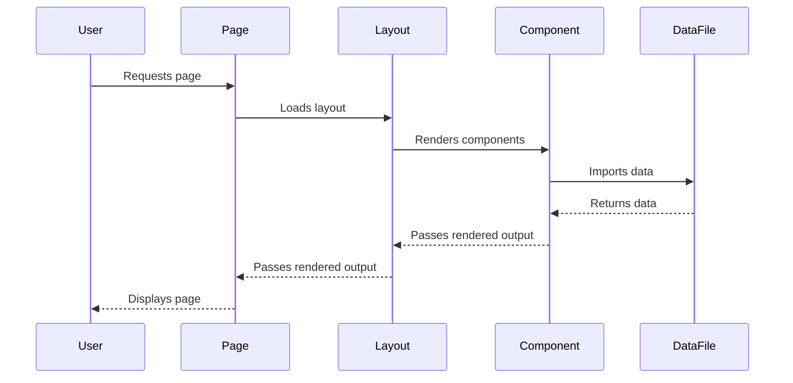

# Data Architecture

This document explains how data is structured, managed, and integrated in the AlexJSully Portfolio project, with technical details and TypeScript interfaces.

## 📦 Data Sources

### Static Data

- `src/data/projects.ts`: Project details (array of project objects)
- `src/data/publications.ts`: Publication details (array of publication objects)
- `src/data/socials.ts`: Social media links (array of social link objects)
- `src/data/keywords.ts`: SEO keywords (string array)

### Dynamic Data

- Firebase integration for real-time and remote data (see `src/configs/firebase.ts`)

## Data Flow



## Data Usage in the Codebase

- Data files in `src/data/` provide static and dynamic content for components and pages.
- Components import data directly using TypeScript path aliases (e.g., `@data/projects`).
- Layouts and pages aggregate data from multiple sources for rendering.
- Dynamic data (e.g., from Firebase) is fetched in helper functions or via API routes, then passed to components as props.
- TypeScript interfaces ensure type safety and validation for all imported data.
- Data is used for:
    - Rendering project lists, publication cards, and social links
    - SEO metadata and keywords
    - Navigation and page structure
    - Analytics and user interaction tracking

## 🧩 Data Structures & Interfaces

- Data is exported as arrays/objects and imported into components using TypeScript path aliases.
- TypeScript interfaces define the structure and validation for each data type.
    - Example:

        ```ts
        // src/data/projects.ts
        export interface Project {
          id: string;
          title: string;
          description: string;
          url: string;
          tags: string[];
        }
        export const projects: Project[] = [ ... ];
        ```

## 🔗 Integration & Usage

- Components import data for rendering lists, cards, and details.
- Layouts use data for navigation and page structure.
- Data is tested and validated using TypeScript and Jest.

## 🛠️ Extending Data

- Add new data files in `src/data/`.
- Define TypeScript interfaces for new data types.
- Update components to consume new data as needed.

## 🔗 Related Docs

- [Component Documentation](./components/index.md)
- [System Architecture](./index.md)

💡 **Tip:** Use TypeScript interfaces for all data structures to ensure type safety and maintainability.
