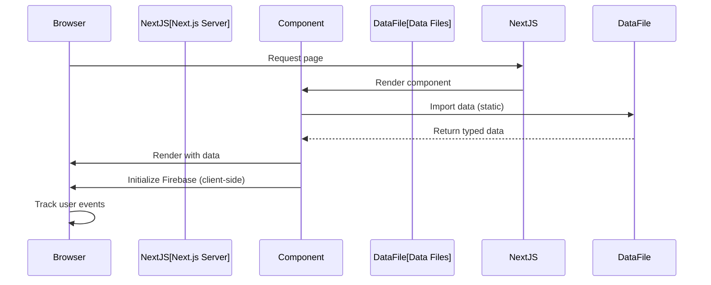

# Data Architecture

This document explains how data is structured, managed, and integrated in the Alexander Sullivan's Portfolio project, with technical details and TypeScript interfaces.

## Data Sources

All static data is centralized in [src/data/](../../src/data/) for consistency and maintainability:

### Static Data Files

- [**projects.ts**](../../src/data/projects.ts) — Project portfolio with employment history, personal projects, and showcase details
- [**publications.ts**](../../src/data/publications.ts) — Academic publications with DOIs, abstracts, and authors
- [**socials.ts**](../../src/data/socials.ts) — Social media links and contact information
- [**keywords.ts**](../../src/data/keywords.ts) — SEO keywords for search engine optimization

### Dynamic Data

- [Firebase integration](../../src/configs/firebase.ts) for analytics, performance monitoring, and real-time features (if configured)

## Data Flow



## Data Usage in the Codebase

- **Data Location:** All static data in [src/data/](../../src/data/) is imported directly into components
- **Type Safety:** TypeScript interfaces define strict types for each data structure
- **Path Aliases:** Components use aliases like `@data/projects` for clean imports (no relative paths)
- **No Runtime Validation:** Data is validated at compile time via TypeScript
- **Integration Points:**
    - [ProjectsGrid](../../src/components/projects/ProjectsGrid.tsx) imports [projects.ts](../../src/data/projects.ts)
    - [Publications](../../src/components/publications/Publications.tsx) imports [publications.ts](../../src/data/publications.ts)
    - [Footer](../../src/components/footer/Footer.tsx) imports [socials.ts](../../src/data/socials.ts)
    - [Root Layout](../../src/app/layout.tsx) imports [keywords.ts](../../src/data/keywords.ts) for SEO

## Data Structures & Interfaces

### Projects Interface

Location: [src/data/projects.ts](../../src/data/projects.ts)

```typescript
interface Projects {
	name: string; // Project name
	id: string; // Unique identifier
	description?: string; // Optional description
	employer?: string; // Company/organization name
	employerURL?: string; // Company website
	title: string; // Job/role title
	publication?: string; // Publication URL
	type?: string; // Employment, Personal Project, etc.
	url: string; // Project URL
	urls: Array<{
		// Links with icons and tooltips
		text: string;
		tooltip: string;
		icon: (props: SvgIconProps) => React.ReactElement;
		url: string;
	}>;
	color: string; // Hex color for card styling
	dates?: {
		// Optional date range
		startDate: string; // YYYY-MM format
		endDate: string; // YYYY-MM format
	};
	showcase?: boolean; // Display in featured section
	objectFit?: string; // Image fit (cover or contain)
	youtubeURL?: string; // Optional YouTube embed
}
```

### Publications Interface

Location: [src/data/publications.ts](../../src/data/publications.ts)

```typescript
interface Publication {
	title: string; // Publication title
	authors: string[]; // List of author names
	abstract: string; // Publication abstract
	doi: string; // Digital Object Identifier
	journal: string; // Journal/conference name
	date: string; // Publication date (YYYY-MM-DD)
	'related-project'?: string; // Link to related project ID
}
```

### Socials Interface

Location: [src/data/socials.ts](../../src/data/socials.ts)

```typescript
interface Social {
	name: string; // Social platform name
	url: string; // Profile URL
	icon: (props: SvgIconProps) => React.ReactElement; // Icon component
	color: string; // Brand color
}
```

## Extending Data

### Adding a New Project

1. Open [src/data/projects.ts](../../src/data/projects.ts)
2. Add a new object to the `projects` array with required fields
3. Create a thumbnail at `public/images/projects/{project-id}/thumbnail.webp`
4. Ensure the `id` matches the folder name
5. Run `npm run validate` to verify TypeScript types

### Adding a New Publication

1. Open [src/data/publications.ts](../../src/data/publications.ts)
2. Add a new object with title, authors, abstract, DOI, and date
3. Optionally link to a related project using the `'related-project'` field
4. Run `npm run validate` to verify types

### Adding New Keywords

1. Open [src/data/keywords.ts](../../src/data/keywords.ts)
2. Add relevant SEO keywords to the array
3. Keywords are used in [src/app/layout.tsx](../../src/app/layout.tsx) for metadata

## Related Docs

- [Projects Component Documentation](./components/projects.md)
- [Publications Component Documentation](./components/publications.md)
- [System Architecture](./index.md)
- [Component Documentation](./components/index.md)
