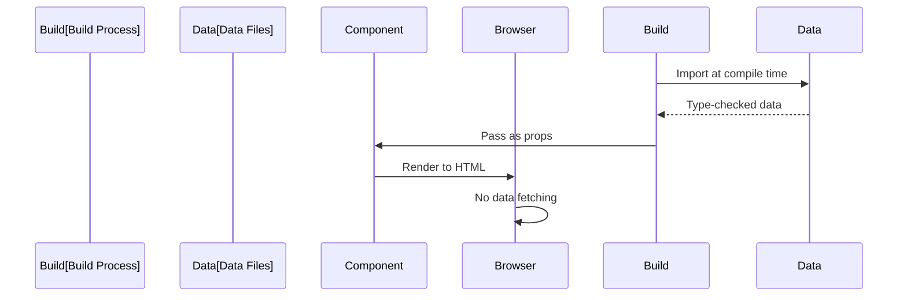

# Data Architecture

The portfolio stores all content as TypeScript files in [src/data/](../../src/data/). This "data-as-code" approach provides compile-time type safety, eliminates database queries, and enables fast static builds.

## Data Flow



1. Next.js build process imports data from [src/data/](../../src/data/)
2. TypeScript validates data against interfaces
3. Components receive type-safe data as imports
4. Next.js pre-renders HTML with embedded data
5. Browser displays content immediately (no loading states)

## Data Files

**Projects** ([src/data/projects.ts](../../src/data/projects.ts)) — Employment history, personal projects, and portfolio items. Each project includes name, employer, dates, thumbnail path, optional YouTube URL, and action links.

**Publications** ([src/data/publications.ts](../../src/data/publications.ts)) — Academic publications with authors, abstracts, DOIs, and journal information. Publications can link to related projects.

**Socials** ([src/data/socials.ts](../../src/data/socials.ts)) — Social media profiles with platform names, URLs, brand colors, and icon components.

**Keywords** ([src/data/keywords.ts](../../src/data/keywords.ts)) — SEO keywords array used in page metadata for search engine optimization.

## How Components Use Data

Components import data directly using TypeScript path aliases:

```typescript
import projects from '@data/projects';
import publications from '@data/publications';
```

- [ProjectsGrid](../../src/components/projects/ProjectsGrid.tsx) maps over projects array to render cards
- [Publications](../../src/components/publications/Publications.tsx) displays publication list
- [Footer](../../src/components/footer/Footer.tsx) renders social media links
- [Root Layout](../../src/app/layout.tsx) uses keywords for SEO metadata

No fetching, no loading states, no error handling. Data is guaranteed available at render time.

## Data Validation

TypeScript interfaces enforce data structure. For project data, the interface requires:

- Unique `id` (string) — Must match thumbnail folder name
- Project `name` (string)
- Job/role `title` (string)
- Project `url` (string)
- `urls` array with link objects containing text, tooltip, icon, and url
- Hex `color` (string) for card styling

Optional fields include employer, dates, YouTube URL, and visibility flags.

See full interface definitions in [src/data/projects.ts](../../src/data/projects.ts), [src/data/publications.ts](../../src/data/publications.ts), and [src/data/socials.ts](../../src/data/socials.ts).

Implementation: [src/data/](../../src/data/)

## Related Documentation

- [Projects Component](./components/projects.md) — How project data renders
- [Publications Component](./components/publications.md) — How publication data renders
- [System Architecture](./index.md) — Overall application flow
