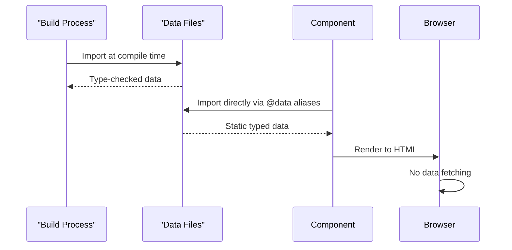

# Data Architecture

The portfolio stores all content as TypeScript files in [src/data/](../../src/data/projects.ts). This "data-as-code" approach provides compile-time type safety, eliminates database queries, and enables fast static builds.

## Data Flow


```mermaid
sequenceDiagram
    accTitle: Build-Time Data Integration Sequence
    accDescr: Shows how the build imports and type-checks data files at compile time, after which components import the data directly via @data aliases and render it to HTML, avoiding any runtime data fetching
    participant Build as "Build Process"
    participant Data as "Data Files"
    participant Component
    participant Browser

    Build->>Data: Import at compile time
    Data-->>Build: Type-checked data
    Component->>Data: Import directly via @data aliases
    Data-->>Component: Static typed data
    Component->>Browser: Render to HTML
    Browser->>Browser: No data fetching
```

1. Next.js build process imports data from [src/data/](../../src/data/projects.ts)
2. TypeScript validates data against its types
3. Components receive type-safe data as imports
4. Next.js pre-renders HTML with embedded data
5. Browser displays content immediately (no loading states)

## Data Files

**Projects** ([src/data/projects.ts](../../src/data/projects.ts)) - Employment history, personal projects, and portfolio items. Each project includes a name, title, URL, and action links; employer, dates, and a YouTube URL are present only where applicable. The project `id` is used to locate associated thumbnail images.

**Publications** ([src/data/publications.ts](../../src/data/publications.ts)) - Academic publications with authors, abstracts, DOIs, and journal information. Publications can link to related projects.

**Socials** ([src/data/socials.ts](../../src/data/socials.ts)) - Social media profiles with platform names, URLs, brand colors, and icon components.

**Keywords** ([src/data/keywords.ts](../../src/data/keywords.ts)) - SEO keywords array used in page metadata for search engine optimization.

**Profile** ([src/data/profile.ts](../../src/data/profile.ts)) - Name, description, contact email, country, résumé path, source repository, and the profiles that have no footer icon (ORCID, Google Scholar, Instagram, Threads), shared by the footer, the structured data, and the Markdown builders.

**Policy** ([src/data/policy.ts](../../src/data/policy.ts)) - The privacy and cookie policy as sections of paragraphs, lists, and tables, rendered in the policy dialog and in the Markdown home page. It reads the consent cookie's name and lifetime from the consent store rather than restating them.

**Structured data** ([src/data/structuredData.ts](../../src/data/structuredData.ts)) - The schema.org JSON-LD array the root layout renders. Its `sameAs` list is built from the socials and the profile's external profiles, so it cannot drift from the footer.

## How Components Use Data

Components import data directly using TypeScript path aliases:

```typescript
import projects from '@data/projects';
import publications from '@data/publications';
```

- [ProjectsGrid](../../src/components/projects/ProjectsGrid.tsx) maps over projects array to render cards
- [Publications](../../src/components/publications/Publications.tsx) displays publication list
- [Footer](../../src/components/footer/Footer.tsx) renders social media links
- [Root Layout](../../src/app/layout.tsx) uses keywords for SEO metadata

No fetching, no loading states, no error handling. Data is guaranteed available at render time.

## Data Validation

TypeScript types enforce data structure. For project data, the `Projects` interface requires:

- Unique `id` (string) - used to locate associated thumbnail images
- Project `name` (string)
- Job/role `title` (string)
- Project `url` (string)
- `urls` array with link objects containing text, tooltip, icon, and url
- Hex `color` (string) for card styling

Optional fields include employer, dates, YouTube URL, and visibility flags.

See the full interface definition in [src/data/projects.ts](../../src/data/projects.ts); [src/data/publications.ts](../../src/data/publications.ts) and [src/data/socials.ts](../../src/data/socials.ts) rely on types inferred from their `const` array literals.

Implementation: [src/data/](../../src/data/projects.ts)

## Related Documentation

- [Projects Component](./components/projects.md) - How project data renders
- [Publications Component](./components/publications.md) - How publication data renders
- [System Architecture](./index.md) - Overall application flow
