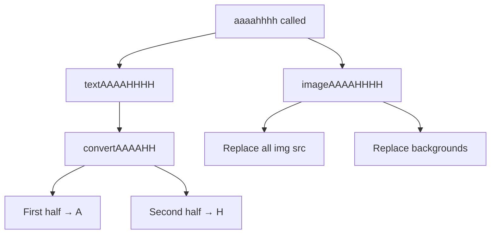

# Helpers Module Documentation

This document describes the purpose, architecture, and usage of helper functions in the AlexJSully Portfolio project, with technical details and integration patterns.

## Purpose

Helpers provide reusable utility functions for formatting, logic, and data manipulation. They help keep components clean and focused on UI, separating business logic from presentation.

## Structure

- Location: `src/helpers/`
- Example files:
    - `ascii.ts`: Generates ASCII art for branding and fun UI elements.
    - `aaaahhhh.ts`: Custom logic for playful UI interactions.
- Test files:
    - `ascii.test.ts`: Unit tests for ASCII art generation.
    - `aaaahhhh.test.ts`: Tests for custom logic.

## Usage Examples

### ASCII Art Helper

```ts
import { consoleLogLogo, debounceConsoleLogLogo } from '@helpers/ascii';

// Print ASCII logo once
consoleLogLogo();

// Debounced version for repeated calls (uses DELAYS.CONSOLE_LOGO_DEBOUNCE)
debounceConsoleLogLogo();
```

The ASCII helper uses constants for timing:

```typescript
import { DELAYS } from '@constants/index';
import { debounce } from 'lodash';

export const debounceConsoleLogLogo = debounce(consoleLogLogo, DELAYS.CONSOLE_LOGO_DEBOUNCE);
```

### AAAAHHHH Easter Egg Helper

The `aaaahhhh` helper provides a playful page transformation triggered after multiple avatar sneezes:

```ts
import { aaaahhhh, convertAAAAHH, imageAAAAHHHH, textAAAAHHHH } from '@helpers/aaaahhhh';

// Trigger full page transformation
aaaahhhh();

// Convert text to AAAAHHHH format
const converted = convertAAAAHH('Hello World'); // Returns: 'Aaaaa HHHHHH'

// Transform all text on page
textAAAAHHHH();

// Transform all images on page
imageAAAAHHHH();
```

**How it Works:**



**Text Conversion Logic:**

- First half of word → 'A' (or 'a' if lowercase)
- Second half of word → 'H' (or 'h' if lowercase)
- Spaces preserved
- Example: "Alexander" → "Aaaahhhhr", "SULLIVAN" → "AAAAHHHH"

**Image Transformation:**

- Replaces all `` src and srcset attributes
- Replaces all background images in style attributes
- Updates the stars background (#sky) with cover image
- Uses `/images/aaaahhhh/aaaahhhh.webp` as replacement

**Target Elements:**

- Text: `<span>`, `<p>`, `<h1>`, `<h2>`, `<h3>`, `<button>`
- Images: All `` tags and elements with `backgroundImage` style

## Integration & Relationships

- Helpers are used by components and layouts for formatting, logic, and data manipulation.
- All helper functions are tested with Jest for reliability.
- TypeScript interfaces ensure type safety and documentation.

## Extending Helpers

- Add new helpers in `src/helpers/`.
- Write unit tests for each helper function.
- Use path aliases (`@helpers/`) for clean imports.

## Related Docs

- [System Architecture](./index.md)
- [Utils Documentation](./utils.md)

**Tip:** Add new helpers in `src/helpers/` and write tests for each function. Use TypeScript for type safety and maintainability.
