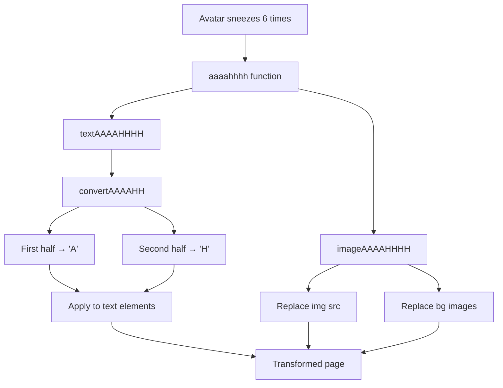

# Helpers Module

Helper functions provide reusable logic for UI formatting, animations, and page transformations. These functions are pure utilities imported by components.

## ASCII Logo Helper

The ASCII helper ([src/helpers/ascii.ts](../../src/helpers/ascii.ts)) generates styled ASCII art logged to the browser console when the page loads.

**Functions:**

- `consoleLogLogo()` — Immediately logs ASCII art
- `debounceConsoleLogLogo()` — Debounced version using `DELAYS.CONSOLE_LOGO_DEBOUNCE` (1000ms)

The debounced version prevents duplicate logs during navigation or hot module replacement in development.

Called by [src/app/page.tsx](../../src/app/page.tsx) in `useEffect` on mount.

Implementation: [src/helpers/ascii.ts](../../src/helpers/ascii.ts)

## AAAAHHHH Easter Egg Helper

The AAAAHHHH helper ([src/helpers/aaaahhhh.ts](../../src/helpers/aaaahhhh.ts)) transforms the entire page into a playful state after the avatar sneezes 6 times.

### Transformation Behavior

**Text Transformation Logic:**

The `convertAAAAHH()` function splits words in half:

- First half characters → 'A' (lowercase → 'a')
- Second half characters → 'H' (lowercase → 'h')
- Spaces and special characters preserved
- Example: "Hello World" → "Aaaaa HHHHHH"

Applied to: ``, `
`, `<h1>`, `<h2>`, `<h3>`, `<button>` elements.

**Image Transformation Logic:**

The `imageAAAAHHHH()` function replaces:

- All `` `src` and `srcset` attributes → `/images/aaaahhhh/aaaahhhh.webp`
- All inline `backgroundImage` CSS properties → same image
- Stars background container → sets background image with cover sizing

**Page Title:** Changes to "Alexander Sullivan's AAAAHHHHH"

### Trigger Flow

The Avatar component tracks sneeze count using `THRESHOLDS.AAAAHHHH_TRIGGER_COUNT` (6). On the 6th sneeze, instead of animating, it calls `aaaahhhh()` and logs a `trigger_aaaahhhh` analytics event.

See [Avatar Component Documentation](./components/avatar.md) for trigger implementation.

Implementation: [src/helpers/aaaahhhh.ts](../../src/helpers/aaaahhhh.ts)

## Related Documentation

- [Avatar Component](./components/avatar.md) — Easter egg trigger
- [Constants](./constants.md) — Timing and threshold values
- [Firebase Config](./configs.md) — Analytics event logging
