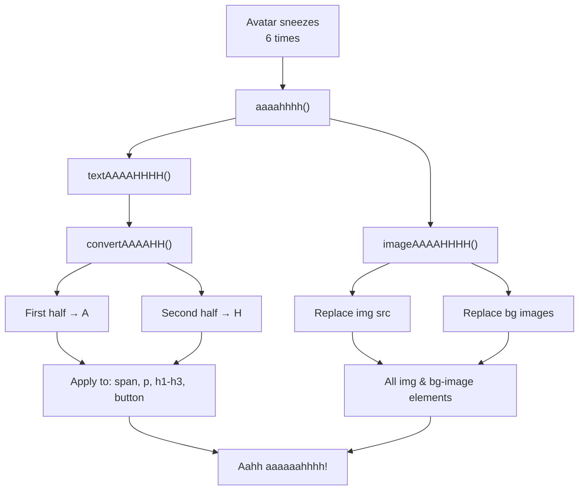

# Helpers Module Documentation

This document describes the purpose, architecture, and usage of helper functions in the Alexander Sullivan's Portfolio project, with technical details and integration patterns.

## Purpose

Helpers provide reusable utility functions for formatting, logic, and data manipulation. They help keep components clean and focused on UI, separating business logic from presentation.

## Structure

**Location:** [src/helpers/](../../src/helpers/)

### Available Helpers

- [`ascii.ts`](../../src/helpers/ascii.ts) — Generates ASCII art for branding and fun UI elements
- [`aaaahhhh.ts`](../../src/helpers/aaaahhhh.ts) — Custom logic for playful UI interactions (Easter egg)

## Usage Examples

### ASCII Art Helper

**Location:** [src/helpers/ascii.ts](../../src/helpers/ascii.ts)

Generates and logs ASCII art to the browser console on page load.

```typescript
import { consoleLogLogo, debounceConsoleLogLogo } from '@helpers/ascii';

// Print ASCII logo once
consoleLogLogo();

// Debounced version for repeated calls (uses DELAYS.CONSOLE_LOGO_DEBOUNCE)
debounceConsoleLogLogo();
```

**Implementation Details:**

The ASCII helper uses constants for timing control:

```typescript
import { DELAYS } from '@constants/index';
import { debounce } from 'lodash';

export const debounceConsoleLogLogo = debounce(consoleLogLogo, DELAYS.CONSOLE_LOGO_DEBOUNCE);
```

**Integration:**

- Called in [src/app/page.tsx](../../src/app/page.tsx) during `useEffect` initialization
- Uses `DELAYS.CONSOLE_LOGO_DEBOUNCE` (1000ms) to prevent duplicate logs on navigation

### AAAAHHHH Easter Egg Helper

**Location:** [src/helpers/aaaahhhh.ts](../../src/helpers/aaaahhhh.ts)

The `aaaahhhh` helper provides a playful page transformation triggered after multiple avatar sneezes (6 total). This is the ultimate Easter egg!

```typescript
import { aaaahhhh, convertAAAAHH, imageAAAAHHHH, textAAAAHHHH } from '@helpers/aaaahhhh';

// Trigger full page transformation
aaaahhhh();

// Convert text to AAAAHHHH format
const converted = convertAAAAHH('Hello World'); // Returns: 'Aaaaa HHHHHH'

// Transform all text on page
textAAAAHHHH();

// Transform all images on page
imageAAAAHHHH();
```

**How it Works:**



**Text Conversion Logic:**

- First half of word → 'A' (or 'a' if lowercase)
- Second half of word → 'H' (or 'h' if lowercase)
- Spaces and special characters preserved

**Image Transformation:**

- Replaces all `` src and srcset attributes
- Replaces all CSS background images in style attributes
- Updates the stars background with cover image
- Uses `/images/aaaahhhh/aaaahhhh.webp` as replacement image

**Target Elements:**

Text transformation applies to:

- `<span>`, `<p>`, `<h1>`, `<h2>`, `<h3>`, `<button>`

Image transformation applies to:

- All `` tags
- All elements with `backgroundImage` CSS property

**Triggering the Easter Egg:**

The Easter egg is triggered from [Avatar component](../../src/components/banner/Avatar.tsx):

```typescript
if (totalSneeze.current >= THRESHOLDS.AAAAHHHH_TRIGGER_COUNT) {
	logAnalyticsEvent('trigger_aaaahhhh', {
		name: 'trigger_aaaahhhh',
		type: 'hover',
	});
	aaaahhhh(); // Transform entire page!
}
```

## Integration & Relationships

- **Used by:** [Avatar component](../../src/components/banner/Avatar.tsx) (Easter egg trigger), [Root layout](../../src/app/layout.tsx) (ASCII logo)
- **Depends on:** [Constants](../../src/constants/index.ts) for timing and thresholds, [Firebase](../../src/configs/firebase.ts) for analytics
- **Testing:** All helper functions have comprehensive Jest test coverage
- **Type Safety:** TypeScript ensures type safety and IDE autocompletion

## Related Docs

- [System Architecture](./index.md)
- [Avatar Component (Easter egg context)](./components/avatar.md)
- [Constants Documentation](./constants.md)
- [Utils Documentation](./utils.md)
- [Firebase Integration](./configs.md)
