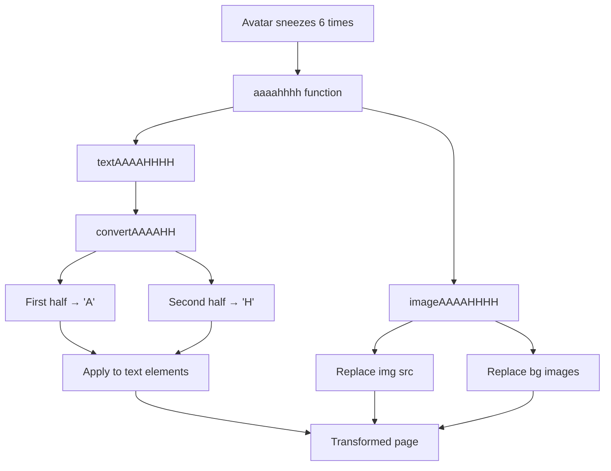

# Helpers Module

Helper functions carry the two console and Easter egg behaviours that no component owns. Only [`convertAAAAHH()`](../../src/helpers/aaaahhhh.ts) is a pure function; the rest write to the console, the document title, or the live DOM, so calling one during server rendering would fail on the missing `document`.

## ASCII Logo Helper

The ASCII helper ([src/helpers/ascii.ts](../../src/helpers/ascii.ts)) generates styled ASCII art logged to the browser console when the page loads.

**Functions:**

- `consoleLogLogo()` - Immediately logs ASCII art
- `debounceConsoleLogLogo()` - Debounced version using `DELAYS.CONSOLE_LOGO_DEBOUNCE` (1000ms)

The debounced version prevents duplicate logs during navigation or hot module replacement in development.

Called by [src/app/page.tsx](../../src/app/page.tsx) in `useEffect` on mount.

Implementation: [src/helpers/ascii.ts](../../src/helpers/ascii.ts)

## AAAAHHHH Easter Egg Helper

The AAAAHHHH helper ([src/helpers/aaaahhhh.ts](../../src/helpers/aaaahhhh.ts)) rewrites the live page once the avatar's sneeze counter reaches six.

### Transformation Behavior

```mermaid
flowchart TD
    accTitle: AAAAHHHH Transformation Logic Flow
    accDescr: When avatar sneezes 6 times, the aaaahhhh function is called which transforms text (first half becomes A, second half becomes H) and replaces all images with the aaaahhhh image, then applies changes to the page
    Trigger[Avatar sneezes 6 times] --> Call[aaaahhhh function]
    Call --> Text[textAAAAHHHH]
    Call --> Images[imageAAAAHHHH]

    Text --> Convert[convertAAAAHH]
    Convert --> FirstHalf[First half → 'A']
    Convert --> SecondHalf[Second half → 'H']

    Images --> ImgReplace[Replace img src]
    Images --> BgReplace[Replace bg images]

    FirstHalf --> Apply[Apply to text elements]
    SecondHalf --> Apply

    Apply --> Page[Transformed page]
    ImgReplace --> Page
    BgReplace --> Page
```

**Text Transformation Logic:**

The `convertAAAAHH()` function splits the full string at its character midpoint:

- Characters before the midpoint → 'A' (lowercase → 'a')
- Characters from the midpoint on → 'H' (lowercase → 'h')
- Spaces and original capitalization are preserved; every other character (letters, punctuation, digits) becomes 'A' or 'H' by position
- Example: "one two three" → "aaa aaa hhhhh"

Applied to: ``, `
`, `<h1>`, `<h2>`, `<h3>`, `<button>` elements. Within each, only direct `#text` child nodes are rewritten; a nested element is reached through its own entry in that list rather than through its parent.

`textAAAAHHHH()` then looks up two elements by ID, guarding each lookup: it removes `#description-Carousel` if present, and clears the `hidden` attribute from `#no-motion-description` if present. Both lookups are guarded, so a page carrying neither element transforms the same way.

**Image Transformation Logic:**

The `imageAAAAHHHH()` function replaces:

- All `` `src` and `srcset` attributes → `/images/aaaahhhh/aaaahhhh.webp`
- Inline `backgroundImage` on `
` elements → same image
- Stars background container → sets background image with cover sizing

**Page Title:** Changes to "Alexander Sullivan's AAAAHHHHH"

### Trigger Flow

The Avatar component tracks sneeze count against `THRESHOLDS.AAAAHHHH_TRIGGER_COUNT` (6). It increments the counter before testing it, so the sixth trigger reaches the threshold and takes the Easter egg branch instead of animating: the reader sees five sneezes, then the transformation. Avatar logs a `trigger_aaaahhhh` analytics event before calling `aaaahhhh()`.

See [Avatar Component Documentation](./components/avatar.md) for trigger implementation.

Implementation: [src/helpers/aaaahhhh.ts](../../src/helpers/aaaahhhh.ts)

## Related Documentation

- [Avatar Component](./components/avatar.md) - Easter egg trigger
- [Constants](./constants.md) - Timing and threshold values
- [Firebase Config](./configs.md) - Analytics event logging
