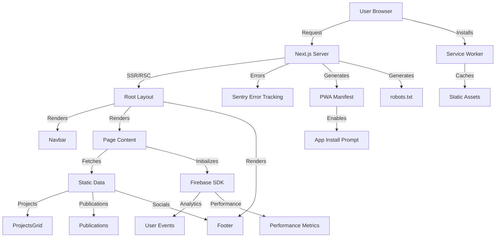

# System Architecture Overview

This document provides a high-level overview of the architecture for AlexJSully's Portfolio project. The system is modular, maintainable, and leverages modern web technologies for performance and scalability.

## Architectural Patterns

- **Framework:** Next.js 16+ (React 19+)
- **Routing:** App Router (Next.js App Directory)
- **Language:** TypeScript
- **UI:** Material-UI (MUI) + Emotion
- **Testing:** Cypress (E2E), Jest (unit)
- **Error Tracking:** Sentry
- **Analytics:** Firebase Analytics & Performance
- **PWA Support:** Native Next.js manifest + Service Worker

## 📂 Directory Structure

```text
src/
  app/                      # Next.js App Router
    layout.tsx              # Root layout with metadata
    page.tsx                # Home page
    manifest.ts             # PWA manifest generator
    robots.ts               # SEO robots.txt generator
    error.tsx               # Error boundary
    global-error.tsx        # Global error boundary
    not-found.tsx           # 404 page
    loading.tsx             # Loading UI
    sw.js/                  # Service worker route handler
  components/               # React components
    banner/                 # Banner with avatar
    cookie-snackbar/        # Cookie consent
    footer/                 # Footer with socials
    navbar/                 # Navigation bar
    projects/               # Projects grid
    publications/           # Publications list
    Stars/                  # Animated background
    ServiceWorkerRegister.tsx
  configs/                  # Configuration files
    firebase.ts             # Firebase initialization
  data/                     # Static data sources
    keywords.ts             # SEO keywords
    projects.ts             # Project data
    publications.ts         # Publication data
    socials.ts              # Social media links
  helpers/                  # Helper functions
    aaaahhhh.ts             # Fun Easter egg logic
    ascii.ts                # ASCII art generation
  images/                   # SVG icons
    icons/
  layouts/                  # Layout components
    GeneralLayout.tsx       # Main layout wrapper
  styles/                   # Global styles
    globals.scss
  util/                     # Utility functions
    isNetworkFast.ts        # Network speed detection
public/
  images/                   # Static images
    projects/               # Project thumbnails
    drawn/                  # Hand-drawn graphics
    aaaahhhh/               # Easter egg images
  resume/                   # Resume files
  icon/                     # PWA icons
  sw.js                     # Service worker implementation
  sitemap.xml               # SEO sitemap
```

## System Flow



## Subsystems

- **Components:** UI elements (see [Components Docs](./components/index.md))
- **Data:** Static and dynamic data sources
- **Helpers/Utils:** Utility functions for logic and formatting
- **Layouts:** Page and section layouts
- **Testing:** E2E and unit tests
- **Config:** Environment and service configuration

## Related Docs

- [Usage Guides](../usage/index.md)
- [Component Documentation](./components/index.md)
