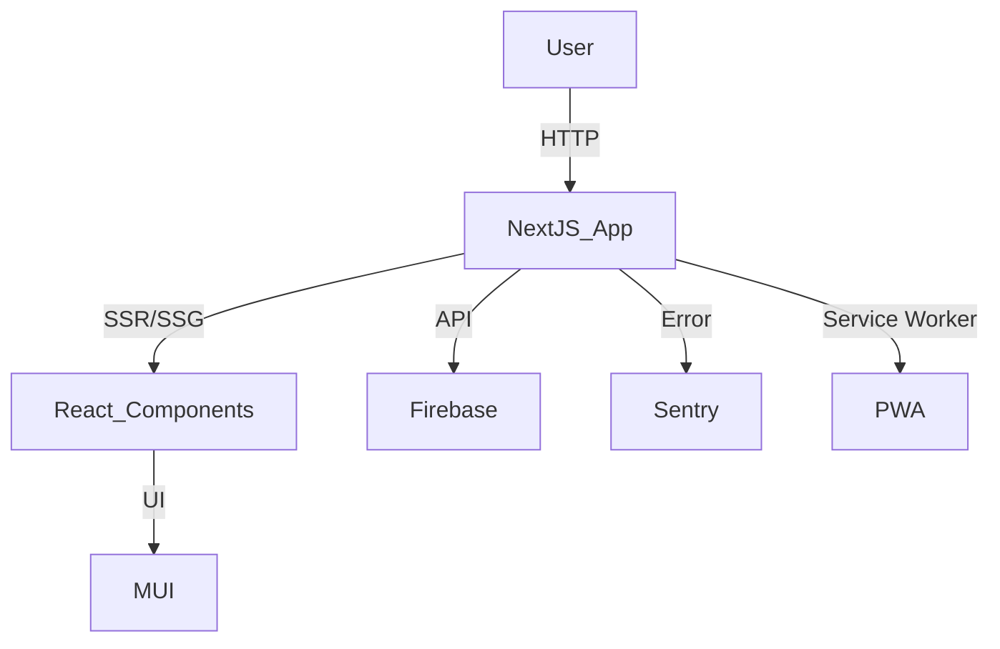

# System Architecture Overview

This document provides a high-level overview of the architecture for AlexJSully's Portfolio project. The system is modular, maintainable, and leverages modern web technologies for performance and scalability.

## 🏗️ Architectural Patterns

- **Framework:** Next.js (React)
- **Language:** TypeScript
- **UI:** Material-UI (MUI)
- **Testing:** Cypress (E2E), Jest (unit)
- **Error Tracking:** Sentry
- **Backend/Data:** Firebase
- **PWA Support:** next-pwa

## 📂 Directory Structure

```text
src/
  app/
    components/
    configs/
    data/
    helpers/
    images/
    layouts/
    styles/
    util/
public/
  images/
  resume/
  icon/
```

## 🔄 System Flow



## 🧩 Subsystems

- **Components:** UI elements (see [Components Docs](../components/index.md))
- **Data:** Static and dynamic data sources
- **Helpers/Utils:** Utility functions for logic and formatting
- **Layouts:** Page and section layouts
- **Testing:** E2E and unit tests
- **Config:** Environment and service configuration

## 🔗 Related Docs

- [Usage Guides](../usage/index.md)
- [Component Documentation](../components/index.md)

---

💡 **Tip:** See subsystem docs for detailed breakdowns and diagrams.
