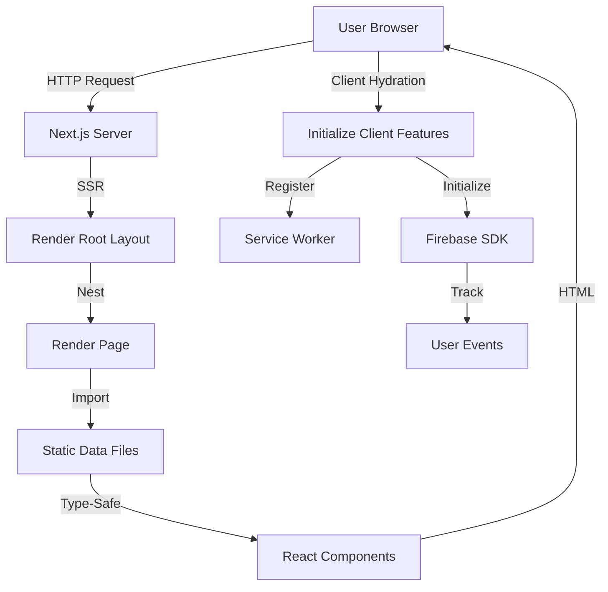

# System Architecture Overview

AlexJSully's Portfolio is a Next.js portfolio application that uses server-side rendering (SSR) and React Server Components (RSC) to deliver a fast, SEO-friendly experience. The architecture separates concerns into components, data, configuration, and utilities.

## Technology Stack

- **Framework:** Next.js 16+ with App Router
- **Language:** TypeScript (strict mode)
- **UI Library:** Material-UI (MUI) with Emotion for styling
- **Testing:** Jest (unit), Cypress (E2E with accessibility testing)
- **Error Tracking:** Sentry for client and server errors
- **Analytics:** Firebase Analytics and Performance Monitoring
- **PWA:** Service worker for offline support and app installation

## Architectural Patterns

The codebase follows these design patterns:

**Static Data as Code:** Project and publication data lives in TypeScript files ([src/data/](../../src/data/)) rather than a database. This enables type safety, compile-time validation, and fast builds without runtime queries.

**Centralized Constants:** Timing values, thresholds, and configuration live in [src/constants/index.ts](../../src/constants/index.ts) using TypeScript's `as const` for literal types. This allows tuning behavior without hunting through components.

**Path Aliases:** TypeScript path mapping (`@components`, `@data`, `@helpers`) eliminates brittle relative imports and makes refactoring safer.

Implementation: [src/app/layout.tsx](../../src/app/layout.tsx), [src/app/page.tsx](../../src/app/page.tsx)

## System Flow

The application follows this request lifecycle:

**Request Flow:**

1. Browser requests page from Next.js server
2. Server renders root layout with metadata (SEO, OpenGraph, PWA manifest)
3. Page component imports static data from [src/data/](../../src/data/)
4. Components receive type-safe data and render to HTML
5. Browser receives HTML and hydrates React components
6. Client initializes service worker and Firebase analytics
7. User interactions trigger analytics events

**Key Behaviors:**

- **No Database Queries:** All data is imported at build time from TypeScript files
- **Progressive Enhancement:** Content renders without JavaScript; interactivity enhances experience
- **Offline Support:** Service worker caches assets for offline use

Implementation: [src/app/page.tsx](../../src/app/page.tsx), [src/layouts/GeneralLayout.tsx](../../src/layouts/GeneralLayout.tsx)

## Module Organization

**Components** ([src/components/](../../src/components/)) contain UI logic and rendering. See [Component Documentation](./components/index.md).

**Constants** ([src/constants/index.ts](../../src/constants/index.ts)) centralize timing, thresholds, and configuration values. See [Constants Documentation](./constants.md).

**Data** ([src/data/](../../src/data/)) stores typed project, publication, and metadata. See [Data Architecture](./data.md).

**Helpers** ([src/helpers/](../../src/helpers/)) provide reusable logic like Easter egg transformations and ASCII art. See [Helpers Documentation](./helpers.md).

**Utils** ([src/util/](../../src/util/)) contain network checks and other utilities. See [Utils Documentation](./utils.md).

**Configs** ([src/configs/](../../src/configs/)) manage Firebase and environment setup. See [Configs Documentation](./configs.md).

## Related Docs

- [Usage Guides](../usage/index.md)
- [Component Documentation](./components/index.md)
