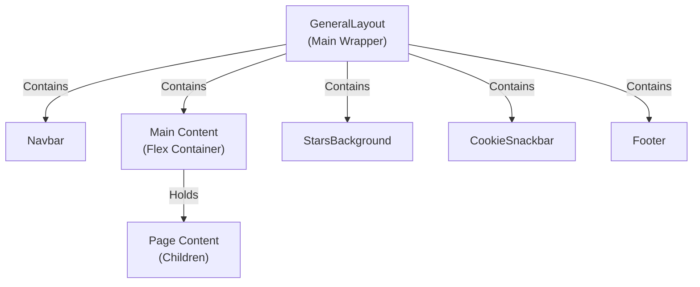

# Layouts Module Documentation

This document describes the layout system in the Alexander Sullivan's Portfolio project.

## Purpose

Layouts define the structure and composition of pages and sections, ensuring consistent UI, navigation, and shared component behavior across the entire site.

## Structure

**Location:** [src/layouts/](../../src/layouts)

- **GeneralLayout.tsx** — Main layout wrapper composing navigation, content area, and footer
- **GeneralLayout.test.tsx** — Unit tests for layout functionality

## How It Works

The GeneralLayout component wraps all page content and provides a consistent structure:

1. **Navbar** — Fixed navigation bar with site-wide links
2. **Main Content Area** — Flex container for page-specific content
3. **StarsBackground** — Animated starfield background
4. **CookieSnackbar** — Cookie consent notification
5. **Footer** — Global footer with social links

### Component Hierarchy



## Usage Example

```tsx
import GeneralLayout from '@layouts/GeneralLayout';

export default function Page() {
	return <GeneralLayout>{/* Page content here */}</GeneralLayout>;
}
```

## Relationships

- **Used by:** [Root Layout](./app-directory.md) wraps pages with this component
- **Contains:** [Navbar](./components/navbar.md), [Footer](./components/socials.md), [StarsBackground](./components/stars.md), [CookieSnackbar](./components/cookie-snackbar.md)
- **Styled with:** Material-UI and Emotion via `sx` prop

## Extending Layouts

To create a new layout variant:

1. Create a new file in `src/layouts/` (e.g., `BlogLayout.tsx`)
2. Compose existing components as needed
3. Export as default
4. Use in appropriate page files
5. Add corresponding `.test.tsx` file

## Related Docs

- [System Architecture](./index.md)
- [App Directory & Routing](./app-directory.md)
- [Component Architecture](./components/index.md)
- [Navbar Component](./components/navbar.md)
- [Footer / Socials](./components/socials.md)
