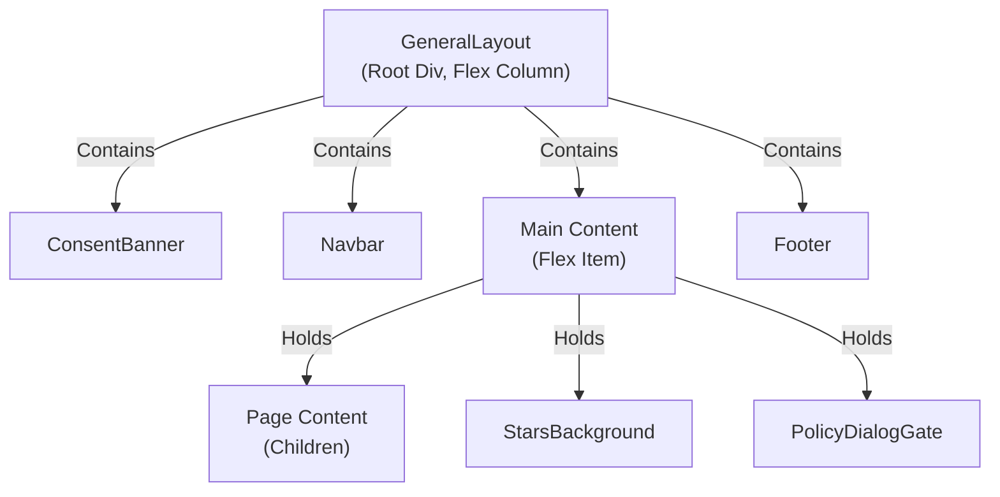

# Layouts Module Documentation

This document describes the layout system in the Alexander Sullivan's Portfolio project.

Implementation: [GeneralLayout.tsx](../../src/layouts/GeneralLayout.tsx)

## Purpose

Layouts define the structure and composition of pages and sections, ensuring consistent UI, navigation, and shared component behavior across the entire site.

## Structure

**Location:** [src/layouts/](../../src/layouts/GeneralLayout.tsx)

- **GeneralLayout.tsx** - Main layout wrapper composing navigation, content area, and footer
- **GeneralLayout.test.tsx** - Unit tests for layout functionality

## How It Works

The GeneralLayout component wraps all page content and provides a consistent structure:

1. **ConsentBanner:** The consent choices, first in the document so keyboard and screen-reader users reach them before the page; it is fixed to the viewport, so its place in the document does not move it on screen
2. **Navbar:** Fixed navigation bar with site-wide links
3. **Main Content Area:** The `<main>` element is a flex item of the root `<div id='content'>` (a `display: flex` column) that grows to fill the remaining vertical space (`flex: '1 0 auto'`); it holds the page-specific children, the **StarsBackground** (animated starfield), and **PolicyDialogGate**, which loads the privacy and cookie policy dialog the first time it is opened. It carries `id='main-content'` (`MAIN_CONTENT_ID` in [`routes.ts`](../../src/constants/routes.ts)) so the consent banner can hand focus back to the page when it closes; the banner makes it focusable only while it holds focus
4. **Footer:** Global footer with social links

### Component Hierarchy


```mermaid
flowchart TD
    accTitle: GeneralLayout Component Composition
    accDescr: The GeneralLayout root div is a flex column containing ConsentBanner, Navbar, a Main content area, and Footer, in that order. The Main content area is a flex item that holds the page children, StarsBackground, and PolicyDialogGate together
    GeneralLayout["GeneralLayout<br/>(Root Div, Flex Column)"]
    GeneralLayout -->|Contains| Consent["ConsentBanner"]
    GeneralLayout -->|Contains| Navbar
    GeneralLayout -->|Contains| Main["Main Content<br/>(Flex Item)"]
    GeneralLayout -->|Contains| Footer

    Main -->|Holds| PageContent["Page Content<br/>(Children)"]
    Main -->|Holds| Stars["StarsBackground"]
    Main -->|Holds| Policy["PolicyDialogGate"]
```

## Usage Example

```tsx
import GeneralLayout from '@layouts/GeneralLayout';

export default function Page() {
	return <GeneralLayout>{/* Page content here */}</GeneralLayout>;
}
```

## Relationships

- **Used by:** [Root Layout](./app-directory.md) wraps pages with this component
- **Contains:** [Navbar](./components/navbar.md), [Footer](./components/socials.md), [StarsBackground](./components/stars.md), [ConsentBanner and PolicyDialog](./components/consent-banner.md)
- **Styled with:** Material-UI and Emotion via `sx` prop

## Extending Layouts

To create a new layout variant:

1. Create a new file in `src/layouts/` (e.g., `BlogLayout.tsx`)
2. Compose existing components as needed
3. Export as default
4. Use in appropriate page files
5. Add corresponding `.test.tsx` file

## Related Documentation

- [System Architecture](./index.md)
- [App Directory & Routing](./app-directory.md)
- [Component Architecture](./components/index.md)
- [Navbar Component](./components/navbar.md)
- [Footer / Socials](./components/socials.md)
