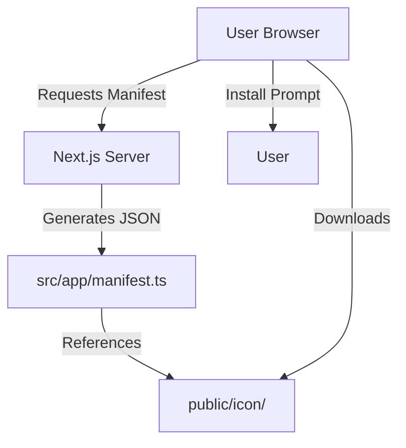
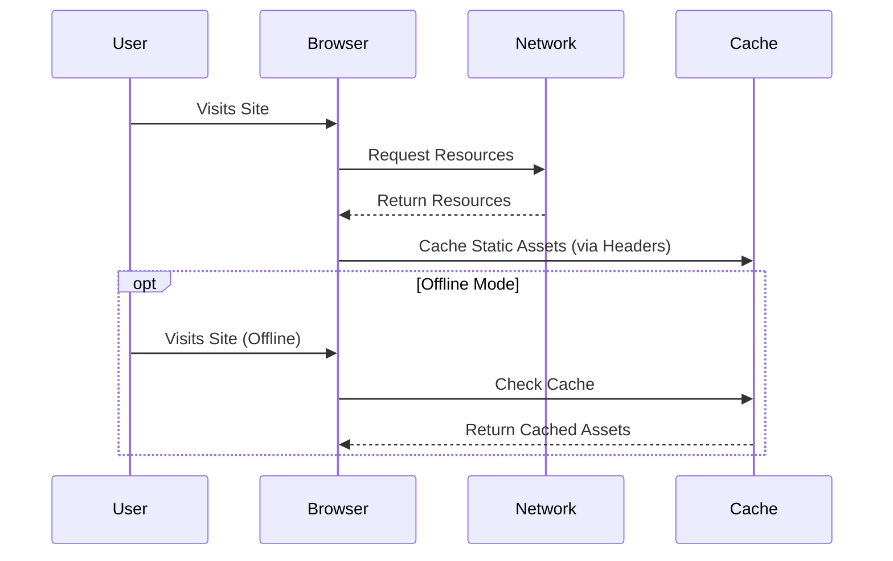

# Service Workers & PWA Documentation

This document explains how Progressive Web App (PWA) features are implemented in the AlexJSully Portfolio project using native Next.js capabilities.

## Purpose

PWA support enables:

- **Installability**: Users can install the website as a standalone app.
- **Offline Capabilities**: Basic offline support via browser caching and service workers (if configured).
- **Native-like Experience**: Standalone display mode and custom icons.

## Architecture

The PWA implementation relies on Next.js's built-in metadata and route handlers, specifically `manifest.ts`.



## Features

- **Dynamic Manifest**: Generated programmatically via `src/app/manifest.ts`.
- **Responsive Icons**: Multiple icon sizes and maskable icons for different devices.
- **Theming**: Custom theme and background colors defined in the manifest.
- **Display Modes**: Supports `standalone`, `minimal-ui`, and `window-controls-overlay`.

## Technical Implementation

### Manifest Generation (`src/app/manifest.ts`)

Instead of a static `manifest.json`, we use a TypeScript file to generate the manifest dynamically. This allows for type safety and easier maintenance.

```typescript
// src/app/manifest.ts
import type { MetadataRoute } from 'next';

export default function manifest(): MetadataRoute.Manifest {
	return {
		name: "Alexander Sullivan's Portfolio",
		short_name: "Alexander Sullivan's Portfolio",
		// ... other properties
		icons: [
			{
				src: '/icon/android-chrome-192x192.png',
				sizes: '192x192',
				type: 'image/png',
			},
			// ... other icons
		],
	};
}
```

### Service Worker Lifecycle

While `next-pwa` previously handled service worker generation, native Next.js apps can use manual service worker registration or rely on standard browser caching headers.



## Customization

To modify PWA settings:

1. **Manifest**: Edit `src/app/manifest.ts` to change app name, colors, or icons.
2. **Icons**: Add or replace images in `public/icon/` and update the manifest accordingly.

## Related Docs

- [Architecture Overview](./index.md)
- [Next.js Manifest Documentation](https://nextjs.org/docs/app/api-reference/file-conventions/metadata/manifest)
