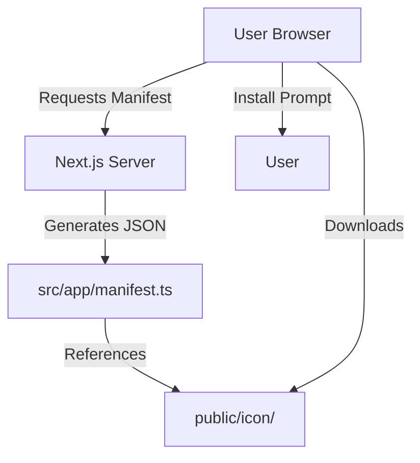

# Service Workers & PWA Documentation

This document explains how Progressive Web App (PWA) features are implemented in the Alexander Sullivan's Portfolio project using native Next.js capabilities.

## Purpose

PWA support enables:

- **Installability**: Users can install the website as a standalone app.
- **Offline Capabilities**: Basic offline support via browser caching and service workers (if configured).
- **Native-like Experience**: Standalone display mode and custom icons.

## Architecture

The PWA implementation relies on Next.js's built-in metadata and route handlers, specifically `manifest.ts`.



## Features

- **Dynamic Manifest**: Generated programmatically via `src/app/manifest.ts`.
- **Responsive Icons**: Multiple icon sizes and maskable icons for different devices.
- **Theming**: Custom theme and background colors defined in the manifest.
- **Display Modes**: Supports `standalone`, `minimal-ui`, and `window-controls-overlay`.

## Technical Implementation

### Manifest Generation (`src/app/manifest.ts`)

The app exports a `MetadataRoute.Manifest` from `src/app/manifest.ts`. Next.js will expose this manifest to the browser as `/manifest.webmanifest` when the app is built and served. Using a TypeScript manifest lets you keep manifest values close to application code and use type safety.

Example usage (the app's implementation returns a full `MetadataRoute.Manifest` object and the root layout references the manifest at `'/manifest.webmanifest'`):

```ts
// src/app/manifest.ts (exports a Next.js manifest)
import type { MetadataRoute } from 'next';

export default function manifest(): MetadataRoute.Manifest {
	return {
		name: "Alexander Sullivan's Portfolio",
		short_name: "Alexander Sullivan's Portfolio",
		icons: [
			{ src: '/icon/android-chrome-192x192.png', sizes: '192x192', type: 'image/png' },
			// ...
		],
		// ...other fields
	};
}
```

### Service Worker Lifecycle

This project includes a manual service worker implementation at `public/sw.js` and registers it from the client. The app registers the service worker in two places:

- `src/components/ServiceWorkerRegister.tsx` — a small client component that calls `navigator.serviceWorker.register('/sw.js')` inside a `useEffect`.
- `src/app/page.tsx` — the home page also calls `navigator.serviceWorker.register('/sw.js')` during its initial `useEffect` (this is a defensive duplicate to ensure registration on client navigations).

The service worker uses a cache-first / stale-while-revalidate strategy for static assets and network-first for navigation requests. See `public/sw.js` for the exact implementation.

## Customization

To modify PWA settings:

1. **Manifest**: Edit `src/app/manifest.ts` to change app name, colors, or icons. The root layout uses `manifest: '/manifest.webmanifest'` so changes will propagate at runtime.
2. **Icons**: Add or replace images in `public/icon/` and update the manifest accordingly.
3. **Service Worker**: Edit `public/sw.js` to customize caching strategies or precached assets.

## Related Docs

- [Architecture Overview](./index.md)
- [Next.js Manifest Documentation](https://nextjs.org/docs/app/api-reference/file-conventions/metadata/manifest)
