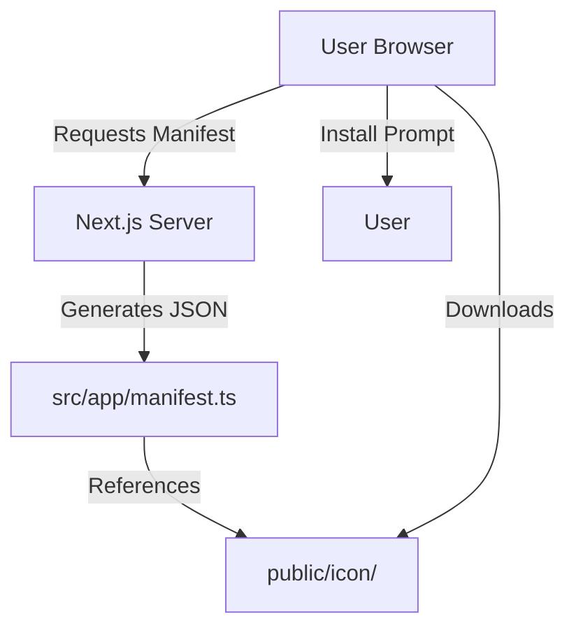

# Service Workers & PWA Documentation

This document explains how Progressive Web App (PWA) features are implemented in the Alexander Sullivan's Portfolio project using native Next.js capabilities.

Implementation: [manifest.ts](../../src/app/manifest.ts)

## Purpose

PWA support enables:

- **Installability**: Users can install the website as a standalone app.
- **Offline Capabilities**: The service worker in [sw.js](../../public/sw.js) precaches `/`, `/manifest.webmanifest`, and `/icon/favicon.ico` on install, and falls back to `/` when a navigation request cannot reach the network.
- **Native-like Experience**: Standalone display mode and custom icons.

## Architecture

The PWA implementation relies on Next.js's built-in metadata and route handlers, specifically `manifest.ts`.

```mermaid
flowchart TD
    accTitle: PWA Manifest and Icons Request Flow
    accDescr: Browser requests PWA manifest from Next.js server which generates JSON and references icons. Browser downloads icons and shows install prompt to user
    Browser[User Browser]
    Manifest["src/app/manifest.ts"]
    Icons["public/icon/"]
    NextJS[Next.js Server]

    Browser -- Requests Manifest --> NextJS
    NextJS -- Generates JSON --> Manifest
    Manifest -- References --> Icons
    Browser -- Downloads --> Icons
    Browser -- Install Prompt --> User
```

## Features

- **Dynamic Manifest**: Generated programmatically via [manifest.ts](../../src/app/manifest.ts).
- **Responsive Icons**: Multiple icon sizes and maskable icons for different devices.
- **Theming**: Custom theme and background colors defined in the manifest.
- **Display Modes**: Supports `standalone`, `minimal-ui`, and `window-controls-overlay`.

## Technical Implementation

### Manifest generation

The app exports a `MetadataRoute.Manifest` from [manifest.ts](../../src/app/manifest.ts). Next.js exposes this manifest to the browser as `/manifest.webmanifest` when the app is built and served. Using a TypeScript manifest lets you keep manifest values close to application code and use type safety.

The default export in [manifest.ts](../../src/app/manifest.ts) returns the whole manifest object: name and description, `display: 'standalone'` with `display_override` falling back through `minimal-ui` to `window-controls-overlay`, matching `#131518` background and theme colours, nine sized icons plus seven maskable variants and one any-purpose fallback, three labelled screenshots, and a twenty-entry `categories` list. Both the `id` and `scope` are `/`, so the installed app owns the whole origin.

### Service Worker Lifecycle

The service worker is written by hand in [sw.js](../../public/sw.js) rather than generated by a build plugin. [ServiceWorkerRegister.tsx](../../src/components/ServiceWorkerRegister.tsx) registers it from the client, calling `navigator.serviceWorker.register('/sw.js')` inside a `useEffect` and retrying up to three times with linear backoff on failure.

The service worker uses a cache-first, stale-while-revalidate strategy for static assets and network-first for navigation requests. [Service Worker Implementation](./service-worker.md) covers the strategies and what the fetch handler skips.

## Customization

To modify PWA settings:

1. **Manifest**: Edit [manifest.ts](../../src/app/manifest.ts) to change app name, colors, or icons. The root layout references the manifest by its route URL (`manifest: '/manifest.webmanifest'`) rather than importing the object, so it stays decoupled from the manifest's values.
2. **Icons**: Add or replace images alongside [favicon.ico](../../public/icon/favicon.ico) in the icon directory and update the manifest accordingly.
3. **Service Worker**: Edit [sw.js](../../public/sw.js) to customize caching strategies or precached assets.

## Related Documentation

- [Architecture Overview](./index.md)
- [Service Worker Implementation](./service-worker.md)
- [Next.js Manifest Documentation](https://nextjs.org/docs/app/api-reference/file-conventions/metadata/manifest)
