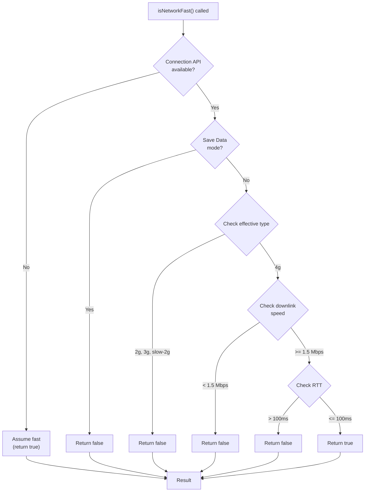

# Utils Module Documentation

This document describes the utility functions in the Alexander Sullivan's Portfolio project, their technical details, and integration patterns.

## Purpose

Utils provide general-purpose functions for network checks, type guards, and other logic not specific to UI or data. They help keep business logic clean and reusable.

## Structure

**Location:** [src/util/](../../src/util/)

### Available Utilities

- [`isNetworkFast.ts`](../../src/util/isNetworkFast.ts) — Detects network speed and adjusts asset loading strategy

## Network Detection Utility

The `isNetworkFast()` function checks the user's network connection speed using the [Network Information API](https://developer.mozilla.org/en-US/docs/Web/API/Network_Information_API) and determines whether to load high-resolution assets or use optimized versions.

### Usage

```tsx
import { isNetworkFast } from '@util/isNetworkFast';

export function ProjectsGrid() {
	const networkFast = isNetworkFast();

	return projects.map((project) => (
		<ProjectCard
			key={project.id}
			project={project}
			// Load video on hover only if network is fast
			enableVideoAutoplay={networkFast}
		/>
	));
}
```

### How It Works

The function checks three network characteristics:



### Detection Criteria

The function returns `false` (slow network) if any of these conditions are true:

| Condition       | Threshold             | Type            |
| --------------- | --------------------- | --------------- |
| Save Data mode  | Enabled               | Boolean flag    |
| Network type    | `2g`, `3g`, `slow-2g` | Connection type |
| Download speed  | < 1.5 Mbps            | Downlink        |
| Round-trip time | > 100 ms              | RTT             |

All thresholds are defined in [src/constants/index.ts](../../src/constants/index.ts) for easy tuning.

### Integration Points

- [ProjectsGrid](../../src/components/projects/ProjectsGrid.tsx) uses `isNetworkFast()` to decide whether to autoplay video on hover
- Delays video playback initialization on slow networks (see `DELAYS.PROJECT_HOVER_VIDEO`)

## Integration & Relationships

- **Used by:** [ProjectsGrid component](../../src/components/projects/ProjectsGrid.tsx), potentially other high-bandwidth components
- **Depends on:** [Network constants](../../src/constants/index.ts) for thresholds
- **Testing:** All utility functions are tested with Jest for reliability and maintainability
- **Type Safety:** TypeScript ensures full type safety and IDE autocompletion

## Related Docs

- [System Architecture](./index.md)
- [Constants Documentation](./constants.md)
- [Helpers Documentation](./helpers.md)
- [Components Documentation](./components/index.md)
