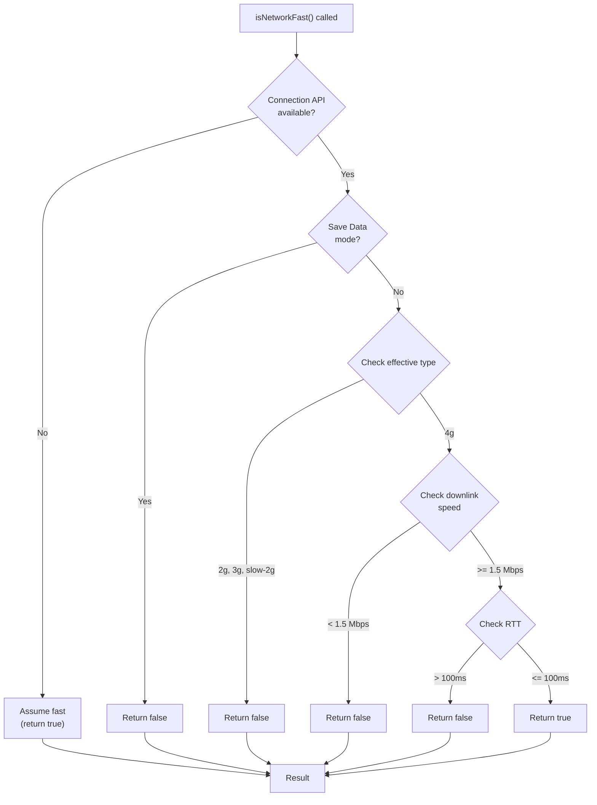

# Utils Module Documentation

This document describes the utility functions in the Alexander Sullivan's Portfolio project, their technical details, and integration patterns.

## Purpose

Utils provide general-purpose functions for network checks, cookie consent, and other logic not specific to UI or data. They help keep business logic clean and reusable.

## Structure

**Location:** [src/util/](../../src/util/isNetworkFast.ts)

### Available Utilities

- [`isNetworkFast.ts`](../../src/util/isNetworkFast.ts) - Detects network speed to decide whether to autoplay project hover videos
- [`cookieConsent.ts`](../../src/util/cookieConsent.ts) - Reads and writes the GDPR cookie consent cookie

## Network Detection Utility

The `isNetworkFast()` function checks the user's network connection speed using the [Network Information API](https://developer.mozilla.org/en-US/docs/Web/API/Network_Information_API) and decides whether to autoplay the project hover video by appending `&autoplay=1` to its YouTube embed URL.

### Usage

[`ProjectsGrid`](../../src/components/projects/ProjectsGrid.tsx) builds the hover-video embed URL, appending autoplay only on a fast network:

```tsx
import { isNetworkFast } from '@util/isNetworkFast';

const getYouTubeURL = (url: string): string => {
	return isNetworkFast() ? `${url}&autoplay=1` : url;
};
```

### How It Works

The function checks three network characteristics:


```mermaid
flowchart TD
    accTitle: Network Speed Detection Decision Tree
    accDescr: Decision tree showing how isNetworkFast checks Connection API availability, save data mode, network type, downlink speed, and RTT to determine if network is fast enough for video autoplay
    A["isNetworkFast() called"] --> B{"Connection API<br/>available?"}
    B -->|No| C["Assume fast<br/>(return true)"]
    B -->|Yes| D{"Save Data<br/>mode?"}
    D -->|Yes| E["Return false"]
    D -->|No| F{"Check effective type"}
    F -->|2g, 3g, slow-2g| G["Return false"]
    F -->|4g| H{"Check downlink<br/>speed"}
    H -->|< 1.5 Mbps| I["Return false"]
    H -->|>= 1.5 Mbps| J{"Check RTT"}
    J -->|> 100ms| K["Return false"]
    J -->|<= 100ms| L["Return true"]
    C --> M["Result"]
    E --> M
    G --> M
    I --> M
    K --> M
    L --> M
```

### Detection Criteria

The function returns `false` (slow network) if any of these conditions are true:

| Condition       | Threshold             | Type            |
| --------------- | --------------------- | --------------- |
| Save Data mode  | Enabled               | Boolean flag    |
| Network type    | `2g`, `3g`, `slow-2g` | Connection type |
| Download speed  | < 1.5 Mbps            | Downlink        |
| Round-trip time | > 100 ms              | RTT             |

All thresholds are defined in [src/constants/index.ts](../../src/constants/index.ts) for easy tuning.

### Integration Points

- [ProjectsGrid](../../src/components/projects/ProjectsGrid.tsx) uses `isNetworkFast()` to decide whether to autoplay video on hover
- The `DELAYS.PROJECT_HOVER_VIDEO` delay before showing the hover video applies to every hover and is independent of `isNetworkFast()`

## Cookie Consent Utility

[`cookieConsent.ts`](../../src/util/cookieConsent.ts) manages a first-party consent cookie named `cookie-consent`:

- `setCookieConsent()` writes `cookie-consent=true` with `max-age` of one year, `path=/`, `SameSite=Strict`, and `Secure` on HTTPS.
- `hasCookieConsent()` parses `document.cookie` (avoiding substring false positives) and returns whether consent was given; it returns `false` during server-side rendering when `document` is undefined.

The [CookieSnackbar component](../../src/components/cookie-snackbar/CookieSnackbar.tsx) calls `hasCookieConsent()` on mount to decide whether to show the notice and `setCookieConsent()` when the user dismisses it.

## Integration & Relationships

- **Used by:** [ProjectsGrid component](../../src/components/projects/ProjectsGrid.tsx), potentially other high-bandwidth components
- **Depends on:** [Network constants](../../src/constants/index.ts) for thresholds
- **Testing:** All utility functions are tested with Jest for reliability and maintainability
- **Type Safety:** TypeScript ensures full type safety and IDE autocompletion

## Related Docs

- [System Architecture](./index.md)
- [Constants Documentation](./constants.md)
- [Helpers Documentation](./helpers.md)
- [Components Documentation](./components/index.md)
