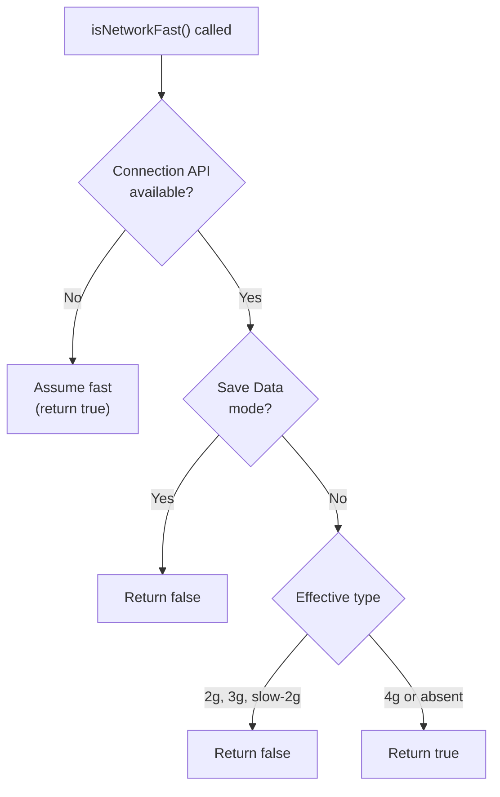

# Utils Module Documentation

This document describes the utility functions in the Alexander Sullivan's Portfolio project, their technical details, and integration patterns.

## Purpose

Utils provide general-purpose functions for network checks, cookie consent, and other logic not specific to UI or data. They help keep business logic clean and reusable.

## Structure

**Location:** [src/util/](../../src/util/isNetworkFast.ts)

### Available Utilities

- [`isNetworkFast.ts`](../../src/util/isNetworkFast.ts) - Detects network speed to decide whether to autoplay project hover videos
- [`consent/`](../../src/util/consent/consentStore.ts) - Stores the visitor's consent choices, reads them in React, and clears what a refused purpose stored; see [Consent](./consent.md)
- [`locationHash.ts`](../../src/util/locationHash.ts) - Reads the URL fragment in React and clears it
- [`linkIcon.ts`](../../src/util/linkIcon.ts) - Chooses the mark for a link and builds the generated globe, so [`LinkIcon`](../../src/components/link-icon/LinkIcon.tsx) stays a thin renderer
- [`panelState.ts`](../../src/util/panelState.ts) - Opens and closes panels such as the policy dialog, either on request without changing the URL or from a redirect's fragment
- [`runWhenIdle.ts`](../../src/util/runWhenIdle.ts) - Runs work once the browser is idle, falling back to the next macrotask where `requestIdleCallback` is missing
- [`focusMainContent.ts`](../../src/util/focusMainContent.ts) - Moves focus to the `<main>` element when a closing overlay has nowhere better to return it, used by the consent banner and the policy dialog
- [`absoluteUrl.ts`](../../src/util/absoluteUrl.ts) - Resolves a site path against the canonical site URL from [`profile.ts`](../../src/data/profile.ts)
- [`negotiateContentType.ts`](../../src/util/negotiateContentType.ts) - Chooses HTML, Markdown, or 406 from an `Accept` header
- [`markdown/`](../../src/util/markdown/homeMarkdown.ts) - Builds the Markdown home page, the policy, the Markdown 404 body, and `llms.txt` from the data modules, and wraps Markdown in a response with the negotiation headers

`negotiateContentType.ts` and `markdown/` serve agents; see [Agent Readiness](./agent-readiness.md).

## Network Detection Utility

The `isNetworkFast()` function checks the user's network connection speed using the [Network Information API](https://developer.mozilla.org/en-US/docs/Web/API/Network_Information_API) and decides whether to autoplay the project hover video by appending `&autoplay=1` to its YouTube embed URL.

### Usage

[`ProjectsGrid`](../../src/components/projects/ProjectsGrid.tsx) builds the hover-video embed URL, appending autoplay only on a fast network:

```tsx
import { isNetworkFast } from '@util/isNetworkFast';

const getYouTubeURL = (url: string): string => {
	return isNetworkFast() ? `${url}&autoplay=1` : url;
};
```

### How It Works

The function checks two network characteristics:


```mermaid
flowchart TD
    accTitle: Network Speed Detection Decision Tree
    accDescr: Decision tree showing how isNetworkFast checks Connection API availability, save data mode, and the effective connection type to determine if the network is fast enough for video autoplay
    A["isNetworkFast() called"] --> B{"Connection API<br/>available?"}
    B -->|No| C["Assume fast<br/>(return true)"]
    B -->|Yes| D{"Save Data<br/>mode?"}
    D -->|Yes| E["Return false"]
    D -->|No| F{"Effective type"}
    F -->|2g, 3g, slow-2g| G["Return false"]
    F -->|4g or absent| H["Return true"]
```

### Detection Criteria

The function returns `false` (slow network) if either of these conditions is true:

| Condition      | Threshold             | Type            |
| -------------- | --------------------- | --------------- |
| Save Data mode | Enabled               | Boolean flag    |
| Network type   | `2g`, `3g`, `slow-2g` | Connection type |

It does not compare the raw `downlink` and `rtt` estimates against cut-offs. Browsers round them coarsely, so a reading near a fixed threshold flips between visits, while `effectiveType` is derived from the same measurements with smoothing.

The slow network types are defined in [src/constants/index.ts](../../src/constants/index.ts).

### Integration Points

- [ProjectsGrid](../../src/components/projects/ProjectsGrid.tsx) uses `isNetworkFast()` to decide whether to autoplay video on hover
- The `DELAYS.PROJECT_HOVER_VIDEO` delay before showing the hover video applies to every hover and is independent of `isNetworkFast()`

## Integration & Relationships

- **Used by:** [`isNetworkFast()`](../../src/util/isNetworkFast.ts) has one caller, [ProjectsGrid](../../src/components/projects/ProjectsGrid.tsx)
- **Depends on:** [Network constants](../../src/constants/index.ts) for thresholds
- **Testing:** every utility has a colocated test, such as [`isNetworkFast.test.ts`](../../src/util/isNetworkFast.test.ts) and [`consentStore.test.ts`](../../src/util/consent/consentStore.test.ts)

## Related Docs

- [System Architecture](./index.md)
- [Constants Documentation](./constants.md)
- [Helpers Documentation](./helpers.md)
- [Components Documentation](./components/index.md)
