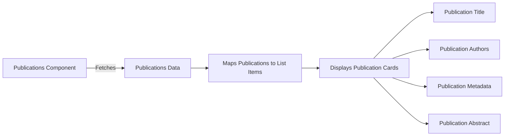

# Publications Documentation

## Overview

This document explains how the publications list is displayed and how to add new publications to the codebase.

## Publications List Display

The publications list is displayed using the `Publications` component located in [Publications.tsx](../../src/components/publications/Publications.tsx). This component creates a list layout to showcase the publications.

### Key Elements

- **Styling**: The component uses inline styles to manage the appearance of publication metadata.
- **List Layout**: The publications are displayed in a responsive list layout using Material-UI's Stack and Typography components.
- **Publication Cards**: Each publication is displayed as a card with a title, authors, metadata, and an abstract.

### Flowchart



## Adding New Publications

To add new publications, you need to update the `publications` array in [publications.ts](../../src/data/publications.ts).

### Steps to Add a New Publication

1. Open the [publications.ts](../../src/data/publications.ts) file.
2. Add a new object to the publications array with the following structure:

    ```json
    {
    	"title": "Publication Title",
    	"authors": [
    		"Author 1",
    		"Author 2"
    		// more authors
    	],
    	"abstract": "Abstract of the publication.",
    	"doi": "10.1234/doi",
    	"journal": "Journal Name",
    	"date": "YYYY-MM-DD",
    	"related-project": "project-id" // optional
    }
    ```

By following these steps, you can successfully add new publications to the publications list.
