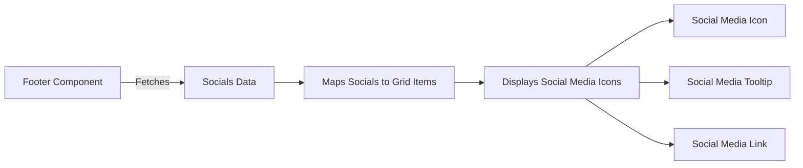

# Socials Documentation

## Overview

This document explains how the social media links are displayed and how to add new social media links to the codebase.

## Social Media Links Display

The social media links are displayed using the `Footer` component located in [Footer.tsx](../../src/components/footer/Footer.tsx). This component creates a grid layout to showcase the social media links.

### Key Elements

* **Grid Layout**: The social media links are displayed in a responsive grid layout using Material-UI's `Grid`, `Stack`, and `Tooltip` components.
* **Social Media Icons**: Each social media link is displayed as an icon button with a tooltip.

### Flowchart



## Adding New Social Media Links

To add new social media links, you need to update the `socials` array in [socials.ts](../../src/data/socials.ts).

### Steps to Add a New Social Media Link

1. Open the [socials.ts](../../src/data/socials.ts) file.
2. Add a new object to the socials array with the following structure:

```typescript
{
    name: 'Social Media Name',
    url: 'https://social-media-url.com',
    icon: SocialMediaIconComponent,
    color: '#colorCode',
}
```

By following these steps, you can successfully add new social media links to the footer.
