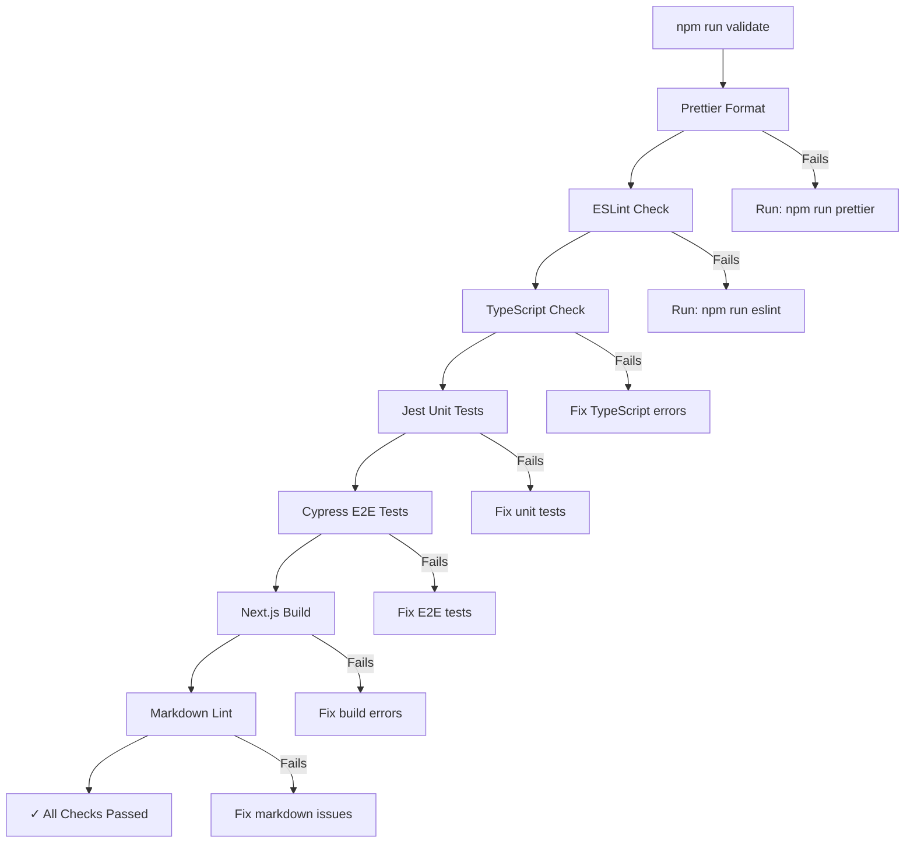

# Testing Documentation

## Overview

This document explains how the testing setup works in this codebase and how to run each test. If you want to contribute to this repository, please refer to the [Contributing Guide](../../CONTRIBUTING.md).

Implementation: [cypress.config.ts](../../cypress.config.ts), [jest.config.js](../../jest.config.js)

## Testing Setup

Two runners cover different layers. Jest exercises individual components and functions from test files colocated beside their source, and Cypress drives the running site end to end. They compile under separate TypeScript programs, which is why [`npm run tsc`](../../package.json) type-checks the root `tsconfig.json` and `cypress/tsconfig.json` in sequence.

### Key Elements

- **Jest Configuration**: [jest.config.js](../../jest.config.js) wraps Next.js's own Jest transform, sets the `jsdom` environment, mirrors the `tsconfig.json` path aliases through `moduleNameMapper`, and loads [jest/setup.ts](../../jest/setup.ts) after the environment is ready. It ignores `cypress/`, so the two suites never collide.
- **Cypress Configuration**: [cypress.config.ts](../../cypress.config.ts) sets `includeShadowDom` so commands reach into shadow roots, and enables `experimentalRunAllSpecs` to run every spec in one pass. No `baseUrl` is configured, so specs pass an absolute URL to `cy.visit()`.
- **Test Files**: End-to-end test specs are located in [cypress/e2e/landing.cy.ts](../../cypress/e2e/landing.cy.ts) and related files in the same directory.
- **Support Files**: Cypress support files are located in [cypress/support/e2e.ts](../../cypress/support/e2e.ts) and [cypress/support/commands.ts](../../cypress/support/commands.ts).

### Flowchart


```mermaid
flowchart TD
    accTitle: Validation Pipeline Workflow
    accDescr: npm run validate executes: Prettier formatting, ESLint code quality, TypeScript type checking, Jest unit tests, Cypress E2E tests, Next.js build, and Markdown linting. Each step can fail with specific fix commands
    Validate[npm run validate] --> Prettier[Prettier Format]
    Prettier --> ESLint[ESLint Check]
    ESLint --> TSC[TypeScript Check]
    TSC --> Jest[Jest Unit Tests]
    Jest --> Cypress[Cypress E2E Tests]
    Cypress --> Build[Next.js Build]
    Build --> Markdown[Markdown Lint]
    Markdown --> Success[✓ All Checks Passed]

    Prettier -->|Fails| PrettierFix[Run: npm run prettier]
    ESLint -->|Fails| ESLintFix[Run: npm run eslint]
    TSC -->|Fails| TSCFix[Fix TypeScript errors]
    Jest -->|Fails| JestFix[Fix unit tests]
    Cypress -->|Fails| CypressFix[Fix E2E tests]
    Build -->|Fails| BuildFix[Fix build errors]
    Markdown -->|Fails| MarkdownFix[Fix markdown issues]
```

## Running Tests

To run the tests, you can use the following commands:

### Running Jest Unit Tests

1. **Run all Jest tests:**

    ```sh
    npm run test:jest
    ```

2. **Run Jest with coverage:**

    ```sh
    npm run test:jest:coverage
    ```

    This generates a coverage report showing which parts of the code are tested.

### Running Cypress Tests

1. **Open Cypress Test Runner:** This command opens the Cypress Test Runner, allowing you to run tests interactively.

    ```sh
    npm run cypress
    # or
    npm run test:cypress:open
    ```

2. **Run Cypress Tests in Headless Mode:** This command runs all Cypress tests in headless mode, which is useful for CI/CD pipelines.

    ```sh
    npm run e2e:headless
    # or
    npm run test:cypress:e2e
    ```

### Running All Tests

To run all tests, linting, type checking, and build, use the following command:

```sh
npm run validate
```

This command runs the following checks in order, stopping at the first one that exits non-zero:

1. **Prettier**: Rewrites formatting in place with `prettier --write ./`.
2. **ESLint**: Repairs what is autofixable with `eslint --fix ./` and reports the rest.
3. **TypeScript**: Ensures type safety by running `npm run tsc` (root `tsconfig.json` and `cypress/tsconfig.json`).
4. **Jest**: Runs unit tests.
5. **Cypress**: Runs end-to-end tests.
6. **Build**: Ensures the project builds successfully with `next build`.
7. **Markdown Lint**: Rewrites markdown in place with `markdownlint-cli2 --fix`, against the rules in [`.markdownlint-cli2.jsonc`](../../.markdownlint-cli2.jsonc).

Because steps 1, 2, and 7 write, a run that reaches exit code 0 can still leave the working tree dirty: each applies every fix its tool can apply and fails only on what is left, such as an ESLint rule with no automatic fix or a markdown file that does not open with a top-level heading. Commit whatever those three rewrote. The workflows described below re-check the same rules without writing, so a fix left unstaged fails CI on the rule the local run already settled.

### Cypress Test Example

Here is an example of a Cypress test located in [cypress/e2e/landing.cy.ts](../../cypress/e2e/landing.cy.ts):

```ts
describe('Landing Page', () => {
	afterEach(() => {
		cy.a11yCheck();
	});

	it('should render page', () => {
		cy.visit('http://localhost:3000');
		cy.get('[data-testid="profile_pic"]').should('exist');
	});
});
```

## Continuous Integration

This repository uses a CI workflow defined in [code-qa.yaml](../../.github/workflows/code-qa.yaml) to ensure code quality. It runs on Node 24.x, on every push and pull request to `main` whose changed files match its `paths` filter: anything under `public/` or `src/`, any `.json`, `.js`, `.ts`, `.tsx`, `.jsx`, `.css`, `.scss`, or `.html` file, or the workflow itself. A pull request touching only Markdown therefore skips it entirely. The checks are:

- **Prettier**: Ensures code formatting is consistent, via `npm run prettier:check`.
- **ESLint**: Checks for code quality and potential issues, via `npm run eslint:check`.
- **TypeScript**: Ensures type safety.
- **Jest**: Runs unit tests.
- **Cypress**: Runs end-to-end tests.
- **Build**: Ensures the project builds successfully.

Markdown is linted by a separate [markdown-lint.yaml](../../.github/workflows/markdown-lint.yaml) workflow, which runs `npm run lint:markdown:check` when a `.md` or `.MD` file, a `.markdownlint-cli2.jsonc`, or the workflow itself changes. Splitting the two means editing prose does not spend a full build, and editing code does not wait on markdown.

No workflow calls `npm run validate`, and none of the steps above writes to a checked-out file. A violation that `npm run validate` would have repaired locally therefore fails CI instead, which is why the local run belongs before the commit rather than after the push.

## Contributing

If you want to contribute to this repository, please refer to the [Contributing Guide](../../CONTRIBUTING.md) for more details on the pull request process and code of conduct.

## Related Documentation

- [Contributing Guide](../../CONTRIBUTING.md)
- [Setup & Installation](./setup.md)
