# Testing Documentation

## Overview

This document explains how the testing setup works in this codebase and how to run each test. If you want to contribute to this repository, please refer to the [Contributing Guide](../../CONTRIBUTING.md).

## Testing Setup

The testing setup in this codebase uses Cypress for end-to-end (E2E) testing. The configuration for Cypress is located in [cypress.config.ts](../../cypress.config.ts).

### Key Elements

- **Cypress Configuration**: The Cypress configuration file defines the settings and options for running tests.
- **Test Files**: Test files are located in the `cypress/e2e` directory.
- **Support Files**: Support files are located in the `cypress/support` directory and include custom commands and global configuration.

### Flowchart

```mermaid
flowchart TD
    Validate[npm run validate] --> Prettier[Prettier Format]
    Prettier --> ESLint[ESLint Check]
    ESLint --> TSC[TypeScript Check]
    TSC --> Jest[Jest Unit Tests]
    Jest --> Cypress[Cypress E2E Tests]
    Cypress --> Build[Next.js Build]
    Build --> Markdown[Markdown Lint]
    Markdown --> Success[✓ All Checks Passed]

    Prettier -->|Fails| PrettierFix[Run: npm run prettier]
    ESLint -->|Fails| ESLintFix[Run: npm run eslint]
    TSC -->|Fails| TSCFix[Fix TypeScript errors]
    Jest -->|Fails| JestFix[Fix unit tests]
    Cypress -->|Fails| CypressFix[Fix E2E tests]
    Build -->|Fails| BuildFix[Fix build errors]
    Markdown -->|Fails| MarkdownFix[Fix markdown issues]
```



## Running Tests

To run the tests, you can use the following commands:

### Running Jest Unit Tests

1. **Run all Jest tests:**

    ```sh
    npm run test:jest
    ```

2. **Run Jest with coverage:**

    ```sh
    npm run test:jest:coverage
    ```

    This generates a coverage report showing which parts of the code are tested.

### Running Cypress Tests

1. **Open Cypress Test Runner:** This command opens the Cypress Test Runner, allowing you to run tests interactively.

    ```sh
    npm run cypress
    # or
    npm run test:cypress:open
    ```

2. **Run Cypress Tests in Headless Mode:** This command runs all Cypress tests in headless mode, which is useful for CI/CD pipelines.

    ```sh
    npm run e2e:headless
    # or
    npm run test:cypress:e2e
    ```

### Running All Tests

To run all tests, linting, type checking, and build, use the following command:

```sh
npm run validate
```

This command runs the following checks in order:

1. **Prettier**: Ensures code formatting is consistent.
2. **ESLint**: Checks for code quality and potential issues.
3. **TypeScript**: Ensures type safety with `tsc --noEmit`.
4. **Jest**: Runs unit tests.
5. **Cypress**: Runs end-to-end tests.
6. **Build**: Ensures the project builds successfully with `next build`.
7. **Markdown Lint**: Validates markdown files.

### Cypress Test Example

Here is an example of a Cypress test located in [cypress/e2e/landing.cy.ts](../../cypress/e2e/landing.cy.ts):

```ts
// This test suite is for the landing page
describe('Landing Page', () => {
	// This hook runs before each test in the suite
	beforeEach(() => {
		// Visit the landing page
		cy.visit('http://localhost:3000');
	});

	// This test checks that the page renders correctly
	it('should render page', () => {
		// Check that the profile picture exists on the page
		cy.get('[data-testid="profile_pic"]').should('exist');
	});
});
```

## Continuous Integration

This repository uses a CI workflow defined in [code-qa.yml](../../.github/workflows/code-qa.yml) to ensure code quality. The workflow runs the following checks on every push and pull request to the `main` branch:

- **Prettier**: Ensures code formatting is consistent.
- **ESLint**: Checks for code quality and potential issues.
- **TypeScript**: Ensures type safety.
- **Cypress**: Runs end-to-end tests.
- **Build**: Ensures the project builds successfully.

## Contributing

If you want to contribute to this repository, please refer to the [Contributing Guide](../../CONTRIBUTING.md) for more details on the pull request process and code of conduct.

By following these steps, you can successfully run and contribute to the tests in this codebase.
